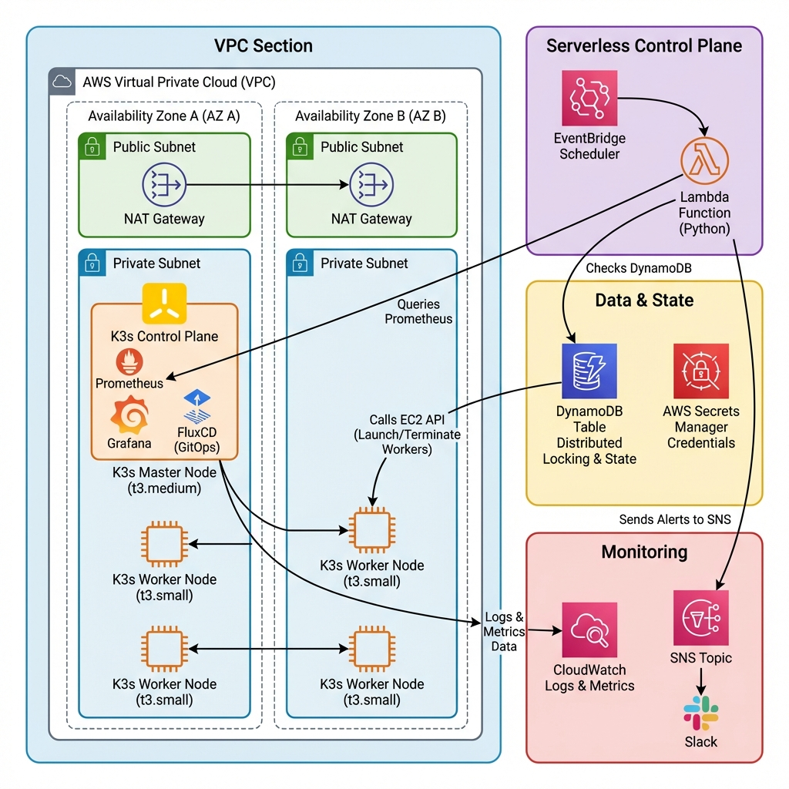

# node-fleet K3s Autoscaler

Smart autoscaling for K3s on AWS EC2, built to cut idle cost and prevent flash-sale outages.



## Quick Scan

- **Problem**: 5 workers running 24/7 caused high off-peak waste and slow manual scaling.
- **Goal**: automated scaling in under 3 minutes, safer scale-down, and lower monthly cost.
- **Result**: production-oriented autoscaler with Prometheus + Lambda + DynamoDB lock + EC2 lifecycle automation.
- **Estimated savings**: about **54-58%** based on current project analysis.

| Setup | Monthly Cost | Savings |
|---|---:|---:|
| Static worker fleet | $180 | 0% |
| node-fleet autoscaling | $70-$83 | 54-58% |

## 1) Project Overview

- Business context and strict requirements: [docs/REQUIREMENTS.md](docs/REQUIREMENTS.md)
- Final mapped architecture summary: [docs/SOLUTION_ARCHITECTURE.md](docs/SOLUTION_ARCHITECTURE.md)

## 2) Architecture Explanation

- High-level architecture: [docs/diagrams/system_architecture.png](docs/diagrams/system_architecture.png)
- Metrics architecture: [docs/diagrams/metrics_architecture.png](docs/diagrams/metrics_architecture.png)
- Scaling decision flow: [docs/diagrams/scaling_logic_flowchart.png](docs/diagrams/scaling_logic_flowchart.png)
- Scale-up sequence: [docs/diagrams/scale_up_sequence.png](docs/diagrams/scale_up_sequence.png)
- Scale-down sequence: [docs/diagrams/scale_down_sequence.png](docs/diagrams/scale_down_sequence.png)

## 3) Technology Stack

- **IaC**: Pulumi (TypeScript) for strongly typed infrastructure workflows
- **Autoscaler runtime**: AWS Lambda (Python 3.11)
- **State & lock**: DynamoDB conditional-write lock pattern
- **Metrics**: Prometheus + kube-state-metrics + Grafana
- **Compute**: K3s on EC2 (On-Demand + Spot mix)

Implementation details:
- [docs/ARCHITECTURE.md](docs/ARCHITECTURE.md)
- [docs/IMPLEMENTATION_HIGHLIGHTS.md](docs/IMPLEMENTATION_HIGHLIGHTS.md)

## 4) Setup Instructions

Prerequisites:
- AWS CLI configured
- Pulumi CLI
- Node.js 18+
- Python 3.11+
- kubectl

Deploy:

```bash
# Infrastructure
cd pulumi
pulumi up --yes

# Full deployment helper
cd ..
./deploy.sh <master-public-ip>
```

Verification:

```bash
kubectl get nodes
bash scripts/verify-autoscaler-requirements.sh
```

Runbook:
- [docs/DEPLOYMENT_GUIDE.md](docs/DEPLOYMENT_GUIDE.md)

## 5) Lambda Function Logic

- Main flow and orchestration: [lambda/autoscaler.py](lambda/autoscaler.py)
- Scaling engine and thresholds: [lambda/scaling_decision.py](lambda/scaling_decision.py)
- EC2 lifecycle and safe deprovisioning: [lambda/ec2_manager.py](lambda/ec2_manager.py)
- State/lock management: [lambda/state_manager.py](lambda/state_manager.py)

Algorithm notes:
- [docs/SCALING_ALGORITHM.md](docs/SCALING_ALGORITHM.md)

## 6) Prometheus Configuration

- Monitoring architecture and queries: [docs/ARCHITECTURE.md](docs/ARCHITECTURE.md)
- Solution mapping and query usage: [docs/SOLUTION_ARCHITECTURE.md](docs/SOLUTION_ARCHITECTURE.md)

Value screenshots:


## 7) DynamoDB Schema

- Full schema and lock behavior: [docs/SOLUTION_ARCHITECTURE.md](docs/SOLUTION_ARCHITECTURE.md)
- Requirement-level lock constraints: [docs/REQUIREMENTS.md](docs/REQUIREMENTS.md)

## 8) Testing Results

- Test strategy and 120-case verification summary: [docs/TESTING.md](docs/TESTING.md)

Evidence screenshots:


## 9) Troubleshooting Guide

- Operational troubleshooting and fixes: [docs/TROUBLESHOOTING.md](docs/TROUBLESHOOTING.md)

## 10) Cost Analysis

- Cost breakdown, optimization model, and savings rationale: [docs/COST_ANALYSIS.md](docs/COST_ANALYSIS.md)
- Cost optimization cycle diagram: [docs/diagrams/cost_optimization_cycle.png](docs/diagrams/cost_optimization_cycle.png)

## 11) Security Checklist

- Security controls and IAM hardening: [docs/SECURITY_CHECKLIST.md](docs/SECURITY_CHECKLIST.md)

## Docs Index

- [docs/ARCHITECTURE.md](docs/ARCHITECTURE.md)
- [docs/SCALING_ALGORITHM.md](docs/SCALING_ALGORITHM.md)
- [docs/DEPLOYMENT_GUIDE.md](docs/DEPLOYMENT_GUIDE.md)
- [docs/TROUBLESHOOTING.md](docs/TROUBLESHOOTING.md)
- [docs/COST_ANALYSIS.md](docs/COST_ANALYSIS.md)
- [docs/SECURITY_CHECKLIST.md](docs/SECURITY_CHECKLIST.md)
- [docs/TESTING.md](docs/TESTING.md)
- [docs/IMPLEMENTATION_HIGHLIGHTS.md](docs/IMPLEMENTATION_HIGHLIGHTS.md)
- [docs/REQUIREMENTS.md](docs/REQUIREMENTS.md)
- [docs/SOLUTION_ARCHITECTURE.md](docs/SOLUTION_ARCHITECTURE.md)

## License

MIT
