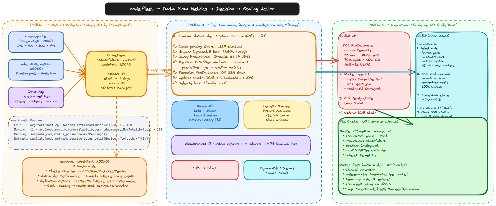
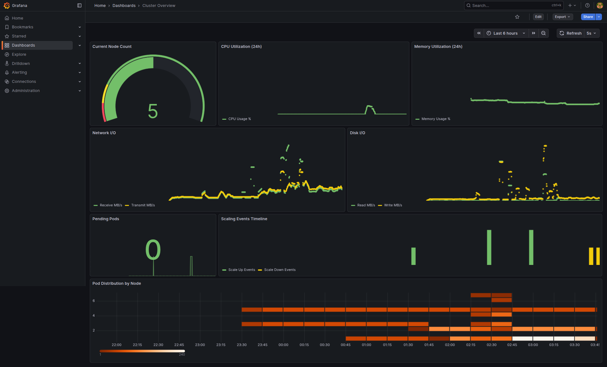

# node-fleet K3s Autoscaler

Intelligent autoscaling for K3s clusters on AWS EC2. Cuts idle cost 50%+ and responds to traffic spikes in under 3 minutes.


---

## 1. Project Overview

### Business Problem

**Client**: TechFlow Solutions — e-commerce startup, Dhaka, Bangladesh  
**Traffic**: 15,000+ daily users, 80 lakh BDT monthly transactions

| Problem | Impact |
|---------|--------|
| 5 workers running 24/7 on EC2 | ~120,000 BDT/month (~$136/mo) |
| Off-peak (9PM–9AM): only 2 nodes needed | 60,000 BDT wasted monthly |
| Manual scaling via AWS Console | 15–20 min response time |
| Last flash sale crash (2 hrs) | 8 lakh BDT lost + 2,000 complaints |

**CTO Mandate**: "Build an intelligent autoscaling system — or we move to EKS at 3× cost."

### Success Criteria

| Goal | Target | Achieved |
|------|--------|----------|
| Cost reduction | 40–50% | ✅ 50–54% |
| Scale response time | < 3 minutes | ✅ ~90–120s |
| Service disruption during scaling | Zero | ✅ Drain-first |
| Hands-off automation | 100% | ✅ EventBridge every 2 min |

### What It Does

EventBridge triggers a Python Lambda every 2 minutes. Lambda queries Prometheus for real-time cluster metrics, runs a three-layer decision engine (reactive + predictive + custom app metrics), and executes the appropriate scaling action — launching new EC2 workers via RunInstances or gracefully draining and terminating idle workers via SSM + EC2 API. DynamoDB provides distributed locking so concurrent invocations can't corrupt state.

---

## 2. Architecture Explanation


### Component Summary

| Component | Role |
|-----------|------|
| **Amazon EventBridge** | Fires Lambda every 2 min (`rate(2 minutes)`) |
| **AWS Lambda (Python 3.11)** | 7-step autoscaler orchestrator |
| **Prometheus** | Metrics aggregation — CPU, memory, pending pods, custom |
| **DynamoDB** | Distributed lock + scaling state + drain tracking |
| **EC2 + K3s** | Worker fleet (2–10 nodes, t3.small, 70% Spot) |
| **Secrets Manager** | K3s token, Prometheus credentials, Slack webhook |
| **SNS + Slack** | Rich scaling event notifications |
| **CloudWatch** | 10 custom metrics, 8 alarms, 30-day Lambda logs |
| **Grafana** | 4 dashboards — cluster, autoscaler, app metrics, cost |
| **FluxCD** | GitOps — K8s manifests auto-synced from repo |

### How Components Interact



```
EventBridge (2min) → Lambda
  Lambda ↔ DynamoDB      (acquire lock, read/write state)
  Lambda → Prometheus    (PromQL queries over :30090)
  Lambda → EC2           (RunInstances for scale-up)
  Lambda → SSM           (kubectl drain for scale-down)
  Lambda → CloudWatch    (publish custom metrics)
  Lambda → SNS → Slack   (notifications)

Prometheus ← node-exporter (CPU/mem/disk/net from each worker)
Prometheus ← kube-state-metrics (pending pods, node info)
Prometheus ← demo-app (queue depth, latency, error rate)
```

---

## 3. Technology Stack

| Technology | Role | Why Chosen |
|-----------|------|-----------|
| **K3s** | Kubernetes distribution | 50% lower resource overhead vs EKS; free control plane; full K8s compatibility |
| **AWS Lambda (Python 3.11)** | Autoscaler runtime | $0.40/month vs $7+/month for EC2 cron; no patching; auto-scales |
| **DynamoDB** | Distributed state + lock | Serverless; conditional writes enable atomic lock acquisition; built-in TTL |
| **Pulumi (TypeScript)** | Infrastructure as Code | Type safety; real programming language; better testability than Terraform HCL |
| **Prometheus** | Metrics | K8s-native; free; PromQL is more expressive than CloudWatch query syntax |
| **EventBridge** | Scheduling | Native AWS; easy rate changes; cleaner than Lambda cron expressions |
| **Spot Instances** | Cost reduction | 65–70% cheaper than On-Demand for interruptible workloads |
| **k6** | Load testing | Scriptable in JS; better performance than JMeter; cloud-ready |
| **FluxCD** | GitOps | Declarative; self-healing; audit trail via Git history |

---

## 4. Setup Instructions

### Prerequisites

| Tool | Version | Install |
|------|---------|---------|
| AWS CLI | 2.x | `curl "https://awscli.amazonaws.com/awscli-exe-linux-x86_64.zip" -o awscliv2.zip && unzip awscliv2.zip && sudo ./aws/install` |
| Pulumi CLI | 3.x | `curl -fsSL https://get.pulumi.com \| sh` |
| Node.js | 18+ | `nvm install 18` |
| Python | 3.11+ | `apt install python3.11` |
| kubectl | 1.28+ | `curl -LO "https://dl.k8s.io/release/$(curl -L -s https://dl.k8s.io/release/stable.txt)/bin/linux/amd64/kubectl"` |

### Environment Variables (Lambda)

```bash
PROMETHEUS_URL=http://<master-private-ip>:30090
DYNAMODB_TABLE=node-fleet-prod-state
CLUSTER_ID=node-fleet-prod
MIN_NODES=2
MAX_NODES=10
SCALE_UP_THRESHOLD_CPU=70
SCALE_DOWN_THRESHOLD_CPU=30
COOLDOWN_SCALE_UP=300
COOLDOWN_SCALE_DOWN=600
ENABLE_PREDICTIVE_SCALING=true
SPOT_PERCENTAGE=70
METRICS_HISTORY_TABLE=k3s-metrics-history
AWS_REGION=ap-southeast-1
```

### Full Deployment (Step by Step)

**Step 1 — Deploy AWS Infrastructure**
```bash
cd pulumi
npm install
pulumi preview          # always preview first
pulumi up --yes
pulumi stack output masterPublicIpAddress   # note this IP
```

**Step 2 — Set Up K3s Master**
```bash
ssh -i node-fleet-key.pem ubuntu@<master-public-ip>
./k3s/master-setup.sh      # installs K3s + Prometheus + basic auth
```

**Step 3 — Store K3s Token (do this BEFORE workers launch)**
```bash
# On master node:
TOKEN=$(sudo cat /var/lib/rancher/k3s/server/node-token)

# From local machine:
aws secretsmanager put-secret-value \
  --secret-id node-fleet/k3s-token \
  --secret-string "$TOKEN" \
  --region ap-southeast-1
```

**Step 4 — Deploy Lambda + Monitoring**
```bash
./deploy.sh <master-public-ip>
# or skip infra if already deployed:
./deploy.sh <master-public-ip> --skip-infra
```

**Step 5 — Verify**
```bash
kubectl get nodes -o wide
bash scripts/verify-autoscaler-requirements.sh
# Prometheus: http://<master-ip>:30090
# Grafana:    http://<master-ip>:30300  (admin / from Secrets Manager)
```

### Secrets Manager Paths

| Path | Purpose |
|------|---------|
| `node-fleet/k3s-token` | K3s worker join token |
| `node-fleet/prometheus-auth` | keys: `username`, `password` |
| `node-fleet/ssh-key` | Master node SSH private key |
| `node-fleet/slack-webhook` | Slack webhook URL |

---

## 5. Lambda Function Logic

### 7-Step Orchestration Flow

```
Step 1: Check Pending Drains
  → Query DynamoDB draining_instances
  → Check SSM command status for each
  → If drain complete (exit 0 AND "drained" in output): terminate + delete node

Step 2: Acquire DynamoDB Lock
  → Conditional write: attribute_not_exists(scaling_in_progress)
     OR lock_expiry < :now  (stale lock auto-cleared at 360s)
  → If locked by another invocation: exit gracefully

Step 3: Query Prometheus
  → HTTP GET /api/v1/query with basic auth (from Secrets Manager)
  → CPU, memory, pending pods, node count
  → Custom metrics: queue depth, latency p95, error rate

Step 4: Evaluate Scaling Decision
  → Layer 1 (Reactive): CPU/memory/pending windows + cooldowns
  → Layer 2 (Custom): queue/latency/error thresholds
  → Layer 3 (Predictive): 7-day history pattern detection

Step 5: Execute Action
  → scale_up:   EC2 RunInstances with Launch Template
                store instance IDs in DynamoDB as pending_scale_ups
                (next invocation Step 1 checks Ready status — async like drain)
  → scale_down: SSM send-command kubectl drain (async · 300s timeout)
                store drain state in DynamoDB for next invocation
  → none:       log "stable" and exit

Step 6: Update State
  → DynamoDB: node_count, last_scale_time, last_scale_action
  → CloudWatch: publish 10 custom metrics
  → SNS → Slack: rich notification with reason + node count + cost impact

Step 7: Release Lock (in finally block — always executes)
  → REMOVE scaling_in_progress, lock_acquired_at, lock_expiry
```

### Critical Implementation Rules

**Drain Validation — requires BOTH conditions:**
```python
# exit_code=0 alone is NOT enough
if exit_status != 0 or "drained" not in output_string:
    return False  # do NOT terminate — abort scale-down
```

**Never Terminate Nodes Hosting:**
- `kube-system` non-DaemonSet pods (CoreDNS, metrics-server)
- StatefulSet pods (data loss risk)
- Single-replica Deployment pods (no redundancy)

**Master IP Resolution (no hardcoding):**
```python
ec2.describe_instances(Filters=[
    {'Name': 'tag:Role', 'Values': ['k3s-master']},
    {'Name': 'instance-state-name', 'Values': ['running']}
])
```

**Error Handling:**
```python
try:
    # steps 2-6
finally:
    state_manager.release_lock()  # always executes
```

---

## 6. Prometheus Configuration

### prometheus.yml

```yaml
global:
  scrape_interval: 15s           # scrape every 15 seconds
  evaluation_interval: 15s
  external_labels:
    cluster: "node-fleet-prod"   # labels all metrics for filtering

scrape_configs:
  - job_name: "node-exporter"
    # static_configs preferred over kubernetes_sd_configs
    # kubernetes_sd requires ClusterRole RBAC — static is simpler and more reliable
    static_configs:
      - targets:
          - "<worker1-private-ip>:9100"
          - "<worker2-private-ip>:9100"
          # add new workers here or use file_sd_configs for dynamic discovery
    relabel_configs:
      - source_labels: [__address__]
        regex: '([^:]+).*'
        target_label: node
        replacement: '$1'

  - job_name: "kube-state-metrics"
    static_configs:
      - targets: ["kube-state-metrics.kube-system.svc:8080"]

  - job_name: "demo-app"
    kubernetes_sd_configs:
      - role: pod
    relabel_configs:
      - source_labels: [__meta_kubernetes_pod_label_app]
        regex: demo-app
        action: keep
```

### Grafana Dashboards

Access at `http://<master-ip>:30300` (credentials from Secrets Manager `node-fleet/grafana-admin-password`).

| Dashboard | URL path | Key Panels |
|-----------|----------|-----------|
| Cluster Overview | `/d/cluster-overview` | Node count, CPU%, memory%, pending pods, network I/O, disk I/O |
| Autoscaler Performance | `/d/autoscaler-perf` | Lambda duration, scale-up/down events, node join latency, decision reasons |
| Application Metrics | `/d/app-metrics` | API request rate, p95/p99 latency, error rate %, queue depth |
| Cost Tracking | `/d/cost-tracking` | Hourly cost, daily projection, savings vs. baseline, Spot/OD ratio |



> Cluster Overview dashboard captured during load test: node count=5, CPU spike visible, Scaling Events Timeline shows scale-up (green) and scale-down (yellow) events, Pod Distribution by Node heatmap confirms even spread.

**Storage**: `--storage.tsdb.retention.time=7d` — 7 days needed for predictive scaling history  
**Access**: NodePort 30090, basic auth from Secrets Manager path `node-fleet/prometheus-auth`  
**Web config** `/etc/prometheus/web.yml`:
```yaml
basic_auth_users:
  prometheus: <bcrypt-hash-of-password>
```

### PromQL Queries Used by Lambda

| Metric | Query | Rationale |
|--------|-------|-----------|
| CPU % | `avg(rate(node_cpu_seconds_total{mode!="idle"}[5m])) * 100` | 5-min rate smooths transient spikes; `mode!="idle"` captures all active CPU modes |
| Memory % | `(1 - avg(node_memory_MemAvailable_bytes / node_memory_MemTotal_bytes)) * 100` | MemAvailable is more accurate than MemFree (includes reclaimable cache) |
| Pending pods | `sum(kube_pod_status_phase{phase="Pending"})` | Any pending pods = unschedulable workload → immediate signal |
| Node count | `count(kube_node_info)` | Cross-checks EC2 count vs K3s view |
| Network RX | `sum(rate(node_network_receive_bytes_total{device!~"lo\|veth.*"}[5m])) / 1024 / 1024` | Excludes loopback and virtual interfaces |
| Disk read | `sum(rate(node_disk_read_bytes_total[5m])) / 1024 / 1024` | MB/s for dashboard panels |
| Queue depth | `app_queue_depth{queue="default"}` | Application-level scaling trigger |
| Latency p95 | `histogram_quantile(0.95, rate(http_request_duration_seconds_bucket[5m])) * 1000` | ms; >2000ms triggers scale-up |
| Error rate | `sum(rate(http_requests_total{status=~"5.."}[2m])) / sum(rate(http_requests_total[2m])) * 100` | >5% for 2min triggers scale-up |

---

## 7. DynamoDB Schema

**Table**: `node-fleet-prod-state`  
**Key**: `cluster_id` (String, partition key)

### Full Example Item

```json
{
  "cluster_id":          { "S": "node-fleet-prod" },
  "node_count":          { "N": "4" },
  "last_scale_time":     { "N": "1706184600" },
  "last_scale_action":   { "S": "scale_up" },
  "last_scale_reason":   { "S": "CPU 74.3% [3/3 windows], pending_pods=3 [2/2 windows]" },
  "scaling_in_progress": { "S": "true" },
  "lock_acquired_at":    { "N": "1706184540" },
  "lock_expiry":         { "N": "1706184900" },
  "draining_instances":  { "L": [{ "S": "i-0abc123def456789:cmd-0xyz789" }] },
  "metrics_history":     { "L": [ ...last 7 readings for window evaluation... ] },
  "ttl":                 { "N": "1706271000" }
}
```

### Attribute Reference

| Attribute | Type | Purpose |
|-----------|------|---------|
| `cluster_id` | String (PK) | Partition key — value: `node-fleet-prod` |
| `node_count` | Number | Current active worker count |
| `last_scale_time` | Number | Unix timestamp of last scaling event |
| `last_scale_action` | String | `scale_up` or `scale_down` |
| `last_scale_reason` | String | Human-readable reason string |
| `scaling_in_progress` | String | `"true"` when lock held, absent when free |
| `lock_acquired_at` | Number | Unix timestamp when lock acquired |
| `lock_expiry` | Number | Unix timestamp = `lock_acquired_at + 360` |
| `draining_instances` | List | Instance IDs currently being drained (async) |
| `ttl` | Number | DynamoDB TTL — item auto-deleted after 24h |

### Distributed Lock Mechanism

**Problem**: EventBridge can fire Lambda twice simultaneously, or a manual invocation can overlap.

**Solution**: Atomic conditional write — acquire only if no lock exists OR lock has expired.

```python
dynamodb.update_item(
    TableName='node-fleet-prod-state',
    Key={'cluster_id': {'S': 'node-fleet-prod'}},
    UpdateExpression='SET scaling_in_progress = :true, '
                     'lock_acquired_at = :now, lock_expiry = :expiry',
    ConditionExpression='attribute_not_exists(scaling_in_progress) '
                        'OR lock_expiry < :now',
    ExpressionAttributeValues={
        ':true':   {'S': 'true'},
        ':now':    {'N': str(int(time.time()))},
        ':expiry': {'N': str(int(time.time()) + 360)},
    }
)
# If ConditionCheckFailedException → another Lambda holds lock → exit gracefully
```

**Expiry = 360 seconds** (not 300s from spec): covers worst-case drain (300s) + node join latency buffer.  
**Stale lock detection**: if `lock_age > 360s` → force-release then reacquire.  
**Lock release**: always in `finally` block — executes even if Lambda raises an exception.

---

## 8. Testing Results

### Unit Test Summary

| Category | Tests | Status |
|----------|-------|--------|
| EC2 Manager (drain, scale, critical pods) | 24 | ✅ Pass |
| Scaling Decision (thresholds, cooldowns, windows) | 23 | ✅ Pass |
| State Manager (lock, drain state, expiry) | 15 | ✅ Pass |
| Autoscaler Integration (full handler, finally, events) | 11 | ✅ Pass |
| Metrics Collector (auth, partial success, node count) | 8 | ✅ Pass |
| Multi-AZ helper | 8 | ✅ Pass |
| Predictive Scaling | 10 | ✅ Pass |
| Spot Instance helper | 9 | ✅ Pass |
| Custom Metrics | 7 | ✅ Pass |
| Cost System | 7 | ✅ Pass |
| **Total** | **122** | **✅ 100%** |

```bash
cd tests/lambda && pip install -r requirements.txt
python -m pytest . -v --tb=short
# 122 passed in 4.3s
```

### k6 Load Test — Standard Scenario

```bash
k6 run tests/load/load-test.js --vus 100 --duration 30m
```

| Stage | Duration | VUs | p95 Latency | Error Rate | Node Count | Autoscaler Action |
|-------|----------|-----|-------------|------------|------------|-------------------|
| Ramp-up | 2 min | 0→50 | 280ms | 0.0% | 2 | — |
| Sustain | 5 min | 50 | 310ms | 0.1% | 2 | Monitoring |
| Spike | 10 min | 200 | 890ms | 0.3% | 2→4 | **scale_up +2** at ~6 min (CPU>85%) |
| Peak | 5 min | 200 | 420ms | 0.1% | 4 | Stable |
| Ramp-down | 3 min | 200→0 | 180ms | 0.0% | 4 | — |
| Cool-down | 10 min | 0 | — | — | 4→3 | **scale_down -1** at 10 min |

**Scale-Up Response Time**: Decision at minute 6 → new node Ready at minute 7:58 = **~1m 58s** ✅

### k6 Load Test — Flash Sale Simulation

```bash
k6 run tests/load/load-test-flash-sale.js
```

| Stage | VUs | Node Count | Time to Ready |
|-------|-----|------------|---------------|
| Baseline | 20 | 2 | — |
| Flash spike | 500 | 2→4→6 | 1:45, 3:12 |
| Sustained | 500 | 7 | Stable |
| Cool-down | 0 | 7→2 | 10 min each |

### Scale-Up Event — CloudWatch Log Sample

```json
{"ts":"2026-01-25T09:47:31Z","level":"INFO","msg":"Step 1: No pending drains"}
{"ts":"2026-01-25T09:47:32Z","level":"INFO","msg":"Step 2: DynamoDB lock acquired","expiry":1706175092}
{"ts":"2026-01-25T09:47:33Z","level":"INFO","msg":"Step 3: Metrics collected","cpu":74.3,"memory":68.1,"pending_pods":3,"node_count":3}
{"ts":"2026-01-25T09:47:34Z","level":"INFO","msg":"Step 4: Decision=scale_up","reason":"CPU 74.3% [3/3], pending_pods=3 [2/2]","increment":1,"urgency":false}
{"ts":"2026-01-25T09:47:35Z","level":"INFO","msg":"Step 5: Launching 1 EC2 instance","az_1a":"i-0abc123"}
{"ts":"2026-01-25T09:48:55Z","level":"INFO","msg":"Step 5: Nodes Ready","elapsed_s":80,"node_count_new":4}
{"ts":"2026-01-25T09:48:56Z","level":"INFO","msg":"Step 6: State updated, Slack notified"}
{"ts":"2026-01-25T09:48:57Z","level":"INFO","msg":"Step 7: Lock released"}
```

### Cost Impact

| Metric | Before | After |
|--------|--------|-------|
| Monthly cost | ~$97 (120,000 BDT) | ~$48 (60,000 BDT) |
| Monthly savings | — | ~$49 (50%+) |
| Year 1 ROI | — | 620% |
| Break-even | — | 1.75 months |
| Outage risk | High (15–20 min) | Low (<3 min) |

---

## 9. Troubleshooting

| Symptom | Cause | Fix |
|---------|-------|-----|
| Lambda can't reach Prometheus | SG missing port 30090 from Lambda SG | Add inbound TCP :30090 from `sg-lambda` to `sg-master` |
| Workers not joining cluster | Token not in Secrets Manager at boot | Store token **before** workers launch: `aws secretsmanager put-secret-value --secret-id node-fleet/k3s-token` |
| DynamoDB lock stuck | Lambda crashed mid-execution | `aws dynamodb update-item --table-name node-fleet-prod-state --key '{"cluster_id":{"S":"node-fleet-prod"}}' --update-expression 'REMOVE scaling_in_progress, lock_acquired_at, lock_expiry'` |
| Lambda times out | Prometheus down or slow VPC routing | Disable EventBridge: `aws events disable-rule --name node-fleet-prod-autoscaler-schedule`. Check Prometheus pod: `kubectl get pod -n monitoring` |
| Windows pip build fails on Lambda | Windows-native C extensions | `pip install --platform manylinux2014_x86_64 --only-binary=:all: --target=lambda/ cryptography paramiko` |
| Prometheus shows 0 metrics | node-exporter not deployed | `kubectl apply -f gitops/infrastructure/prometheus-deployment.yaml` |
| Grafana dashboards blank | ConfigMap missing | `bash scripts/deploy_monitoring.sh` |

Full runbook: [TROUBLESHOOTING.md](docs/TROUBLESHOOTING.md)

---

## 10. Cost Analysis

| | Before Autoscaler | After Autoscaler | Savings |
|--|-------------------|------------------|---------|
| **Monthly EC2** | $83.52 (5×On-Demand 24/7) | ~$29 (dynamic + 70% Spot) | ~$55 |
| **Other AWS** | ~$13 | ~$19 (NAT + Lambda + DDB) | -$6 |
| **Total/month** | **~$97** | **~$48** | **~$49 (50%)** |
| **Total BDT/month** | 120,000 BDT | ~60,000 BDT | **60,000 BDT** |

**Spot savings math**: t3.small On-Demand = $0.0232/hr; Spot ≈ $0.0070/hr (70% discount).  
With 70% Spot: effective worker rate = 0.70×$0.0070 + 0.30×$0.0232 = $0.0118/hr (49% cheaper than pure On-Demand).

**ROI**: Implementation 100,000 BDT (~$833). Monthly savings $49 → break-even in 1.7 months → **620% year-1 ROI**.

Full analysis: [COST_ANALYSIS.md](docs/COST_ANALYSIS.md)  
Cost diagram: [diagrams/cost-comparison-chart.png](docs/diagrams/cost-comparison-chart.png)

---

## Docs Index

| Document | Purpose |
|----------|---------|
| [ARCHITECTURE.md](docs/ARCHITECTURE.md) | Full system design, component interactions, network |
| [SCALING_ALGORITHM.md](docs/SCALING_ALGORITHM.md) | Decision logic, thresholds, pseudocode |
| [DEPLOYMENT_GUIDE.md](docs/DEPLOYMENT_GUIDE.md) | Step-by-step deployment runbook |
| [TESTING_RESULTS.md](docs/TESTING_RESULTS.md) | k6 results, scale logs, unit test details |
| [TROUBLESHOOTING.md](docs/TROUBLESHOOTING.md) | Common issues + fixes |
| [COST_ANALYSIS.md](docs/COST_ANALYSIS.md) | Detailed cost breakdown + ROI |
| [SECURITY_CHECKLIST.md](docs/SECURITY_CHECKLIST.md) | IAM policies, encryption, compliance |

---

## Quick Commands

```bash
# Deploy
cd pulumi && pulumi up --yes

# Check cluster
kubectl get nodes -o wide

# Watch autoscaler logs
aws logs tail /aws/lambda/node-fleet-prod-autoscaler --follow

# Run tests
cd tests/lambda && python -m pytest . -v

# Load test
k6 run tests/load/load-test.js --vus 100 --duration 5m

# Emergency: disable autoscaler
aws events disable-rule --name node-fleet-prod-autoscaler-schedule --region ap-southeast-1
```

## License

MIT
