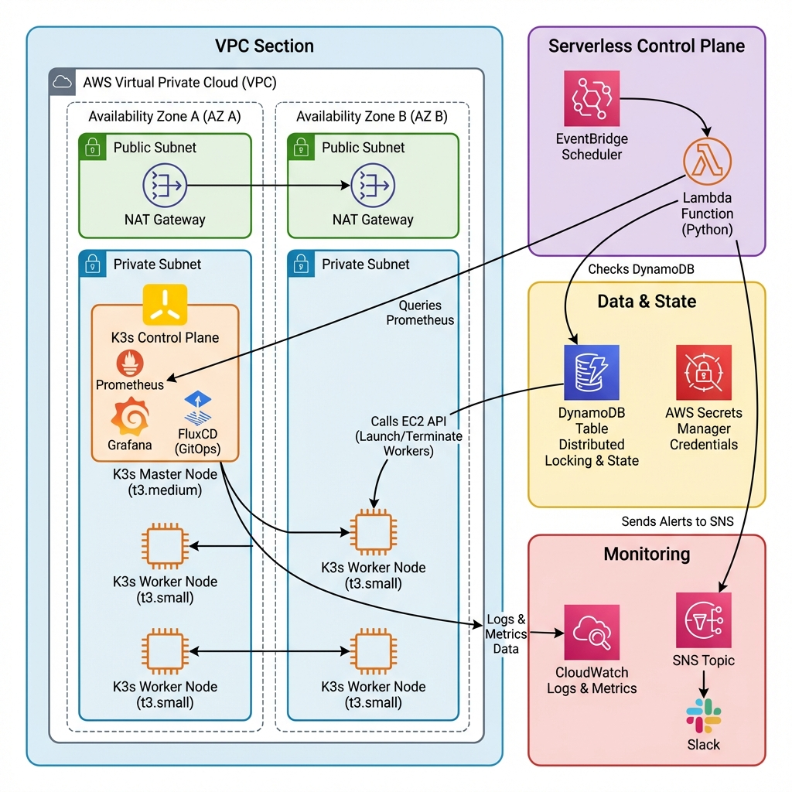
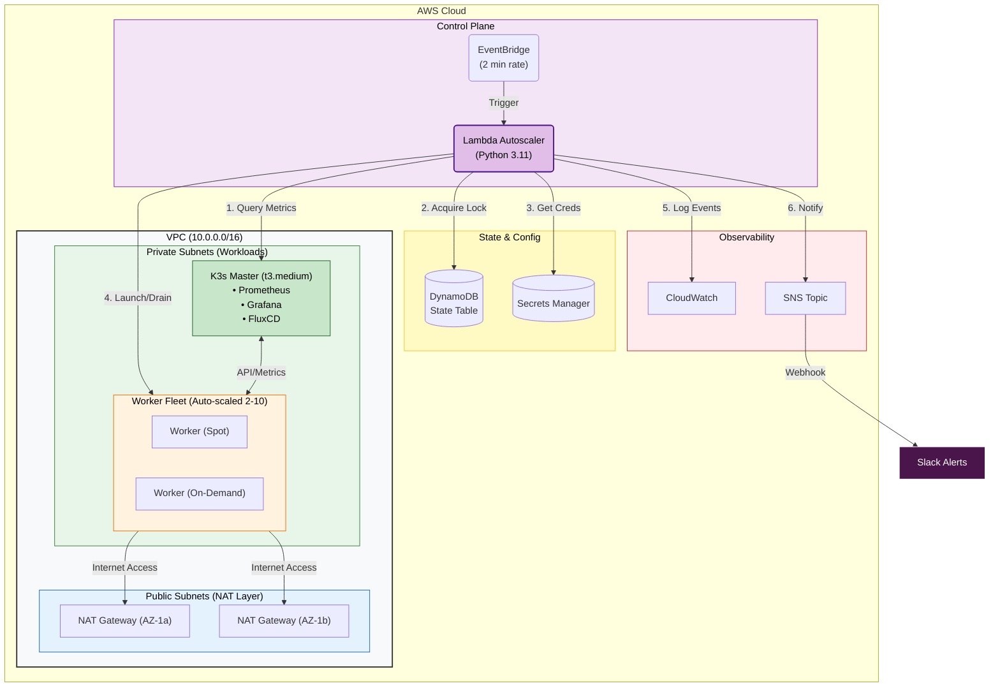
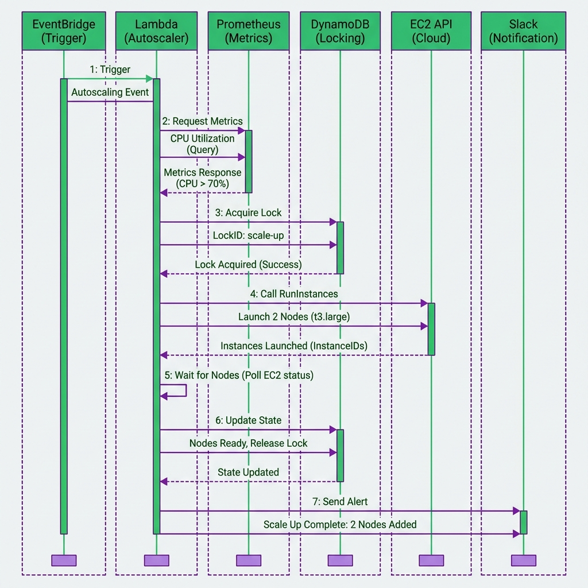
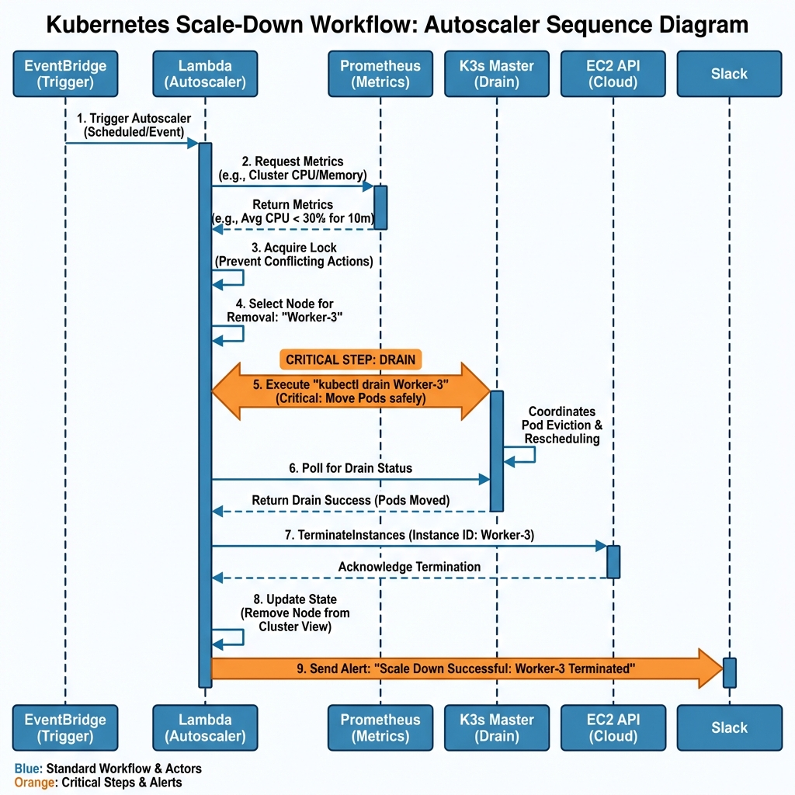

# SmartScale K3s Autoscaler - Detailed Architecture



> **Important: Cluster Topology**
>
> - **Fixed**: 1 master node (never scales, runs in single AZ)
> - **Scalable**: 2-10 worker nodes (autoscaler manages these)
> - **Minimum Cluster**: 1 master + 2 workers = **3 nodes total (always)**
> - **Multi-AZ**: 2 initial workers launch in different AZs for high availability
> - **All node counts in this document refer to WORKER nodes unless explicitly stated**

## Table of Contents

1. [System Overview](#system-overview)
2. [Component Architecture](#component-architecture)
3. [Network Topology](#network-topology)
4. [Data Flow Sequences](#data-flow-sequences)
5. [State Management](#state-management)
6. [Security Architecture](#security-architecture)
7. [High Availability Design](#high-availability-design)

---

## System Overview

SmartScale is a serverless autoscaling system for K3s clusters on AWS that uses event-driven architecture to dynamically adjust cluster capacity based on real-time metrics.

### Architecture Principles

1. **Serverless-First**: Lambda for autoscaling logic eliminates operational overhead
2. **Event-Driven**: EventBridge triggers enable precise timing and cost control
3. **State Management**: DynamoDB provides distributed locking and audit trails
4. **Observable**: Prometheus + Grafana + CloudWatch provide complete visibility
5. **Secure by Default**: No hardcoded credentials, least-privilege IAM, encryption everywhere

### Key Design Decisions

| Decision                         | Rationale                                                                     |
| -------------------------------- | ----------------------------------------------------------------------------- |
| **K3s over EKS**                 | 50% lower resource overhead, full K8s compatibility, free control plane       |
| **Lambda over EC2 cron**         | $0.50/month vs $7/month, auto-scaling, no patching required                   |
| **DynamoDB over RDS**            | Serverless pricing model, built-in distributed locking via conditional writes |
| **Pulumi over Terraform**        | TypeScript type safety, real programming language, better testability         |
| **Prometheus over CloudWatch**   | K8s-native metrics, free, PromQL query power                                  |
| **EventBridge over Lambda cron** | Native AWS integration, easier rate adjustments, no cron expression parsing   |

---

## Component Architecture

### AWS Infrastructure Components



---

## Network Topology

### VPC Design

**CIDR Block**: `10.0.0.0/16` (65,536 IP addresses)

#### Subnet Allocation

| Subnet Type | CIDR         | AZ              | Purpose                          | Route Table |
| ----------- | ------------ | --------------- | -------------------------------- | ----------- |
| Public-1    | 10.0.1.0/24  | ap-southeast-1a | NAT Gateway, Bastion (if needed) | IGW         |
| Public-2    | 10.0.2.0/24  | ap-southeast-1b | NAT Gateway redundancy           | IGW         |
| Private-1   | 10.0.11.0/24 | ap-southeast-1a | K3s Master, Workers              | NAT-1       |
| Private-2   | 10.0.12.0/24 | ap-southeast-1b | Workers (Multi-AZ)               | NAT-2       |

#### Security Group Rules

**sg-master (K3s Master Node)**

| Direction | Protocol | Port Range | Source               | Purpose         |
| --------- | -------- | ---------- | -------------------- | --------------- |
| Inbound   | TCP      | 6443       | sg-worker            | K3s API Server  |
| Inbound   | TCP      | 30090      | sg-lambda, 0.0.0.0/0 | Prometheus API  |
| Inbound   | TCP      | 30030      | 0.0.0.0/0            | Grafana UI      |
| Inbound   | TCP      | 22         | 0.0.0.0/0            | SSH Admin       |
| Outbound  | All      | All        | 0.0.0.0/0            | Internet Access |

**sg-worker (K3s Worker Nodes)**

| Direction | Protocol | Port Range | Source    | Purpose           |
| --------- | -------- | ---------- | --------- | ----------------- |
| Inbound   | TCP      | 22         | 0.0.0.0/0 | SSH Admin         |
| Inbound   | All      | All        | sg-master | K3s Control Plane |
| Outbound  | All      | All        | 0.0.0.0/0 | Internet Access   |

**sg-lambda (Lambda Function)**

| Direction | Protocol | Port Range | Source    | Purpose                           |
| --------- | -------- | ---------- | --------- | --------------------------------- |
| Outbound  | TCP      | 30090      | sg-master | Prometheus Queries                |
| Outbound  | TCP      | 443        | 0.0.0.0/0 | AWS APIs (EC2, DynamoDB, Secrets) |

---

## Data Flow Sequences

### Scale-Up Sequence



```
[EventBridge]
    |
    | (Every 2 minutes)
    v
[Lambda: autoscaler.py] --1--> [Query Prometheus]
    |                              http://master:30090/api/v1/query
    |                              Queries: CPU%, Memory%, Pending Pods
    |
    |<--2-- [Metrics Response]
    |       { cpu: 78, memory: 65, pending_pods: 5 }
    |
    |--3--> [DynamoDB: Acquire Lock]
    |       PutItem(condition: scaling_in_progress != true)
    |
    |<--4-- [Lock Acquired]
    |
    |--5--> [Scaling Decision Engine]
    |       Evaluate: CPU > 70% → SCALE UP
    |       Calculate: Add 2 nodes (pending pods urgent)
    |
    |--6--> [EC2: RunInstances]
    |       LaunchTemplate: lt-worker
    |       Count: 2
    |       SubnetIds: [subnet-private-1a, subnet-private-1b]
    |       InstanceMarketOptions: Spot (if available)
    |       UserData: K3s agent join script
    |
    |<--7-- [Instance IDs]
    |       [i-0abc123, i-0def456]
    |
    |--8--> [Poll Node Status]
    |       kubectl get nodes (via SSH to master)
    |       Wait for Ready condition (max 5 min)
    |
    |<--9-- [Nodes Ready]
    |
    |--10-> [DynamoDB: Update State]
    |       current_node_count: 5 → 7
    |       last_scale_time: 2026-01-25T10:30:00Z
    |       last_scale_action: "scale_up"
    |       worker_node_ids: add [i-0abc123, i-0def456]
    |       scaling_in_progress: false (release lock)
    |
    |--11-> [CloudWatch: Publish Metrics]
    |       Namespace: SmartScale
    |       Metrics: CurrentNodeCount=7
    |
    |--12-> [SNS: Send Notification]
    |       Topic: autoscaler-notifications
    |       Message: "🟢 Scale-up: +2 nodes, CPU 78%"
    |
    v
[Slack Webhook] receives formatted message
```

### Scale-Down Sequence



```
[EventBridge]
    |
    | (Every 2 minutes, after 10+ min low CPU)
    v
[Lambda: autoscaler.py] --1--> [Query Prometheus]
    |                              Queries: CPU%, Memory%, Pending Pods
    |
    |<--2-- [Metrics Response]
    |       { cpu: 25, memory: 40, pending_pods: 0 }
    |
    |--3--> [DynamoDB: Acquire Lock]
    |
    |<--4-- [Lock Acquired]
    |
    |--5--> [Scaling Decision Engine]
    |       Evaluate: CPU < 30% AND no pending pods → SCALE DOWN
    |       Calculate: Remove 1 node (gradual)
    |       Safety Check: current_nodes (4) > min_nodes (2) ✓
    |
    |--6--> [Select Node to Remove]
    |       Strategy: Least-utilized, maintain AZ balance
    |       Selected: i-0def456 (AZ: 1b, CPU 15%)
    |
    |--7--> [kubectl drain i-0def456]
    |       SSH to master: kubectl drain i-0def456 \
    |         --ignore-daemonsets \
    |         --delete-emptydir-data \
    |         --timeout=5m
    |
    |<--8-- [Drain Complete]
    |       All pods migrated to other nodes
    |
    |--9--> [EC2: TerminateInstances]
    |       InstanceIds: [i-0def456]
    |
    |<--10- [Termination Initiated]
    |
    |--11-> [DynamoDB: Update State]
    |       current_node_count: 4 → 3
    |       last_scale_time: 2026-01-25T10:45:00Z
    |       last_scale_action: "scale_down"
    |       worker_node_ids: remove i-0def456
    |       scaling_in_progress: false
    |
    |--12-> [SNS: Notify]
    |       "🔵 Scale-down: -1 node, CPU 25%"
    |
    v
[Slack]
```

---

## State Management

### DynamoDB State Schema

**Table: node-fleet-dev-state**

```json
{
  "cluster_id": "node-fleet-cluster",
  "current_node_count": 5,
  "last_scale_time": "2026-01-25T10:30:00Z",
  "last_scale_action": "scale_up",
  "scaling_in_progress": false,
  "lock_acquired_at": "2026-01-25T10:28:00Z",
  "worker_node_ids": [
    "i-0abc123",
    "i-0def456",
    "i-0ghi789",
    "i-0jkl012",
    "i-0mno345"
  ],
  "last_updated": "2026-01-25T10:30:15Z",
  "config": {
    "min_nodes": 2,
    "max_nodes": 10,
    "scale_up_cooldown": 300,
    "scale_down_cooldown": 600,
    "spot_percentage": 70
  }
}
```

### Distributed Lock Mechanism

**Problem**: Multiple Lambda invocations (if EventBridge misfires or manual trigger) could cause race conditions.

**Solution**: DynamoDB conditional writes with TTL-based lock expiry.

**Lock Acquisition**:

```python
# state_manager.py
def acquire_lock(cluster_id, timeout=300):
    try:
        response = dynamodb.update_item(
            TableName='node-fleet-dev-state',
            Key={'cluster_id': cluster_id},
            UpdateExpression='SET scaling_in_progress = :true, lock_acquired_at = :now',
            ConditionExpression='attribute_not_exists(scaling_in_progress) OR scaling_in_progress = :false',
            ExpressionAttributeValues={
                ':true': True,
                ':false': False,
                ':now': datetime.utcnow().isoformat()
            },
            ReturnValues='ALL_NEW'
        )
        return True
    except ClientError as e:
        if e.response['Error']['Code'] == 'ConditionalCheckFailedException':
            # Lock already held, check if expired
            state = get_state(cluster_id)
            lock_age = (datetime.utcnow() - parse_iso(state['lock_acquired_at'])).seconds
            if lock_age > timeout:
                # Force release expired lock
                release_lock(cluster_id, force=True)
                return acquire_lock(cluster_id, timeout)
            return False
        raise
```

**Lock Release**:

```python
def release_lock(cluster_id, force=False):
    dynamodb.update_item(
        TableName='node-fleet-dev-state',
        Key={'cluster_id': cluster_id},
        UpdateExpression='SET scaling_in_progress = :false REMOVE lock_acquired_at',
        ExpressionAttributeValues={':false': False}
    )
```

---

## Advanced Lambda Modules

### 1. Predictive Scaling Module (`predictive_scaling.py`)

**Purpose**: Analyze historical patterns and proactively scale before predicted load spikes.

**Architecture**:

```
DynamoDB Metrics History Table (30-day TTL)
    ↓
[Hour-of-Day Pattern Analysis] → Predict next hour load
    ↓
[Proactive Scale Decision] → Scale 10 minutes before spike
```

**Key Methods**:

```python
def store_metrics(cluster_id, cpu, memory, timestamp):
    """Store metrics in DynamoDB with 30-day TTL for historical analysis"""
    dynamodb.put_item(
        TableName='node-fleet-metrics-history',
        Item={
            'cluster_id': cluster_id,
            'timestamp': timestamp,
            'cpu_percent': cpu,
            'memory_percent': memory,
            'ttl': int(timestamp + 2592000)  # 30 days
        }
    )

def predict_next_hour_load(cluster_id):
    """Analyze 7-day hourof-day patterns"""
    metrics = get_historical_metrics(cluster_id, days=7)
    current_hour = datetime.utcnow().hour

    # Group by hour-of-day
    hourly_patterns = defaultdict(list)
    for metric in metrics:
        hour = parse_iso(metric['timestamp']).hour
        hourly_patterns[hour].append(metric['cpu_percent'])

    # Calculate average for current hour in past 7 days
    predicted_cpu = sum(hourly_patterns[current_hour]) / len(hourly_patterns[current_hour])
    return predicted_cpu

def should_proactive_scale_up(cluster_id, current_cpu):
    """Check if proactive scaling is needed"""
    predicted_cpu = predict_next_hour_load(cluster_id)

    # Scale up 10 minutes before predicted spike (at minute 50)
    current_minute = datetime.utcnow().minute
    if current_minute >= 50 and predicted_cpu > 70 and current_cpu < 60:
        return True, predicted_cpu
    return False, None
```

**Integration Point**: Called from `autoscaler.py` main handler at minute 50+ of each hour.

---

### 2. Cost Optimizer Module (`cost_optimizer.py`)

**Purpose**: Automated weekly cost analysis with actionable recommendations.

**Architecture**:

```
[Weekly Trigger] → Analyze 7-day metrics
    ↓
[4 Analysis Functions]:
  - check_underutilization()
  - check_spot_usage()
  - check_instance_rightsizing()
  - check_idle_patterns()
    ↓
[Generate Recommendations] → Slack report
```

**Analysis Types**:

```python
def _check_underutilization(avg_cpu, avg_memory):
    """Detect consistent low resource usage"""
    if avg_cpu < 30 and avg_memory < 40:
        return {
            "type": "underutilization",
            "severity": "medium",
            "message": f"Cluster averaging {avg_cpu:.1f}% CPU, {avg_memory:.1f}% memory",
            "action": "Reduce minimum nodes or increase application load",
            "savings_percent": 15.0
        }
    return None

def _check_spot_usage(current_spot_percent, target_spot_percent=70):
    """Verify Spot instance usage meets target"""
    if current_spot_percent < target_spot_percent - 10:
        savings = (target_spot_percent - current_spot_percent) * 0.6
        return {
            "type": "spot_usage",
            "severity": "high",
            "message": f"Only {current_spot_percent}% Spot instances (target: {target_spot_percent}%)",
            "action": f"Increase SPOT_PERCENTAGE to {target_spot_percent}%",
            "savings_percent": savings
        }
    return None

def _check_instance_rightsizing(current_instance_type, avg_cpu, avg_memory):
    """Suggest smaller instance types if resources unused"""
    if current_instance_type == "t3.medium" and avg_cpu < 25 and avg_memory < 35:
        return {
            "type": "rightsizing",
            "severity": "medium",
            "message": f"t3.medium oversized for {avg_cpu:.1f}% CPU usage",
            "action": "Consider switching to t3.small",
            "savings_percent": 50.0  # t3.small is 50% cheaper
        }
    return None
```

**Integration Point**: Runs every Sunday at 12:00 UTC (configured in `autoscaler.py` lines 290-310).

---

### 3. Custom Metrics Module (`custom_metrics.py`)

**Purpose**: Application-level scaling triggers beyond CPU/memory.

**Architecture**:

```
[Prometheus PromQL Queries] → Get app metrics
    ↓
[Evaluate Thresholds]:
  - Queue depth > 100
  - API p95 latency > 500ms
  - Request rate > 1000 req/s
    ↓
[Return scale_needed boolean + reasons]
```

**Supported Metrics**:

```python
def get_queue_depth(queue_name: str = "default"):
    """Query application queue depth from Prometheus"""
    query = f'app_queue_depth{{queue="{queue_name}"}}'
    result = execute_promql(query)
    return int(result[0]['value'][1]) if result else None

def get_api_latency_p95():
    """Get API latency 95th percentile"""
    query = 'histogram_quantile(0.95, rate(http_request_duration_seconds_bucket[5m]))'
    result = execute_promql(query)
    return float(result[0]['value'][1]) * 1000  # Convert to ms

def get_request_rate():
    """Get current request rate"""
    query = 'sum(rate(http_requests_total[1m]))'
    result = execute_promql(query)
    return float(result[0]['value'][1])

def evaluate(thresholds):
    """Evaluate all custom metrics and return scaling decision"""
    reasons = []

    queue_depth = get_queue_depth()
    if queue_depth > thresholds['queue_depth']:
        reasons.append(f"Queue depth: {queue_depth} > {thresholds['queue_depth']}")

    latency = get_api_latency_p95()
    if latency > thresholds['api_latency_p95']:
        reasons.append(f"API p95 latency: {latency:.1f}ms > {thresholds['api_latency_p95']}ms")

    rate = get_request_rate()
    if rate > thresholds['request_rate']:
        reasons.append(f"Request rate: {rate:.1f} req/s > {thresholds['request_rate']}")

    return len(reasons) > 0, reasons
```

**Integration Point**: Called from `scaling_decision.py` evaluate() method after CPU/memory checks.

---

### 4. Multi-AZ Helper Module (`multi_az_helper.py`)

**Purpose**: Balance worker distribution across availability zones.

**Architecture**:

```
[Get Existing Instances] → Count per AZ
    ↓
[Select Least-Filled AZ] → Return subnet_id
```

**Key Logic**:

```python
def select_subnet_for_new_instance(existing_instances, available_subnets):
    """
    Smart subnet selection for AZ load balancing

    Example: If AZ-a has 3 workers and AZ-b has 2, select AZ-b
    """
    subnet_counts = {subnet_id: 0 for subnet_id in available_subnets}

    for instance in existing_instances:
        subnet_id = instance.get('SubnetId')
        if subnet_id in subnet_counts:
            subnet_counts[subnet_id] += 1

    # Return subnet with fewest instances
    return min(subnet_counts, key=subnet_counts.get)
```

**Integration Point**: Called from `ec2_manager.py` launch_instances() method.

---

### 5. Spot Instance Helper Module (`spot_instance_helper.py`)

**Purpose**: Maintain 70/30 Spot/On-Demand ratio dynamically.

**Architecture**:

```
[Current Mix] → Calculate ideal Spot/On-Demand split
    ↓
[Prioritize Spot] → Add Spot first, On-Demand as fallback
```

**Key Logic**:

```python
def calculate_spot_ondemand_mix(current_nodes, desired_nodes,
                                existing_spot_count, existing_ondemand_count):
    """
    Maintain target 70/30 Spot/On-Demand ratio

    Example: If scaling from 4 to 6 nodes with current mix of 2 Spot + 2 On-Demand:
      - Target: 4.2 Spot (70% of 6) → Add 2 Spot, 0 On-Demand
    """
    target_spot_ratio = 0.70
    nodes_to_add = desired_nodes - current_nodes

    ideal_total_spot = int(desired_nodes * target_spot_ratio)
    ideal_total_ondemand = desired_nodes - ideal_total_spot

    spot_to_add = max(0, ideal_total_spot - existing_spot_count)
    ondemand_to_add = max(0, ideal_total_ondemand - existing_ondemand_count)

    # Ensure we don't exceed desired total
    if spot_to_add + ondemand_to_add > nodes_to_add:
        spot_to_add = min(spot_to_add, nodes_to_add)
        ondemand_to_add = nodes_to_add - spot_to_add

    return {'spot': spot_to_add, 'ondemand': ondemand_to_add}
```

**Integration Point**: Called from `ec2_manager.py` before launching instances.

---

### 6. Audit Logger Module (`audit_logger.py`)

**Purpose**: Comprehensive event logging for compliance and debugging.

**Log Schema**:

```json
{
  "timestamp": "2026-01-25T10:30:15Z",
  "event_type": "scale_up",
  "cluster_id": "node-fleet-cluster",
  "user": "lambda:autoscaler",
  "details": {
    "reason": "CPU threshold exceeded (82.5% > 70%)",
    "nodes_added": 2,
    "new_total": 5,
    "instance_ids": ["i-0abc123", "i-0def456"],
    "metrics": { "cpu": 82.5, "memory": 65.3 }
  }
}
```

**Integration Point**: Called from `autoscaler.py` after every scaling action.

---

### 7. Dynamic Scheduler Module (`dynamic_scheduler.py`)

**Purpose**: Time-aware threshold adjustments for predictable traffic patterns.

**Architecture**:

```
[Get Current Hour] → Map to traffic tier
    ↓
[Adjust Thresholds]:
  - Peak hours (9 AM - 9 PM): Lower thresholds → faster scale-up
  - Off-peak (9 PM - 9 AM): Higher thresholds → reduce cost
```

**Key Logic**:

```python
def get_time_aware_thresholds(current_hour):
    """
    Adjust scaling thresholds based on time of day

    Peak hours: More aggressive scaling (lower CPU threshold)
    Off-peak: More conservative (higher threshold)
    """
    if 9 <= current_hour < 21:  # 9 AM - 9 PM
        return {
            "cpu_scale_up": 65.0,  # vs 70.0 default
            "cpu_scale_down": 35.0,  # vs 30.0 default
            "memory_scale_up": 70.0
        }
    else:  # 9 PM - 9 AM
        return {
            "cpu_scale_up": 75.0,  # Higher threshold to avoid over-scaling
            "cpu_scale_down": 25.0,
            "memory_scale_up": 75.0
        }
```

**Integration Point**: Called from `scaling_decision.py` before threshold evaluation.

---

## Production Infrastructure Components

### Monitoring Stack

#### Prometheus Deployment

**Components**:

- **Prometheus Server**: Port 30090 (NodePort for Lambda access)
- **Node Exporter**: Per-node metrics (CPU, memory, disk, network)
- **Kube-State-Metrics**: K8s object metrics (pods, deployments, nodes)
- **Cost Exporter**: Custom AWS cost tracking (`monitoring/cost_exporter.py`)

**Key Metrics Exported**:

```python
# Cost Exporter Metrics
aws_ec2_instance_cost_per_hour{instance_id, instance_type, lifecycle, az}
aws_cluster_total_cost_hourly{cluster}
aws_cluster_total_cost_monthly{cluster}
aws_cost_by_lifecycle{lifecycle}  # spot vs on-demand
aws_potential_savings_hourly{optimization_type}
```

**Deployment**: Managed by GitOps (`gitops/infrastructure/prometheus-deployment.yaml`)

---

#### Grafana Dashboards

**Three Pre-Built Dashboards** (`monitoring/grafana-dashboards/`):

1. **cluster-overview.json**:
   - Real-time CPU/Memory gauges
   - Node count timeline with scale events
   - Per-node resource table
   - Network I/O and disk usage graphs

2. **autoscaler-performance.json**:
   - Scaling events timeline (scale-up/down annotations)
   - Trigger breakdown (CPU/Memory/Pending/Custom/Predictive)
   - Node join latency histogram
   - Lambda execution time
   - Predictive accuracy graph

3. **cost-tracking.json** [BONUS]:
   - Hourly/daily/monthly cost trends
   - Spot vs On-Demand mix (pie chart)
   - Cost per instance type (bar chart)
   - Savings percentage vs all On-Demand
   - Budget status and optimization alerts

**Access**: Port 30030 (NodePort), default credentials in Secrets Manager

---

### GitOps with FluxCD

**Purpose**: Declarative, Git-driven Kubernetes deployment management

**Architecture**:

```
[Git Repository: gitops/] → [FluxCD polls every 1 min] → [Auto-apply to K3s]
```

**Directory Structure**:

```
gitops/
├── clusters/production/     # Cluster-specific kustomizations
│   ├── apps.yaml            # Application deployments
│   ├── infrastructure.yaml  # Prometheus, Grafana
│   ├── monitoring.yaml      # Exporters, alerts
│   └── image-automation.yaml
├── apps/demo-app/           # Demo Flask application
│   ├── deployment.yaml
│   ├── service.yaml
│   └── kustomization.yaml
├── infrastructure/          # Core infrastructure
│   ├── prometheus-deployment.yaml
│   ├── prometheus-basic-auth.yaml
│   └── grafana.yaml
└── monitoring/              # Monitoring components
    ├── node-exporter.yaml
    ├── kube-state-metrics.yaml
    ├── alerts.yaml
    └── cost-exporter.yaml
```

**Management Scripts** (`gitops/`):

- `install-flux.sh`: Bootstrap FluxCD to cluster
- `check-status.sh`: Verify FluxCD health
- `reconcile.sh`: Force immediate sync
- `uninstall-flux.sh`: Remove FluxCD

**Key Features**:

- ✅ Auto-sync every 1 minute from Git
- ✅ Rollback via `git revert` (FluxCD auto-reverts cluster)
- ✅ Complete audit trail in Git history
- ✅ Dependency management (infra before apps)
- ✅ Image automation (auto-update on new tags)

---

### Deployment Automation

**Scripts Location**: `scripts/` directory

#### deploy-cluster.sh

One-command full cluster deployment:

```bash
cd pulumi && pulumi up --yes
# Extract master IP, wait for cluster ready
# Deploy FluxCD, monitoring stack
```

#### deploy_monitoring.sh

Deploy Prometheus + Grafana + Cost Exporter:

```bash
kubectl apply -f monitoring/prometheus/
kubectl apply -f monitoring/cost-exporter-deployment.yaml
kubectl wait --for=condition=ready pod -l app=prometheus
```

#### verify-autoscaler-requirements.sh

Comprehensive Lambda compliance check:

- ✅ Runtime (Python 3.11)
- ✅ Timeout (60s), Memory (256MB)
- ✅ VPC attachment
- ✅ Environment variables
- ✅ IAM permissions
- ✅ EventBridge trigger (2 min)
- ✅ DynamoDB tables exist
- ✅ Secrets Manager secrets present

**Output**: Pass/Fail report with detailed diagnostics

#### configure-grafana.sh

Auto-configure Grafana data source and import 3 dashboards

---

## Security Architecture

### Secrets Management

**AWS Secrets Manager Secrets**:

1. **node-fleet/k3s-token**
   - Value: K3s join token from master node (`/var/lib/rancher/k3s/server/node-token`)
   - Encryption: AWS-managed KMS key
   - Access: EC2 worker instance profile, Lambda role

2. **node-fleet/slack-webhook**
   - Value: `https://hooks.slack.com/services/T.../B.../...`
   - Encryption: AWS-managed KMS key
   - Access: Lambda role (for SNS → Slack notifier)

### IAM Roles & Policies

**Lambda Execution Role** (`node-fleet-lambda-autoscaler-role`):

```json
{
  "Version": "2012-10-17",
  "Statement": [
    {
      "Effect": "Allow",
      "Action": [
        "ec2:RunInstances",
        "ec2:TerminateInstances",
        "ec2:DescribeInstances",
        "ec2:DescribeInstanceStatus",
        "ec2:CreateTags"
      ],
      "Resource": "*",
      "Condition": {
        "StringEquals": {
          "ec2:Region": "ap-southeast-1"
        }
      }
    },
    {
      "Effect": "Allow",
      "Action": [
        "dynamodb:GetItem",
        "dynamodb:PutItem",
        "dynamodb:UpdateItem",
        "dynamodb:Query"
      ],
      "Resource": [
        "arn:aws:dynamodb:ap-southeast-1:*:table/node-fleet-dev-state",
        "arn:aws:dynamodb:ap-southeast-1:*:table/node-fleet-dev-metrics-history"
      ]
    },
    {
      "Effect": "Allow",
      "Action": ["secretsmanager:GetSecretValue"],
      "Resource": [
        "arn:aws:secretsmanager:ap-southeast-1:*:secret:node-fleet/k3s-token-*",
        "arn:aws:secretsmanager:ap-southeast-1:*:secret:node-fleet/slack-webhook-*"
      ]
    },
    {
      "Effect": "Allow",
      "Action": ["sns:Publish"],
      "Resource": "arn:aws:sns:ap-southeast-1:*:autoscaler-notifications"
    },
    {
      "Effect": "Allow",
      "Action": [
        "logs:CreateLogGroup",
        "logs:CreateLogStream",
        "logs:PutLogEvents"
      ],
      "Resource": "arn:aws:logs:ap-southeast-1:*:log-group:/aws/lambda/node-fleet-dev-autoscaler:*"
    },
    {
      "Effect": "Allow",
      "Action": [
        "ec2:CreateNetworkInterface",
        "ec2:DescribeNetworkInterfaces",
        "ec2:DeleteNetworkInterface",
        "ec2:AssignPrivateIpAddresses",
        "ec2:UnassignPrivateIpAddresses"
      ],
      "Resource": "*"
    },
    {
      "Effect": "Allow",
      "Action": ["cloudwatch:PutMetricData"],
      "Resource": "*",
      "Condition": {
        "StringEquals": {
          "cloudwatch:namespace": "SmartScale"
        }
      }
    }
  ]
}
```

**EC2 Master Instance Role** (`node-fleet-master-instance-role`):

```json
{
  "Version": "2012-10-17",
  "Statement": [
    {
      "Effect": "Allow",
      "Action": ["secretsmanager:GetSecretValue"],
      "Resource": "arn:aws:secretsmanager:ap-southeast-1:*:secret:node-fleet/k3s-token-*"
    },
    {
      "Effect": "Allow",
      "Action": [
        "logs:CreateLogGroup",
        "logs:CreateLogStream",
        "logs:PutLogEvents"
      ],
      "Resource": "arn:aws:logs:ap-southeast-1:*:log-group:/aws/ec2/master:*"
    },
    {
      "Effect": "Allow",
      "Action": ["cloudwatch:PutMetricData"],
      "Resource": "*"
    }
  ]
}
```

**EC2 Worker Instance Role** (`node-fleet-worker-instance-role`):

```json
{
  "Version": "2012-10-17",
  "Statement": [
    {
      "Effect": "Allow",
      "Action": ["secretsmanager:GetSecretValue"],
      "Resource": "arn:aws:secretsmanager:ap-southeast-1:*:secret:node-fleet/k3s-token-*"
    },
    {
      "Effect": "Allow",
      "Action": ["ec2:DescribeInstances", "ec2:DescribeTags"],
      "Resource": "*"
    },
    {
      "Effect": "Allow",
      "Action": [
        "logs:CreateLogGroup",
        "logs:CreateLogStream",
        "logs:PutLogEvents"
      ],
      "Resource": "arn:aws:logs:ap-southeast-1:*:log-group:/aws/ec2/worker:*"
    }
  ]
}
```

---

## High Availability Design

### Multi-AZ Worker Distribution

**Strategy**: Maintain balanced worker distribution across 2 availability zones.

**Implementation**:

1. **Scale-Up**: Round-robin subnet selection (Private-1a, Private-1b alternating)
2. **Scale-Down**: Remove node from AZ with highest count
3. **Constraint**: Minimum 1 worker per AZ (if total workers ≥ 2)

**Example Distribution**:

| Total Workers | AZ-1a Workers | AZ-1b Workers |
| ------------- | ------------- | ------------- |
| 2 (minimum)   | 1             | 1             |
| 3             | 2             | 1             |
| 4             | 2             | 2             |
| 5             | 3             | 2             |
| 10 (maximum)  | 5             | 5             |

### Spot Instance Resilience

**Configuration**: 70% Spot, 30% On-Demand

**Interruption Handling**:

1. **EventBridge Rule**: Subscribe to EC2 Spot Interruption Warnings (2-minute notice)
2. **Handler Lambda**: Triggered on interruption warning
   - Cordons node immediately (`kubectl cordon`)
   - Drains pods to other nodes
   - Updates DynamoDB to exclude from scale-down candidates
3. **Replacement**: Next autoscaler cycle launches On-Demand replacement if needed

**Fallback**: If Spot capacity unavailable, Lambda automatically falls back to On-Demand instances.

### Master Node Resilience

**Current State**: Single master node (acceptable for development/testing)

**Production Recommendation**:

- 3-node master HA cluster (K3s embedded etcd)
- External load balancer for API server (AWS NLB)
- Automated master failover (Keepalived + VIP)

---

## Component Interactions

### Lambda → Prometheus

**Connection**: Lambda ENI in private subnet → Master node private IP port 30090

**Query Example**:

```bash
curl -s "http://10.0.11.50:30090/api/v1/query?query=avg(rate(node_cpu_seconds_total{mode!='idle'}[5m]))*100"
```

**Error Handling**:

- Retry 2x with 5-second backoff
- If Prometheus unavailable: Use cached metrics from DynamoDB
- If cache stale (>10 min): Abort scaling, alert to Slack

### Lambda → K3s API (via SSH)

**Why SSH instead of direct API**: K3s API server (port 6443) not exposed to Lambda for security

**Commands Executed**:

```bash
# Get node list
kubectl get nodes -o json

# Drain node before termination
kubectl drain <node-name> --ignore-daemonsets --delete-emptydir-data --timeout=5m

# Check node Ready status
kubectl get node <node-name> -o jsonpath='{.status.conditions[?(@.type=="Ready")].status}'
```

### EC2 UserData → Secrets Manager

**Worker Join Script** (`/var/lib/cloud/instance/user-data.txt`):

```bash
#!/bin/bash
set -e

# Retrieve K3s token from Secrets Manager
TOKEN=$(aws secretsmanager get-secret-value \
  --secret-id node-fleet/k3s-token \
  --region ap-southeast-1 \
  --query SecretString \
  --output text)

# Resolve master IP via EC2 tags
MASTER_IP=$(aws ec2 describe-instances \
  --region ap-southeast-1 \
  --filters "Name=tag:Role,Values=k3s-master" "Name=instance-state-name,Values=running" \
  --query 'Reservations[0].Instances[0].PrivateIpAddress' \
  --output text)

# Install K3s agent
curl -sfL https://get.k3s.io | K3S_URL=https://${MASTER_IP}:6443 K3S_TOKEN=${TOKEN} sh -

# Verify join success
systemctl status k3s-agent
```

---

## Scalability Considerations

### Current Limits

| Resource             | Limit  | Justification                                       |
| -------------------- | ------ | --------------------------------------------------- |
| Max Workers          | 10     | AWS quota limit + cost control                      |
| Min Workers          | 2      | High availability requirement                       |
| Lambda Concurrency   | 1      | DynamoDB lock prevents concurrent scaling           |
| Prometheus Retention | 7 days | Sufficient for troubleshooting + predictive scaling |

### Scaling Beyond 10 Nodes

To support larger clusters:

1. **Request AWS EC2 Quota Increase**: vCPU limit for t3 instances
2. **Multi-Region**: Deploy autoscaler in multiple regions with separate DynamoDB tables
3. **Master HA**: Upgrade to 3-master cluster with external load balancer
4. **Prometheus Federation**: Deploy Prometheus per 20-node group, federate to central instance

---

## Disaster Recovery

### Failure Scenarios & Recovery

| Scenario                      | Impact                            | Recovery                                                       |
| ----------------------------- | --------------------------------- | -------------------------------------------------------------- |
| **Lambda Fails**              | No scaling for 2 min              | EventBridge retriggers next cycle                              |
| **DynamoDB Outage**           | No scaling, uses last known state | Manual intervention via EC2 console                            |
| **Prometheus Down**           | Uses cached metrics (10 min)      | Auto-restarts (K8s deployment), alerts to Slack                |
| **Master Node Failure**       | Cluster unavailable               | Manual: Launch new master, restore from etcd backup            |
| **All Workers Terminated**    | Service down                      | Autoscaler launches MIN_NODES (2) workers within 3 min         |
| **Spot Interruptions (Mass)** | 2-min warning                     | EventBridge triggers drain, autoscaler replaces with On-Demand |

### Backup Strategy

**DynamoDB**: Point-in-time recovery enabled (35-day retention)

**K3s etcd**: Automated backups to S3 every 6 hours (not implemented in current version, production recommendation)

---

## Cost Breakdown

| Component                                        | Monthly Cost (BDT) |
| ------------------------------------------------ | ------------------ |
| EC2 t3.medium Master (24/7)                      | 15,000             |
| EC2 t3.small Workers (avg 4 nodes, 12h/day peak) | 24,000             |
| Spot Discount (70% of workers)                   | -12,000            |
| Lambda (15,000 invocations @ 60s)                | 500                |
| DynamoDB On-Demand                               | 200                |
| NAT Gateway (2 AZs)                              | 8,000              |
| CloudWatch Logs & Metrics                        | 300                |
| Secrets Manager                                  | 200                |
| Data Transfer                                    | 1,000              |
| **Total**                                        | **~60,000 BDT**    |

**Savings vs. Baseline (120,000 BDT)**: **50%** 🎉

---

_For operational runbooks and troubleshooting, see [DEPLOYMENT_GUIDE.md](DEPLOYMENT_GUIDE.md) and [TROUBLESHOOTING.md](TROUBLESHOOTING.md)._
