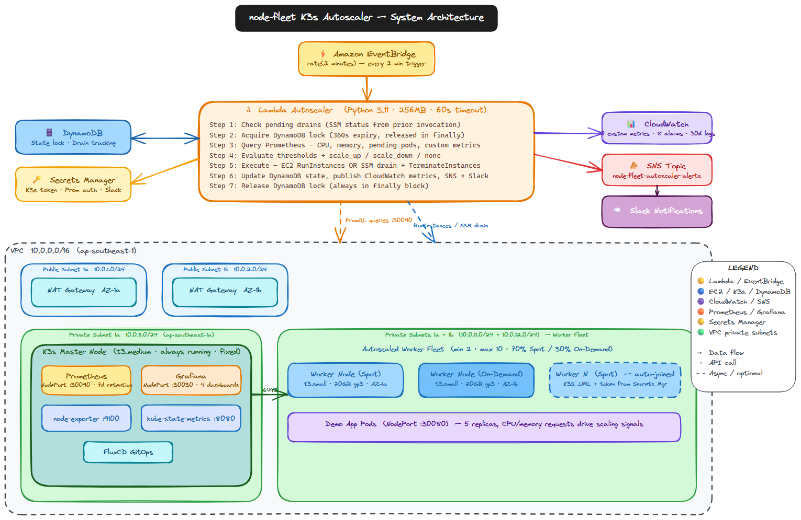

# node-fleet — Deployment Guide

---

## ⚠️ Critical Lessons (Read Before Deploying)

Hard-won from production. Skipping these wastes hours.

1. **Lambda build MUST use Linux wheels** — Building `cryptography`/`paramiko` on Windows creates Windows-native `.so` files that crash on Lambda (Linux). Use `--platform manylinux2014_x86_64`.

2. **Store K3s token BEFORE workers boot** — Workers fetch the join token from Secrets Manager at boot via userdata. If the token isn't there when a worker first boots, it fails silently and never joins the cluster.

3. **Disable EventBridge before debugging Lambda** — If Lambda has a bug (e.g., sees 0 nodes), it fires every 2 minutes and spins up instances. Disable EventBridge immediately when debugging.

4. **Use `static_configs` for Prometheus** — `kubernetes_sd_configs` requires ClusterRole RBAC to list K8s nodes. Without it, all targets show `0/0`. Use `static_configs` with known worker IPs.

5. **Deploy `node-exporter` DaemonSet manually** — Not bundled in K3s. Without it, Prometheus has no CPU/memory metrics.

6. **Use SSM for kubectl, not SSH** — Master has SSM agent. Workers may not. Use `aws ssm send-command` instead of SSH for cluster operations.

7. **EventBridge resets lambda schedule on Lambda code update** — Re-verify EventBridge is enabled after updating Lambda function code.

---

## Prerequisites

### Required Tools

| Tool | Version | Install |
|------|---------|---------|
| AWS CLI | 2.x | `curl "https://awscli.amazonaws.com/awscli-exe-linux-x86_64.zip" -o awscliv2.zip && unzip awscliv2.zip && sudo ./aws/install` |
| Pulumi CLI | 3.x | `curl -fsSL https://get.pulumi.com \| sh` |
| Node.js | 18+ | `curl -fsSL https://deb.nodesource.com/setup_18.x \| sudo -E bash - && sudo apt install -y nodejs` |
| Python | 3.11+ | `sudo apt install python3.11 python3.11-venv` |
| kubectl | 1.28+ | `curl -LO "https://dl.k8s.io/release/$(curl -L -s https://dl.k8s.io/release/stable.txt)/bin/linux/amd64/kubectl" && chmod +x kubectl && sudo mv kubectl /usr/local/bin/` |
| k6 (optional) | latest | `sudo apt-key adv --keyserver hkp://keyserver.ubuntu.com:80 --recv-keys C5AD17C747E3415A && sudo apt install k6` |

### AWS Permissions

Your AWS IAM user/role needs:
- `AdministratorAccess` OR the specific permissions to create: VPC, EC2, Lambda, DynamoDB, Secrets Manager, EventBridge, SNS, CloudWatch, IAM roles, ECR

```bash
aws sts get-caller-identity   # verify credentials work
aws configure list             # verify region = ap-southeast-1
```

---

## Full Deployment (From Zero)



### Step 1 — Clone and Configure

```bash
git clone https://github.com/BayajidAlam/node-fleet.git
cd node-fleet

# Configure AWS region
aws configure set region ap-southeast-1
```

### Step 2 — Deploy AWS Infrastructure (Pulumi)

```bash
cd pulumi
npm install

# Preview changes first — always
pulumi preview

# Deploy (creates VPC, EC2 master, Lambda, DynamoDB, Secrets, SNS, CloudWatch, ECR)
pulumi up --yes

# Get master IP
export MASTER_IP=$(pulumi stack output masterPublicIpAddress)
echo "Master IP: $MASTER_IP"

cd ..
```

### Step 3 — Set Up K3s Master

```bash
# SSH to master
ssh -i node-fleet-key.pem ubuntu@$MASTER_IP

# On master: run setup script
./k3s/master-setup.sh
# This installs: K3s server, Prometheus, basic auth, kube-state-metrics

# Verify K3s running
kubectl get nodes
# NAME          STATUS   ROLES                  AGE   VERSION
# master-node   Ready    control-plane,master   2m    v1.28.x

exit
```

### Step 4 — Store K3s Token (CRITICAL: do BEFORE launching workers)

```bash
# Get token from master
TOKEN=$(ssh -i node-fleet-key.pem ubuntu@$MASTER_IP \
  "sudo cat /var/lib/rancher/k3s/server/node-token")

# Store in Secrets Manager
aws secretsmanager put-secret-value \
  --secret-id node-fleet/k3s-token \
  --secret-string "$TOKEN" \
  --region ap-southeast-1

# Verify
aws secretsmanager get-secret-value \
  --secret-id node-fleet/k3s-token \
  --query SecretString --output text
```

### Step 5 — Deploy Lambda, Monitoring, and GitOps

```bash
# Full deploy: Lambda + monitoring stack + GitOps
./deploy.sh $MASTER_IP

# Or skip infra if already deployed:
./deploy.sh $MASTER_IP --skip-infra
```

The deploy script:
1. Builds Lambda zip (Linux wheels)
2. Updates Lambda function code
3. Creates monitoring namespace + ConfigMaps
4. Deploys Prometheus, Grafana, cost-exporter
5. Applies FluxCD GitOps manifests

### Step 6 — Verify Everything

```bash
# Check K3s nodes (should show master + 2 initial workers)
kubectl get nodes -o wide

# Check Prometheus scraping
curl -u prometheus:<password> http://$MASTER_IP:30090/api/v1/targets | jq '.data.activeTargets[].health'

# Check Lambda
aws lambda invoke --function-name node-fleet-cluster-autoscaler /tmp/out.json
cat /tmp/out.json

# Full verification script
bash scripts/verify-autoscaler-requirements.sh

# Access Grafana
echo "Grafana: http://$MASTER_IP:30030  (admin / check Secrets Manager)"
```

---

## EC2 Worker User Data Script

`k3s/worker-userdata.sh` runs on each new worker at first boot. Idempotent — safe to re-run.

```bash
#!/bin/bash
# No set -e — errors handled manually with retry loops
exec > >(tee /var/log/k3s-worker-setup.log)
exec 2>&1

# 1. Install dependencies
apt-get update -qq && apt-get install -y awscli jq curl

# 2. Fetch K3s token from Secrets Manager (retries 30×, 30s apart = 15 min max)
K3S_TOKEN=""
for i in $(seq 1 30); do
  K3S_TOKEN=$(aws secretsmanager get-secret-value \
    --secret-id node-fleet/k3s-token \
    --region ap-southeast-1 \
    --query SecretString --output text 2>/dev/null || echo "")
  [ -n "$K3S_TOKEN" ] && [ "$K3S_TOKEN" != "null" ] && break
  sleep 30
done
[ -z "$K3S_TOKEN" ] && echo "❌ Token fetch failed" && exit 1

# 3. Resolve master IP via EC2 tag (no hardcoded IPs)
MASTER_IP=""
for i in $(seq 1 20); do
  MASTER_IP=$(aws ec2 describe-instances \
    --region ap-southeast-1 \
    --filters "Name=tag:Role,Values=k3s-master" "Name=instance-state-name,Values=running" \
    --query 'Reservations[0].Instances[0].PrivateIpAddress' \
    --output text 2>/dev/null || echo "")
  [ -n "$MASTER_IP" ] && [ "$MASTER_IP" != "None" ] && break
  sleep 15
done
[ -z "$MASTER_IP" ] && echo "❌ Master not found" && exit 1

# 4. Join K3s cluster (retries 10×, 30s apart)
for i in $(seq 1 10); do
  curl -sfL https://get.k3s.io | \
    K3S_URL=https://${MASTER_IP}:6443 K3S_TOKEN=${K3S_TOKEN} sh - && break
  sleep 30
done

# 5. Verify agent running
systemctl is-active --quiet k3s-agent || { echo "❌ k3s-agent not running"; exit 1; }
echo "✅ Worker joined cluster at $MASTER_IP"
```

**Key design decisions:**
- Token fetched at runtime from Secrets Manager — never in User Data plaintext
- Master IP resolved via `tag:Role=k3s-master` — no hardcoded IP (survives master replacement)
- Retry loops on all steps — handles race condition where Lambda launches worker before master is fully ready
- Full log to `/var/log/k3s-worker-setup.log` for debugging via SSM or CloudWatch

---

## Lambda Build (Manual)

```bash
cd lambda

# Windows-safe build (manylinux wheels for Lambda Linux environment)
pip install \
  --platform manylinux2014_x86_64 \
  --only-binary=:all: \
  --target=. \
  cryptography paramiko

pip install -r requirements.txt --target=. --ignore-installed cryptography paramiko

# Package
zip -r function.zip . \
  --exclude "*.pyc" "__pycache__/*" "venv/*" "tests/*" "*.zip"

# Deploy to Lambda
aws lambda update-function-code \
  --function-name node-fleet-cluster-autoscaler \
  --zip-file fileb://function.zip \
  --region ap-southeast-1

cd ..
```

---

## Day 2 Operations

### Update Lambda Code

```bash
cd lambda
# Edit Python files...
zip -r function.zip . --exclude "*.pyc" "__pycache__/*" "venv/*" "tests/*"
aws lambda update-function-code \
  --function-name node-fleet-cluster-autoscaler \
  --zip-file fileb://function.zip
```

### Rotate Secrets

```bash
# Rotate Prometheus credentials
aws secretsmanager update-secret \
  --secret-id node-fleet/prometheus-auth \
  --secret-string '{"username":"prometheus","password":"<new-password>"}' \
  --region ap-southeast-1

# Update Prometheus web.yml on master with new bcrypt hash
ssh -i node-fleet-key.pem ubuntu@$MASTER_IP
htpasswd -nbB prometheus <new-password>
# → paste hash into /etc/prometheus/web.yml
kubectl rollout restart deployment/prometheus -n monitoring
```

### Add Capacity Manually (Emergency)

```bash
# Temporarily raise MAX_NODES
aws lambda update-function-configuration \
  --function-name node-fleet-cluster-autoscaler \
  --environment "Variables={MAX_NODES=15,...}" \
  --region ap-southeast-1

# Or manually launch a worker using the launch template
TEMPLATE_ID=$(cd pulumi && pulumi stack output workerLaunchTemplateId)
aws ec2 run-instances \
  --launch-template LaunchTemplateId=$TEMPLATE_ID \
  --count 1 \
  --tag-specifications 'ResourceType=instance,Tags=[{Key=Project,Value=node-fleet},{Key=ManagedBy,Value=manual}]' \
  --region ap-southeast-1
```

### Emergency: Disable Autoscaler

```bash
# Disable EventBridge (stops Lambda invocations)
aws events disable-rule \
  --name node-fleet-autoscaler-trigger \
  --region ap-southeast-1

# Re-enable when fixed
aws events enable-rule \
  --name node-fleet-autoscaler-trigger \
  --region ap-southeast-1
```

### Check DynamoDB State

```bash
aws dynamodb get-item \
  --table-name k3s-autoscaler-state \
  --key '{"cluster_id":{"S":"node-fleet-prod"}}' \
  --region ap-southeast-1 | jq .
```

### Manual Lock Release

```bash
# Use only if Lambda crashed and left lock stuck
aws dynamodb update-item \
  --table-name k3s-autoscaler-state \
  --key '{"cluster_id":{"S":"node-fleet-prod"}}' \
  --update-expression 'REMOVE scaling_in_progress, lock_acquired_at, lock_expiry' \
  --region ap-southeast-1
```

### View Lambda Logs

```bash
# Stream live logs
aws logs tail /aws/lambda/node-fleet-cluster-autoscaler --follow

# Last 50 invocations
aws logs get-log-events \
  --log-group-name /aws/lambda/node-fleet-cluster-autoscaler \
  --log-stream-name "$(aws logs describe-log-streams \
    --log-group-name /aws/lambda/node-fleet-cluster-autoscaler \
    --order-by LastEventTime --descending \
    --query 'logStreams[0].logStreamName' --output text)" \
  --limit 100
```

---

## Teardown

```bash
# 1. Disable autoscaler first
aws events disable-rule --name node-fleet-autoscaler-trigger --region ap-southeast-1

# 2. Drain all workers gracefully
for node in $(kubectl get nodes -l 'node-role.kubernetes.io/worker' -o name); do
  kubectl drain $node --ignore-daemonsets --delete-emptydir-data --timeout=5m
done

# 3. Destroy infrastructure (WARNING: destructive)
cd pulumi
pulumi destroy --yes

# 4. Clean up local files
rm -f node-fleet-key.pem lambda/function.zip
```

---

## Rollback Procedures

### Rollback Lambda to Previous Version

```bash
# List versions
aws lambda list-versions-by-function \
  --function-name node-fleet-cluster-autoscaler \
  --query 'Versions[*].[Version,LastModified]' --output table

# Point alias to previous version
aws lambda update-alias \
  --function-name node-fleet-cluster-autoscaler \
  --name live \
  --function-version <previous-version>
```

### Rollback Pulumi Infrastructure

```bash
cd pulumi
# View history
pulumi stack history

# Roll back to specific deployment
pulumi stack import --file <exported-state.json>
```

### Rollback K8s Manifests (GitOps)

```bash
# All K8s manifests are in Git — rollback via git revert
git revert <commit-sha>
git push origin main
# FluxCD auto-applies within 1 minute
```
