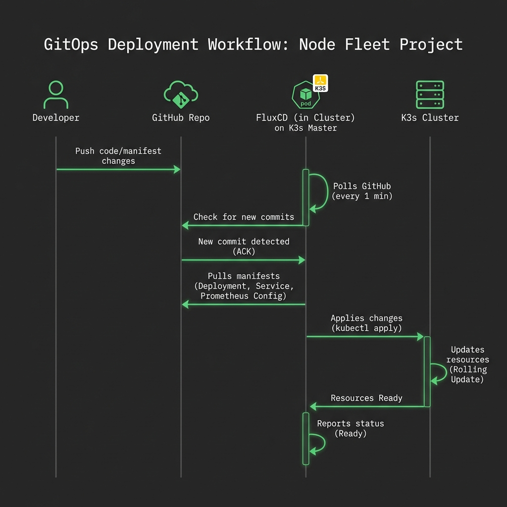

# node-fleet K3s Autoscaler - Deployment Guide



## Table of Contents

1. [Prerequisites](#prerequisites)
2. [Environment Setup](#environment-setup)
3. [Infrastructure Deployment](#infrastructure-deployment)
4. [K3s Cluster Setup](#k3s-cluster-setup)
5. [Verification Steps](#verification-steps)
6. [Post-Deployment Configuration](#post-deployment-configuration)
7. [Troubleshooting](#troubleshooting)
8. [Teardown / Destroy](#teardown--destroy)

---

## ⚠️ Critical Lessons Learned (Read Before Deploying)

These are hard-won lessons from production deployment. Skipping any of these will waste hours.

### 1. Lambda Build MUST Use Linux Platform Wheels

Building `cryptography`/`paramiko` on Windows creates Windows-native C extensions that crash on Lambda (Linux). **Always install Lambda deps with Linux wheels:**

```bash
# Windows-safe Lambda build (run from repo root)
mkdir -p tmp
pip install \
  --platform manylinux2014_x86_64 \
  --only-binary=:all: \
  --target=lambda/ \
  cryptography paramiko
pip install --target=lambda/ -r lambda/requirements.txt --ignore-installed cryptography paramiko
```

### 2. Store K3s Token BEFORE Workers Launch

Workers fetch the join token from Secrets Manager at boot via userdata. If the token is not in Secrets Manager when a worker first boots, **it will fail silently and never join the cluster**. You must store the token immediately after master init, before launching workers.

### 3. Disable EventBridge Before Debugging Lambda

If Lambda has a bug that causes runaway scaling (e.g., seeing 0 nodes), it will fire every 2 minutes and spin up instances that cost money. **Immediately disable EventBridge when debugging:**

```bash
aws events disable-rule --name <eventbridge-rule-name> --region ap-southeast-1
# Re-enable after fix:
aws events enable-rule --name <eventbridge-rule-name> --region ap-southeast-1
```

### 4. Use Prometheus `static_configs`, NOT `kubernetes_sd_configs`

`kubernetes_sd_configs` requires ClusterRole RBAC to list K8s nodes. Without it, all targets show as `0/0` (no scraping). Use `static_configs` with known node IPs instead — simpler and more reliable.

### 5. Deploy `node-exporter` DaemonSet Manually

node-exporter is **not** bundled in K3s. It must be deployed as a DaemonSet after cluster setup. Without it, Prometheus has no CPU/memory metrics.

### 6. Use `count(up{job="node-exporter"})-1` for Node Count

`kube_node_info` requires `kube-state-metrics` to be running. Use `count(up{job="node-exporter"})-1` (subtract 1 for master) — this works with just node-exporter.

### 7. Use SSM for Cluster Management (No SSH Needed)

Master has SSM agent. Use `aws ssm send-command` to run `kubectl` commands from your local machine — no need to SSH. Workers may NOT have SSM; manage them via master.

---

---

## Prerequisites

### Required Tools

| Tool           | Version | Installation Command                                                                                                                                                     |
| -------------- | ------- | ------------------------------------------------------------------------------------------------------------------------------------------------------------------------ |
| **AWS CLI**    | 2.x     | `curl "https://awscli.amazonaws.com/awscli-exe-linux-x86_64.zip" -o "awscliv2.zip" && unzip awscliv2.zip && sudo ./aws/install`                                          |
| **Pulumi CLI** | 3.x     | `curl -fsSL https://get.pulumi.com \| sh`                                                                                                                                |
| **Node.js**    | 18+     | `curl -fsSL https://deb.nodesource.com/setup_18.x \| sudo -E bash - && sudo apt install -y nodejs`                                                                       |
| **kubectl**    | 1.28+   | `curl -LO "https://dl.k8s.io/release/$(curl -L -s https://dl.k8s.io/release/stable.txt)/bin/linux/amd64/kubectl" && chmod +x kubectl && sudo mv kubectl /usr/local/bin/` |
| **Python**     | 3.11+   | `sudo apt install python3.11 python3.11-venv`                                                                                                                            |
| **jq**         | 1.6+    | `sudo apt install jq`                                                                                                                                                    |

### AWS Account Requirements

1. **IAM Permissions**:
   - EC2: Full access (RunInstances, TerminateInstances, DescribeInstances, CreateTags)
   - VPC: Full access (CreateVpc, CreateSubnet, CreateSecurityGroup, etc.)
   - Lambda: Full access (CreateFunction, UpdateFunctionCode, etc.)
   - DynamoDB: Full access (CreateTable, PutItem, GetItem, UpdateItem)
   - Secrets Manager: Full access (CreateSecret, GetSecretValue)
   - SNS: Publish, CreateTopic
   - CloudWatch: PutMetricData, CreateLogGroup
   - IAM: CreateRole, AttachRolePolicy

2. **Service Quotas**:
   - EC2 vCPU limit: At least 20 vCPUs for t3 instances
   - VPC limit: 1 VPC available
   - Elastic IPs: 2 available (for NAT Gateways)

3. **AWS CLI Configuration**:

```bash
aws configure
# AWS Access Key ID: <your-access-key>
# AWS Secret Access Key: <your-secret-key>
# Default region name: ap-southeast-1
# Default output format: json
```

### Local Machine Setup

**Recommended Specs**:

- OS: Ubuntu 20.04+ or macOS 12+
- RAM: 4GB minimum
- Disk: 10GB free space

---

## Environment Setup

### 1. Clone Repository

```bash
git clone https://github.com/BayajidAlam/node-fleet.git
cd node-fleet
```

### 2. Install Dependencies

#### Pulumi Dependencies

```bash
cd pulumi
npm install
cd ..
```

#### Lambda Dependencies — Linux Platform Wheels Required

> ⚠️ **CRITICAL**: If building on Windows, you MUST use `--platform manylinux2014_x86_64` for packages with C extensions (`cryptography`, `paramiko`). Windows-native wheels will crash on Lambda (Linux).

```bash
# Step 1: Install Linux-compatible platform wheels for C-extension packages
pip install \
  --platform manylinux2014_x86_64 \
  --only-binary=:all: \
  --target=lambda/ \
  cryptography paramiko

# Step 2: Install remaining dependencies (skip already-installed packages)
pip install \
  --target=lambda/ \
  --ignore-installed cryptography paramiko \
  -r lambda/requirements.txt

# Step 3: Package Lambda zip (exclude dev files)
mkdir -p tmp
cd lambda
zip -r ../tmp/lambda-deployment.zip . \
  --exclude "*.pyc" \
  --exclude "__pycache__/*" \
  --exclude ".venv/*" \
  --exclude "venv/*" \
  --exclude "tests/*" \
  --exclude "*.zip"
cd ..

# Step 4: Upload to S3 and update Lambda function code
BUCKET=$(aws s3 ls | grep node-fleet | awk '{print $3}')
aws s3 cp tmp/lambda-deployment.zip s3://$BUCKET/lambda-deployment.zip --region ap-southeast-1

FUNCTION=$(aws lambda list-functions --region ap-southeast-1 --query "Functions[?contains(FunctionName,'autoscaler')].FunctionName" --output text)
S3_VERSION=$(aws s3api head-object --bucket $BUCKET --key lambda-deployment.zip --region ap-southeast-1 --query VersionId --output text)
aws lambda update-function-code \
  --function-name $FUNCTION \
  --s3-bucket $BUCKET \
  --s3-key lambda-deployment.zip \
  --region ap-southeast-1
```

### 3. Configure Pulumi Stack

```bash
cd pulumi

# Login to Pulumi (choose local or cloud backend)
pulumi login --local  # OR pulumi login (for cloud backend)

# Initialize stack
pulumi stack init dev

# Set AWS region
pulumi config set aws:region ap-southeast-1

# Set cluster configuration
pulumi config set node-fleet:clusterName node-fleet-cluster
pulumi config set node-fleet:minNodes 2
pulumi config set node-fleet:maxNodes 10
pulumi config set node-fleet:spotPercentage 70

# Set SSH key name (create one in AWS Console first)
pulumi config set node-fleet:sshKeyName node-fleet-key

# Review configuration
pulumi config
```

---

## Infrastructure Deployment

### Step 1: Preview Infrastructure Changes

```bash
cd pulumi
pulumi preview
```

**Expected Output**:

```
Previewing update (dev)

     Type                              Name                           Plan
 +   pulumi:pulumi:Stack               node-fleet-dev                 create
 +   ├─ aws:ec2:Vpc                    main-vpc                       create
 +   ├─ aws:ec2:InternetGateway        internet-gateway               create
 +   ├─ aws:ec2:Subnet                 public-subnet-1a               create
 +   ├─ aws:ec2:Subnet                 public-subnet-1b               create
 +   ├─ aws:ec2:Subnet                 private-subnet-1a              create
 +   ├─ aws:ec2:Subnet                 private-subnet-1b              create
 +   ├─ aws:ec2:NatGateway             nat-gateway-1a                 create
 +   ├─ aws:ec2:NatGateway             nat-gateway-1b                 create
 +   ├─ aws:dynamodb:Table             state-table                    create
 +   ├─ aws:dynamodb:Table             metrics-history-table          create
 +   ├─ aws:secretsmanager:Secret      k3s-token                      create
 +   ├─ aws:secretsmanager:Secret      slack-webhook                  create
 +   ├─ aws:sns:Topic                  autoscaler-notifications       create
 +   ├─ aws:iam:Role                   lambda-role                    create
 +   ├─ aws:iam:Role                   master-instance-role           create
 +   ├─ aws:iam:Role                   worker-instance-role           create
 +   ├─ aws:ec2:SecurityGroup          master-sg                      create
 +   ├─ aws:ec2:SecurityGroup          worker-sg                      create
 +   ├─ aws:ec2:SecurityGroup          lambda-sg                      create
 +   ├─ aws:ec2:LaunchTemplate         master-launch-template         create
 +   ├─ aws:ec2:LaunchTemplate         worker-launch-template         create
 +   ├─ aws:ec2:Instance               k3s-master                     create
 +   ├─ aws:lambda:Function            autoscaler                     create
 +   └─ aws:cloudwatch:EventRule       autoscaler-schedule            create

Resources:
    + 82 to create
```

### Step 2: Deploy Infrastructure

```bash
pulumi up --yes
```

**Deployment Time**: 10-15 minutes

**Critical Outputs** (save these):

```bash
# After deployment, save outputs
pulumi stack output masterPublicIpAddress > ../master-ip.txt
pulumi stack output masterPrivateIpAddress > ../master-private-ip.txt
pulumi stack output vpcId > ../vpc-id.txt
pulumi stack output autoscalerFunctionName > ../lambda-function-name.txt

# View all outputs
pulumi stack output --json | jq '.'
```

### Step 3: Configure Secrets

#### Set K3s Join Token (after master setup)

```bash
# This will be done after master is initialized
# See "K3s Cluster Setup" section below
```

#### Set Slack Webhook URL

```bash
aws secretsmanager update-secret \
  --secret-id node-fleet/slack-webhook \
  --secret-string "https://hooks.slack.com/services/YOUR/WEBHOOK/URL" \
  --region ap-southeast-1
```

---

## K3s Cluster Setup

### Step 1: Connect to Master Node

```bash
export MASTER_IP=$(cat master-ip.txt)
ssh -i ~/.ssh/node-fleet-key.pem ubuntu@$MASTER_IP
```

### Step 2: Initialize K3s Master

The master setup script is automatically executed via UserData during instance launch. Verify it completed successfully:

```bash
# Check K3s installation
sudo systemctl status k3s

# Expected output: active (running)

# Verify node is Ready
sudo kubectl get nodes

# Expected output:
# NAME           STATUS   ROLES                  AGE   VERSION
# ip-10-0-11-x   Ready    control-plane,master   5m    v1.28.x+k3s1
```

If K3s is not installed, manually run:

```bash
curl -sfL https://get.k3s.io | sh -s - server \
  --disable traefik \
  --write-kubeconfig-mode 644 \
  --node-name master
```

### Step 3: Store K3s Token in Secrets Manager

> ⚠️ **CRITICAL**: Do this IMMEDIATELY after master is running, BEFORE launching workers. Workers fetch the token at boot — if it's missing, they silently fail to join.

```bash
# Option A: Via SSM (recommended — no SSH needed)
aws ssm send-command \
  --instance-ids <MASTER_INSTANCE_ID> \
  --document-name AWS-RunShellScript \
  --parameters 'commands=["TOKEN=$(cat /var/lib/rancher/k3s/server/node-token) && aws secretsmanager update-secret --secret-id node-fleet/k3s-token --secret-string \"$TOKEN\" --region ap-southeast-1 || aws secretsmanager create-secret --name node-fleet/k3s-token --secret-string \"$TOKEN\" --region ap-southeast-1"]' \
  --region ap-southeast-1

# Option B: Via SSH
ssh -i node-fleet-key.pem ubuntu@$MASTER_IP \
  "K3S_TOKEN=\$(sudo cat /var/lib/rancher/k3s/server/node-token) && \
   aws secretsmanager update-secret --secret-id node-fleet/k3s-token --secret-string \"\$K3S_TOKEN\" --region ap-southeast-1"
```

### Step 4: Deploy Prometheus + node-exporter

> ⚠️ node-exporter is NOT included in K3s. You must deploy it as a DaemonSet or Prometheus will have no metrics.

```bash
# Apply all monitoring manifests via SSM (no SSH needed)
MASTER_ID=<MASTER_INSTANCE_ID>

aws ssm send-command \
  --instance-ids $MASTER_ID \
  --document-name AWS-RunShellScript \
  --parameters 'commands=[
    "kubectl apply -f /home/ubuntu/k3s/prometheus-namespace.yaml",
    "kubectl apply -f /home/ubuntu/k3s/prometheus-configmap.yaml",
    "kubectl apply -f /home/ubuntu/k3s/prometheus-deployment.yaml",
    "kubectl apply -f /home/ubuntu/k3s/prometheus-service.yaml"
  ]' \
  --region ap-southeast-1

# Deploy node-exporter DaemonSet (REQUIRED for CPU/memory metrics)
aws ssm send-command \
  --instance-ids $MASTER_ID \
  --document-name AWS-RunShellScript \
  --parameters commands=["kubectl apply -f - <<'EOF'\napiVersion: apps/v1\nkind: DaemonSet\nmetadata:\n  name: node-exporter\n  namespace: monitoring\nspec:\n  selector:\n    matchLabels:\n      app: node-exporter\n  template:\n    metadata:\n      labels:\n        app: node-exporter\n    spec:\n      hostNetwork: true\n      hostPID: true\n      containers:\n      - name: node-exporter\n        image: prom/node-exporter:latest\n        ports:\n        - containerPort: 9100\n          hostPort: 9100\n        securityContext:\n          privileged: true\n        args:\n        - --path.rootfs=/host\n        volumeMounts:\n        - name: root\n          mountPath: /host\n          readOnly: true\n      volumes:\n      - name: root\n        hostPath:\n          path: /\nEOF"] \
  --region ap-southeast-1
```

**Prometheus ConfigMap — Use `static_configs` (NOT `kubernetes_sd_configs`):**

`kubernetes_sd_configs` requires ClusterRole RBAC and will produce 0 targets without it. Safer approach with static IPs:

```yaml
scrape_configs:
  - job_name: "node-exporter"
    static_configs:
      - targets:
          - "10.0.1.X:9100"   # master private IP
          - "10.0.1.Y:9100"   # worker 1 private IP
          - "10.0.1.Z:9100"   # worker 2 private IP
```

After updating the ConfigMap, restart Prometheus:

```bash
aws ssm send-command \
  --instance-ids $MASTER_ID \
  --document-name AWS-RunShellScript \
  --parameters 'commands=["kubectl rollout restart deployment/prometheus -n monitoring"]' \
  --region ap-southeast-1
```

Wait for Prometheus to be ready:

```bash
aws ssm send-command \
  --instance-ids $MASTER_ID \
  --document-name AWS-RunShellScript \
  --parameters 'commands=["kubectl wait --for=condition=ready pod -l app=prometheus -n monitoring --timeout=120s && kubectl get pods -n monitoring"]' \
  --region ap-southeast-1
```

### Step 5: Deploy Grafana

```bash
# On master node
sudo kubectl apply -f grafana-deployment.yaml
sudo kubectl apply -f grafana-service.yaml

# Wait for Grafana to be ready
sudo kubectl wait --for=condition=ready pod -l app=grafana -n monitoring --timeout=300s

# Get Grafana admin password (default: admin123)
echo "Grafana URL: http://$MASTER_IP:30030"
echo "Username: admin"
echo "Password: admin123"
```

### Step 6: Configure kubeconfig (Local Machine)

```bash
# On master node, copy kubeconfig
sudo cat /etc/rancher/k3s/k3s.yaml > ~/kubeconfig.yaml

# On local machine, download kubeconfig
scp -i ~/.ssh/node-fleet-key.pem ubuntu@$MASTER_IP:~/kubeconfig.yaml ./kubeconfig.yaml

# Update server IP to master's public IP
sed -i "s/127.0.0.1/$MASTER_IP/g" kubeconfig.yaml

# Set KUBECONFIG environment variable
export KUBECONFIG=$(pwd)/kubeconfig.yaml

# Test connection
kubectl get nodes
```

### Step 7: Initial Worker Nodes

> ✅ **Workers are automatically launched by Pulumi** (`initialWorker1` and `initialWorker2`). You do not need to launch them manually — Pulumi creates 2 workers (one in each AZ) as part of `pulumi up`.
>
> ⚠️ **Workers will only join if K3s token is already in Secrets Manager at boot time** (see Step 3). If you forgot to store the token before workers launched, terminate them and relaunch.

Wait 3-5 minutes after `pulumi up` completes, then verify workers joined:

```bash
# Via SSM (no SSH needed)
aws ssm send-command \
  --instance-ids <MASTER_INSTANCE_ID> \
  --document-name AWS-RunShellScript \
  --parameters 'commands=["kubectl get nodes -o wide"]' \
  --region ap-southeast-1

# Get command output
aws ssm get-command-invocation \
  --command-id <CMD_ID> \
  --instance-id <MASTER_INSTANCE_ID> \
  --region ap-southeast-1 \
  --query StandardOutputContent \
  --output text
```

If workers did not join, terminate them and relaunch manually:

```bash
# Terminate old workers
aws ec2 terminate-instances --instance-ids <OLD_WORKER_ID_1> <OLD_WORKER_ID_2> --region ap-southeast-1

# Get worker userdata (base64 encoded)
USERDATA=$(base64 -w0 k3s/worker-userdata.sh)

# Get the worker instance profile name
PROFILE=$(aws iam list-instance-profiles --query "InstanceProfiles[?contains(InstanceProfileName,'worker')].InstanceProfileName" --output text --region ap-southeast-1 | head -1)

# Get public subnet ID
SUBNET=$(aws ec2 describe-subnets \
  --filters "Name=tag:Name,Values=*public*" \
  --region ap-southeast-1 \
  --query "Subnets[0].SubnetId" --output text)

# Get worker security group
WORKER_SG=$(aws ec2 describe-security-groups \
  --filters "Name=tag:Name,Values=*worker*" \
  --region ap-southeast-1 \
  --query "SecurityGroups[0].GroupId" --output text)

# Launch 2 fresh workers
for i in 1 2; do
  aws ec2 run-instances \
    --image-id ami-0c1d28734eb221b6d \
    --instance-type t3.medium \
    --subnet-id $SUBNET \
    --security-group-ids $WORKER_SG \
    --iam-instance-profile Name=$PROFILE \
    --user-data "$USERDATA" \
    --associate-public-ip-address \
    --tag-specifications "ResourceType=instance,Tags=[{Key=Project,Value=node-fleet},{Key=Role,Value=k3s-worker},{Key=Name,Value=k3s-worker-$i}]" \
    --region ap-southeast-1
done
```

---

## Verification Steps

### 1. Verify Infrastructure

```bash
# Check VPC
aws ec2 describe-vpcs --filters "Name=tag:Name,Values=node-fleet-vpc" --region ap-southeast-1

# Check DynamoDB tables
aws dynamodb list-tables --region ap-southeast-1 | grep node-fleet

# Check Lambda function
aws lambda get-function --function-name $(cat lambda-function-name.txt) --region ap-southeast-1

# Check EventBridge rule
aws events describe-rule --name node-fleet-dev-autoscaler-schedule --region ap-southeast-1
```

### 2. Verify K3s Cluster

```bash
# Get all nodes
kubectl get nodes

# Expected output: 1 master + 2 workers in Ready state

# Get all pods
kubectl get pods --all-namespaces

# Check Prometheus
kubectl get pods -n monitoring -l app=prometheus

# Check Grafana
kubectl get pods -n monitoring -l app=grafana
```

### 3. Verify Autoscaler Functionality

```bash
# Check Lambda logs (MSYS_NO_PATHCONV=1 needed on Windows Git Bash)
MSYS_NO_PATHCONV=1 aws logs filter-log-events \
  --log-group-name /aws/lambda/node-fleet-cluster-autoscaler \
  --start-time $(($(date +%s) - 600))000 \
  --filter-pattern "Successfully collected metrics" \
  --region ap-southeast-1 \
  --output json | python3 -c "import json,sys; [print(e['message'][:300]) for e in json.load(sys.stdin).get('events',[])]"

# Expected output (every 2 minutes):
# [INFO] Successfully collected metrics: {'cpu_usage': X.X, 'memory_usage': Y.Y, 'pending_pods': 0, 'node_count': 2.0, ...}
```

#### Disable/Enable EventBridge (when debugging)

```bash
# Get rule name
RULE=$(aws events list-rules --region ap-southeast-1 --query "Rules[?contains(Name,'autoscaler')].Name" --output text)

# Disable to stop Lambda triggers
aws events disable-rule --name $RULE --region ap-southeast-1

# Re-enable after fix
aws events enable-rule --name $RULE --region ap-southeast-1
```

### 4. Verify Prometheus Metrics

```bash
# Via SSM (recommended)
MASTER_ID=<MASTER_INSTANCE_ID>
aws ssm send-command \
  --instance-ids $MASTER_ID \
  --document-name AWS-RunShellScript \
  --parameters 'commands=["CREDS=$(aws secretsmanager get-secret-value --secret-id node-fleet/prometheus-auth --region ap-southeast-1 --query SecretString --output text); USER=$(echo $CREDS | python3 -c \"import json,sys; print(json.load(sys.stdin)['"'"'username'"'"'])\"); PASS=$(echo $CREDS | python3 -c \"import json,sys; print(json.load(sys.stdin)['"'"'password'"'"'])\"); curl -s -u $USER:$PASS http://localhost:30090/api/v1/query?query=up | python3 -m json.tool"]' \
  --region ap-southeast-1

# Expected: node-exporter targets for all 3 nodes with value "1"
# Key checks:
# - count(up{job="node-exporter"}) should return 3
# - cpu metric: avg(rate(node_cpu_seconds_total{mode!="idle"}[5m]))*100 > 0
```

### 5. Verify CloudWatch Metrics

```bash
# List custom metrics
aws cloudwatch list-metrics --namespace NodeFleet/Autoscaler --region ap-southeast-1

# Expected metrics:
# - AutoscalerInvocations
# - ClusterCPUUtilization
# - ClusterMemoryUtilization
# - PendingPods
# - CurrentNodeCount
```

### 6. Verify Slack Notifications

Trigger a test notification:

```bash
# Manually invoke Lambda with test event
aws lambda invoke \
  --function-name $(cat lambda-function-name.txt) \
  --payload '{}' \
  --region ap-southeast-1 \
  response.json

# Check Slack channel for notification
```

---

## Post-Deployment Configuration

### 1. Import Grafana Dashboards

```bash
# Access Grafana at http://<master-ip>:30030
# Login: admin/admin123

# Import pre-built dashboards from monitoring/grafana-dashboards/
# Dashboard 1: Cluster Overview (cluster-overview.json)
# Dashboard 2: Autoscaler Performance (autoscaler-performance.json)
# Dashboard 3: Cost Tracking (cost-tracking.json)
```

### 2. Configure CloudWatch Alarms

```bash
# Create CPU threshold alarm
aws cloudwatch put-metric-alarm \
  --alarm-name node-fleet-cpu-critical \
  --alarm-description "Cluster CPU > 90% for 5 minutes" \
  --metric-name ClusterCPUUtilization \
  --namespace NodeFleet/Autoscaler \
  --statistic Average \
  --period 300 \
  --threshold 90 \
  --comparison-operator GreaterThanThreshold \
  --evaluation-periods 1 \
  --region ap-southeast-1

# Create scaling failure alarm
aws cloudwatch put-metric-alarm \
  --alarm-name node-fleet-scaling-failures \
  --alarm-description "3+ scaling failures in 15 minutes" \
  --metric-name ScalingFailures \
  --namespace NodeFleet/Autoscaler \
  --statistic Sum \
  --period 900 \
  --threshold 3 \
  --comparison-operator GreaterThanThreshold \
  --evaluation-periods 1 \
  --region ap-southeast-1
```

### 3. Deploy Demo Application

```bash
cd demo-app

# Build and push to ECR (if using ECR)
aws ecr get-login-password --region ap-southeast-1 | docker login --username AWS --password-stdin <account-id>.dkr.ecr.ap-southeast-1.amazonaws.com
docker build -t node-fleet-demo .
docker tag node-fleet-demo:latest <account-id>.dkr.ecr.ap-southeast-1.amazonaws.com/node-fleet-demo:latest
docker push <account-id>.dkr.ecr.ap-southeast-1.amazonaws.com/node-fleet-demo:latest

# Deploy to K3s
kubectl apply -f k8s-deployment.yaml

# Access demo app
echo "Demo App URL: http://$MASTER_IP:30080"
```

---

## Troubleshooting

### Common Issues

#### Issue 1: Workers Not Joining Cluster

**Symptoms**: EC2 instances launched but not showing in `kubectl get nodes`

**Diagnosis via SSM**:

```bash
# Check from master what nodes have joined
aws ssm send-command \
  --instance-ids <MASTER_ID> \
  --document-name AWS-RunShellScript \
  --parameters 'commands=["kubectl get nodes -o wide"]' \
  --region ap-southeast-1

# Check K3s server logs on master
aws ssm send-command \
  --instance-ids <MASTER_ID> \
  --document-name AWS-RunShellScript \
  --parameters 'commands=["journalctl -u k3s --no-pager -n 50"]' \
  --region ap-southeast-1
```

**Root causes and fixes**:

| Cause | Fix |
|-------|-----|
| K3s token not in Secrets Manager when worker booted | Terminate worker, store token first, relaunch |
| Security group blocks 6443 from worker to master | Add inbound rule on master SG from worker SG |
| Workers launched in wrong subnet (no internet access) | Use public subnet or subnet with NAT gateway |

```bash
# Emergency: manually join a worker via SSM on master
aws ssm send-command \
  --instance-ids <MASTER_ID> \
  --document-name AWS-RunShellScript \
  --parameters 'commands=["kubectl get nodes -o wide && kubectl get node --no-headers | grep -v Ready | awk '"'"'{print $1}'"'"' | xargs -r kubectl delete node"]' \
  --region ap-southeast-1
```

#### Issue 2: Lambda Cannot Query Prometheus

**Symptoms**: Lambda logs show "ConnectionError: Failed to connect to Prometheus"

**Diagnosis**:

```bash
# Check Lambda VPC configuration
aws lambda get-function-configuration --function-name $(cat lambda-function-name.txt) --region ap-southeast-1 | jq '.VpcConfig'

# Expected: VpcId and SubnetIds should match private subnets
```

**Solution**:

```bash
# Update Lambda security group to allow outbound to master:30090
LAMBDA_SG=$(pulumi stack output lambdaSecurityGroupId)

aws ec2 authorize-security-group-egress \
  --group-id $LAMBDA_SG \
  --protocol tcp \
  --port 30090 \
  --cidr 10.0.0.0/16 \
  --region ap-southeast-1

# Update master security group to allow inbound from Lambda
aws ec2 authorize-security-group-ingress \
  --group-id $MASTER_SG \
  --protocol tcp \
  --port 30090 \
  --source-group $LAMBDA_SG \
  --region ap-southeast-1
```

#### Issue 3: DynamoDB Lock Stuck

**Symptoms**: Lambda always logs "Scaling already in progress"

**Diagnosis**:

```bash
# Check DynamoDB state
aws dynamodb get-item \
  --table-name node-fleet-dev-state \
  --key '{"cluster_id": {"S": "node-fleet-cluster"}}' \
  --region ap-southeast-1 | jq '.Item'
```

**Solution**:

```bash
# Force release lock (emergency only)
aws dynamodb update-item \
  --table-name node-fleet-dev-state \
  --key '{"cluster_id": {"S": "node-fleet-cluster"}}' \
  --update-expression "SET scaling_in_progress = :false REMOVE lock_acquired_at" \
  --expression-attribute-values '{":false": {"BOOL": false}}' \
  --region ap-southeast-1
```

#### Issue 4: Lambda Causes Runaway Scaling (Seeing 0 Nodes)

**Symptoms**: Lambda fires every 2 minutes and keeps launching EC2 instances

**Cause**: Prometheus returns `node_count=0` (scrapers not ready yet) → Lambda thinks cluster has no workers → triggers "bootstrap" scale-up

**Immediate fix**:

```bash
# 1. Disable EventBridge immediately to stop the loop
RULE=$(aws events list-rules --region ap-southeast-1 --query "Rules[?contains(Name,'autoscaler')].Name" --output text)
aws events disable-rule --name $RULE --region ap-southeast-1

# 2. Terminate all rogue instances (keep master + 2 original workers)
# List all running instances with node-fleet tag
aws ec2 describe-instances \
  --filters "Name=tag:Project,Values=node-fleet" "Name=instance-state-name,Values=running" \
  --region ap-southeast-1 \
  --query "Reservations[].Instances[].[InstanceId,Tags[?Key=='Role'].Value|[0],PrivateIpAddress]" \
  --output table

# Terminate the excess worker instances
aws ec2 terminate-instances --instance-ids <ROGUE_IDS> --region ap-southeast-1

# 3. Reset DynamoDB node count
aws dynamodb update-item \
  --table-name k3s-autoscaler-state \
  --key '{"cluster_id": {"S": "node-fleet-cluster"}}' \
  --update-expression "SET node_count = :n, scaling_in_progress = :f" \
  --expression-attribute-values '{":n": {"N": "2"}, ":f": {"BOOL": false}}' \
  --region ap-southeast-1

# 4. Re-enable EventBridge after fix is deployed
aws events enable-rule --name $RULE --region ap-southeast-1
```

#### Issue 5: Lambda Import Error (cryptography/paramiko)

**Symptoms**: `Runtime.ImportModuleError: cannot import name 'exceptions' from 'cryptography.hazmat.bindings._rust'`

**Cause**: Lambda zip was built on Windows — native Windows C extensions don't work on Lambda (Linux)

**Fix**: Rebuild with Linux platform wheels (see [Lambda Dependencies section](#lambda-dependencies--linux-platform-wheels-required))


---

## Teardown / Destroy

### Step 1: Disable Lambda Triggers First

```bash
# Prevent Lambda from scaling during teardown
RULE=$(aws events list-rules --region ap-southeast-1 --query "Rules[?contains(Name,'autoscaler')].Name" --output text)
aws events disable-rule --name $RULE --region ap-southeast-1
```

### Step 2: Destroy Pulumi Infrastructure

```bash
cd pulumi

# Preview what will be destroyed
pulumi destroy --preview

# Destroy all resources
PULUMI_CONFIG_PASSPHRASE=<your-passphrase> pulumi destroy --yes
```

> **Note**: If `pulumi destroy` fails on some resources, run it again — Pulumi is idempotent.

### Step 3: Clean Up Secrets Manager

```bash
for SECRET in node-fleet/k3s-token node-fleet/prometheus-auth node-fleet/slack-webhook node-fleet/kubeconfig node-fleet/ssh-key; do
  aws secretsmanager delete-secret \
    --secret-id $SECRET \
    --force-delete-without-recovery \
    --region ap-southeast-1 2>/dev/null && echo "Deleted: $SECRET" || echo "Not found: $SECRET"
done
```

### Step 4: Verify All Resources Gone

```bash
# EC2 instances
aws ec2 describe-instances \
  --filters "Name=tag:Project,Values=node-fleet" "Name=instance-state-name,Values=running,stopped,pending" \
  --region ap-southeast-1 \
  --query "Reservations[].Instances[].[InstanceId,State.Name]" --output table

# VPCs
aws ec2 describe-vpcs --filters "Name=tag:Name,Values=*node-fleet*" \
  --region ap-southeast-1 --query "Vpcs[].VpcId" --output table

# DynamoDB
aws dynamodb list-tables --region ap-southeast-1 | grep node-fleet

# Lambda
aws lambda list-functions --region ap-southeast-1 \
  --query "Functions[?contains(FunctionName,'node-fleet')].FunctionName" --output table
```

---

## Rollback Procedure

If deployment fails partway through:

```bash
cd pulumi
pulumi destroy --yes
```

Then clean up Secrets Manager (see [Teardown section](#teardown--destroy)).

## Next Steps

1. **Load Testing**: Run `k6 run tests/load-test.js` to trigger autoscaling
2. **Monitoring Setup**: Import Grafana dashboards from `monitoring/grafana-dashboards/`
3. **Cost Tracking**: Set up AWS Cost Explorer tags to track node-fleet costs
4. **Production Hardening**: See [SECURITY_CHECKLIST.md](SECURITY_CHECKLIST.md)

---

_For detailed troubleshooting, see [TROUBLESHOOTING.md](TROUBLESHOOTING.md)._
