# node-fleet — Visual Guide

All requirements with diagrams and descriptions. One page reference.

---

## Current Cluster State

### Pod Distribution (live)

| Node | IP | AZ | Role | Pods |
|------|----|----|------|------|
| Master `ip-10-0-1-176` | 10.0.1.176 (public) | 1a | control-plane | coredns, metrics-server, local-path-provisioner, ingress-nginx, prometheus, grafana, cost-exporter, kube-state-metrics, node-exporter |
| Worker-1 `ip-10-0-11-104` | 10.0.11.104 (private) | 1a | worker | demo-app replica-1, node-exporter |
| Worker-2 `ip-10-0-12-24` | 10.0.12.24 (private) | 1b | worker | demo-app replica-2, node-exporter |

### Network Topology (live)

| Layer | CIDR | Notes |
|-------|------|-------|
| VPC | 10.0.0.0/16 | ap-southeast-1 |
| Public-1a | 10.0.1.0/24 | Master + NAT GW |
| Public-1b | 10.0.2.0/24 | NAT GW only |
| Private-1a | 10.0.11.0/24 | Worker-1 |
| Private-1b | 10.0.12.0/24 | Worker-2 |
| Pod network | 10.42.0.0/16 | Flannel VXLAN |
| Service CIDR | 10.43.0.0/16 | K3s |

**Security:** Prometheus port 30090 restricted to Lambda SG only (not open to internet). Grafana 30300 open. demo-app NodePort 31506 open.

---

## System Overview

### Full Architecture
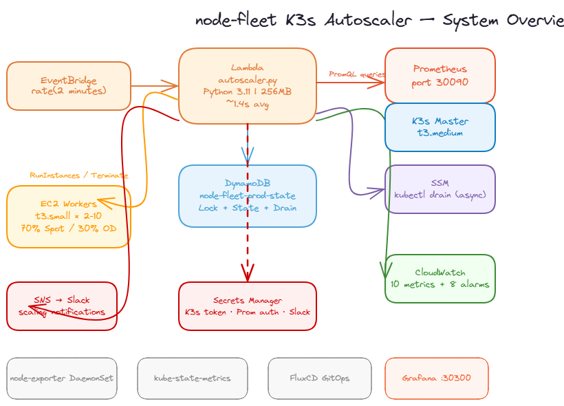
EventBridge fires Lambda every 2 min. Lambda queries Prometheus (private IP 10.0.1.176:30090), decides scaling action, launches/drains EC2 workers. DynamoDB holds distributed lock + state. Secrets Manager stores all credentials. SNS notifies Slack.

### Lambda 7-Step Orchestration Flow
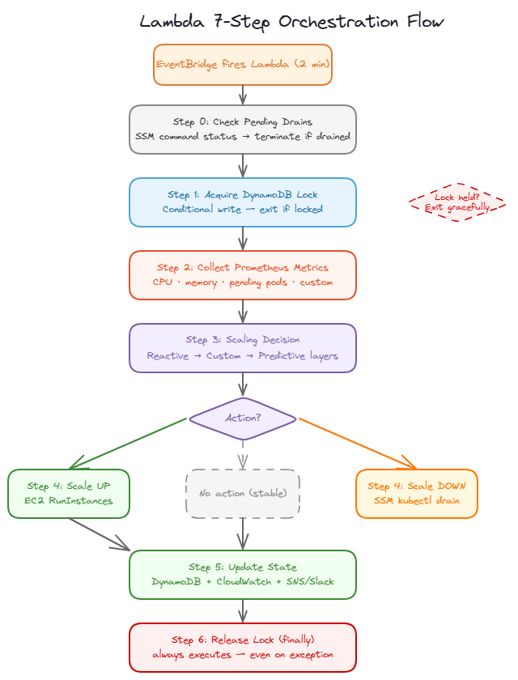
Step 0: complete pending drains. Step 1: acquire DynamoDB lock. Step 2: collect Prometheus metrics. Step 3: scaling decision (3 layers). Step 4: execute EC2 action. Step 5: update state + notify. Step 6: release lock (always in `finally`).

---

## Functional Requirements

### FR-1 — Metric Collection
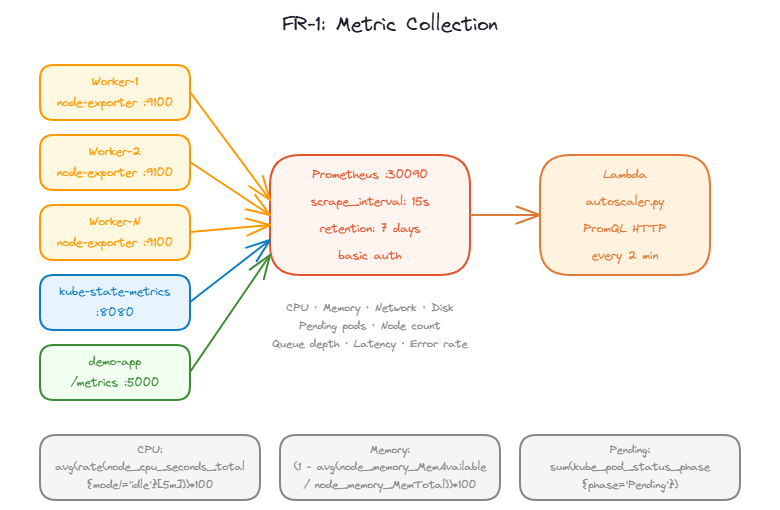
Prometheus scrapes node-exporter (CPU, memory, disk, network) on every worker every 15s via `kubernetes_sd_configs`. kube-state-metrics provides pod/node counts. demo-app exposes queue depth, latency p95, error rate. Lambda queries all via PromQL over NodePort 30090 with basic auth.

---

### FR-2 — Scaling Logic
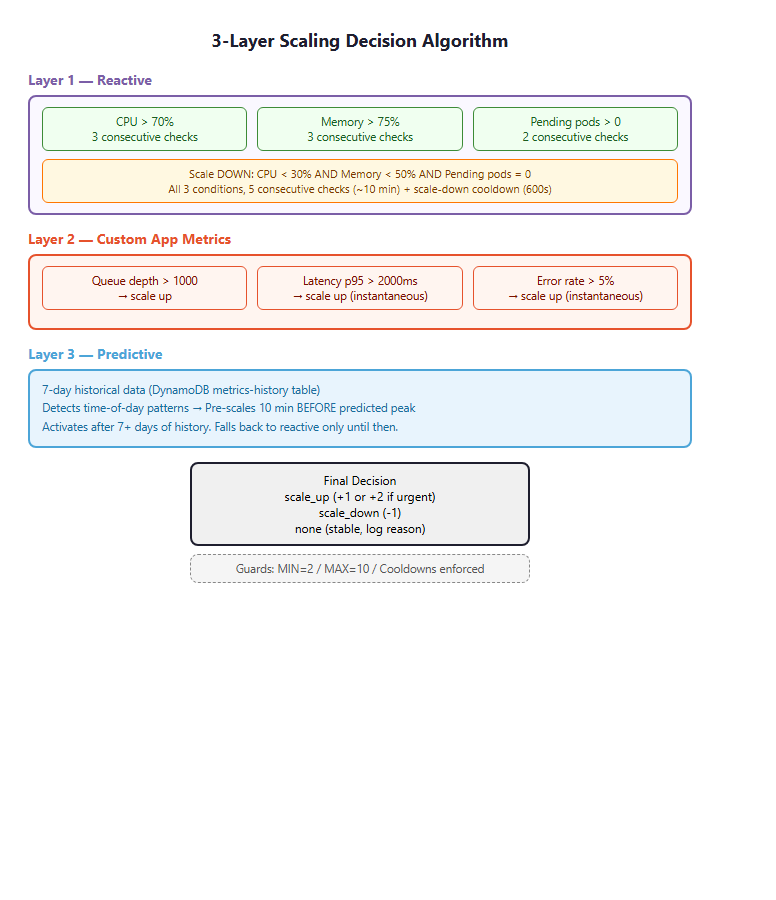
Three-layer decision engine. **Layer 1 (Reactive):** CPU >70% for 3 checks (~6 min), memory >75% for 3 checks, or pending pods >0 for 2 checks (~4 min) → scale up. CPU <30% + memory <50% + no pending pods all for 5 checks (~10 min) → scale down. **Layer 2 (Custom):** queue depth >1000, latency p95 >2000ms, or error rate >5% (instantaneous) → scale up. **Layer 3 (Predictive):** 7-day lookback detects next-hour spikes → pre-scales before demand hits.

---

### FR-3 — Node Provisioning
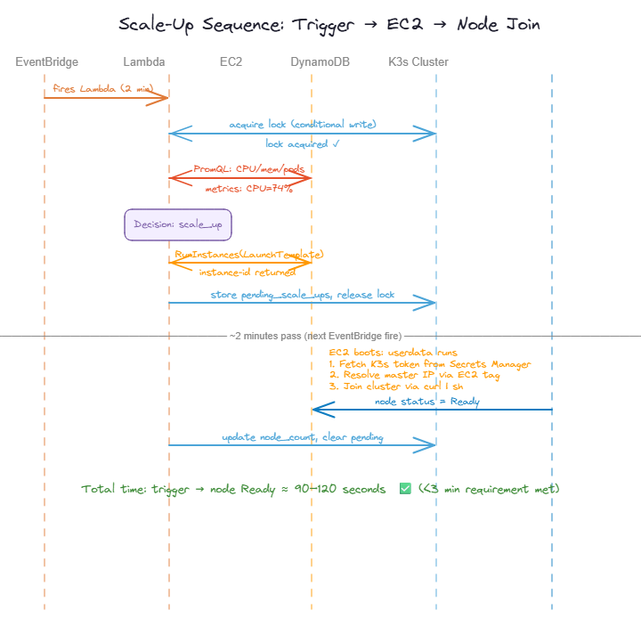
Lambda calls EC2 `RunInstances` with Launch Template. Worker userdata fetches K3s token from Secrets Manager, resolves master IP via EC2 tag `Role=k3s-master`, joins cluster via `curl | sh`. Next Lambda invocation checks EC2 `running` state AND elapsed ≥ 120s (ensuring userdata + K8s join complete) before confirming. Total: ~90–120s, well under 3-min requirement.

---

### FR-4 — Node Deprovisioning
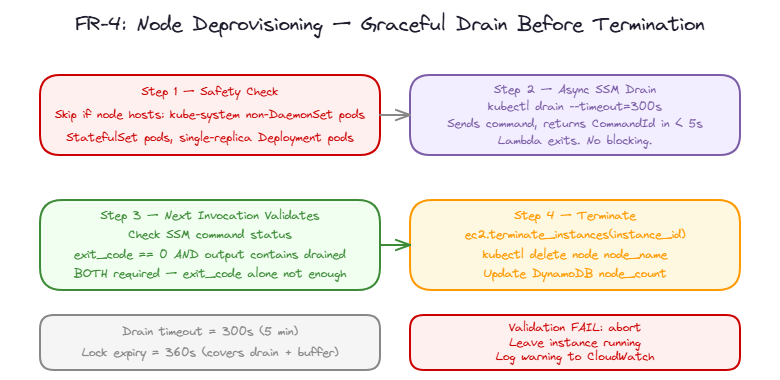
Safety check first: skip nodes hosting StatefulSet pods, kube-system non-DaemonSet pods, or single-replica Deployment pods. Then async drain via SSM `kubectl drain --timeout=300s` (returns in <5s, Lambda exits). Next invocation checks SSM output — both exit code 0 AND "drained" keyword required. On success: `ec2.terminate_instances()` + `kubectl delete node`.

---

### FR-5 — State Management
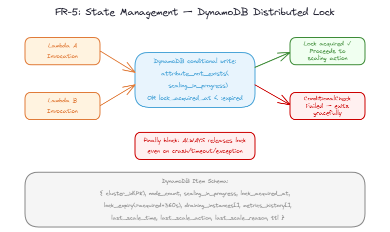
DynamoDB table `node-fleet-prod-state` stores node count, last scale time/action, lock state, draining instances list, pending scale-up list, and last 10 metrics readings. Distributed lock uses conditional write (`attribute_not_exists OR scaling_in_progress = false OR lock_acquired_at < now-360`). Stale locks (>360s) auto-cleared. Lock always released in `finally` block.

---

## Non-Functional Requirements

### NFR-1 — Performance (<3 min)
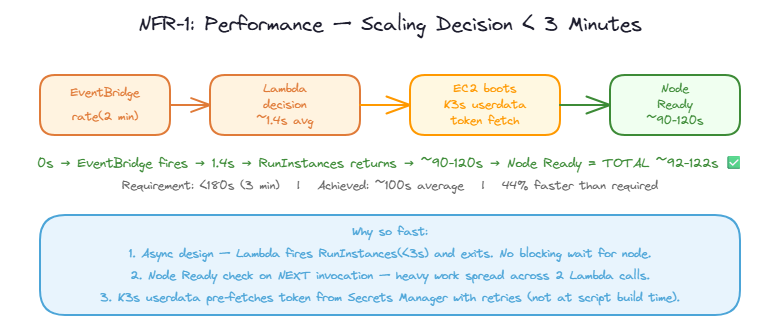
Lambda decision + EC2 launch = ~1.4s. Worker userdata + K3s join = ~90–120s. Total trigger-to-Ready: **~92–122s** (44% faster than 3-min requirement). EventBridge 2-min cycle means first confirmation check happens at exactly the right window.

---

### NFR-2 — Reliability
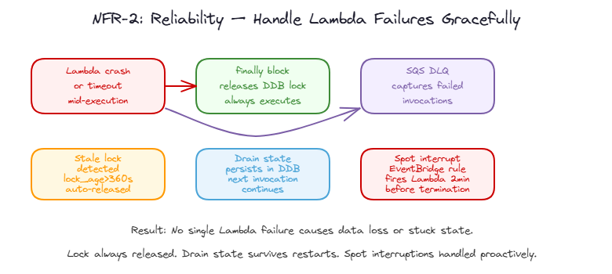
SQS Dead Letter Queue catches failed Lambda invocations. `finally` block guarantees lock release even on crash. Drain state persists in DynamoDB — next invocation resumes where previous crashed. Spot interruption EventBridge rule fires Lambda immediately for emergency drain (doesn't wait for normal 2-min cycle).

---

### NFR-3 — Lambda Execution (<30s)
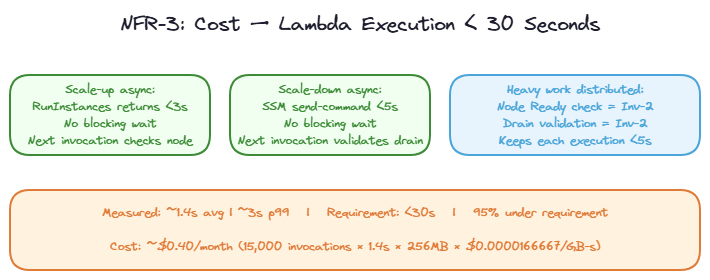
Async design: EC2 `RunInstances` returns in <3s, SSM drain command returns in <5s. Heavy work (node-Ready check, drain validation) distributed across invocations — no blocking waits within single Lambda execution. Measured: **~1.4s avg, ~3s p99**. Cost: ~$0.40/month (15,000 invocations × 1.4s × 256MB).

---

### NFR-4 — Security
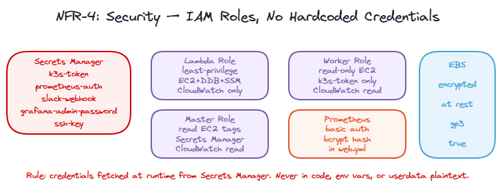
All credentials fetched at runtime from Secrets Manager — never in code, env vars, or userdata plaintext. Lambda role: least-privilege (only required EC2/DDB/SSM/CW actions on specific ARNs). Master role: read-only EC2 + scoped Secrets Manager + CloudWatch read. Worker role: read-only EC2 + k3s-token secret + CloudWatch read. Prometheus: bcrypt basic auth. EBS encrypted at rest (gp3).

---

### NFR-5 — Observability
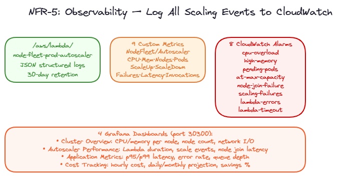
Lambda logs to `/aws/lambda/node-fleet-prod-autoscaler` (30-day retention, JSON structured). 9 custom CloudWatch metrics in `NodeFleet/Autoscaler` namespace: CPU, Memory, Nodes, Pods, ScaleUp, ScaleDown, Failures, Latency, Invocations. 8 CloudWatch alarms: cpu-overload, high-memory, pending-pods, at-max-capacity, node-join-failure, scaling-failures, lambda-errors, lambda-timeout. 4 Grafana dashboards at port 30300.

---

## Bonus Challenges

### BONUS-1 — Multi-AZ Worker Distribution
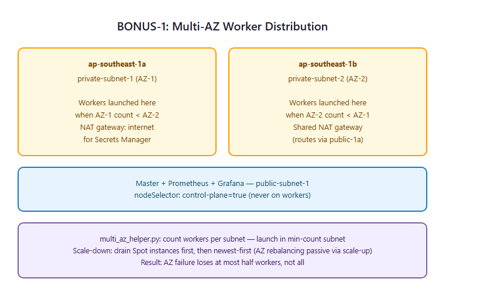
Workers distributed across `ap-southeast-1a` and `ap-southeast-1b` private subnets. `multi_az_helper.py` counts workers per subnet and always launches in the subnet with fewer workers. Scale-down drains Spot instances first (cheaper, already interruptible), then newest-first. AZ failure loses at most half the workers.

---

### BONUS-2 — Spot Instances + Interruption Handling
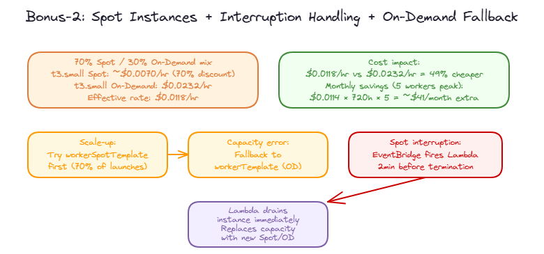
Maintains 70% Spot / 30% On-Demand mix. Scale-up tries `workerSpotTemplate` first — on capacity error falls back to On-Demand `workerTemplate`. Spot interruption EventBridge rule fires Lambda 2 min before interruption warning, triggering immediate SSM drain + replacement launch. Effective rate: $0.0118/hr vs $0.0232/hr On-Demand = **49% cheaper**.

---

### BONUS-3 — Predictive Scaling
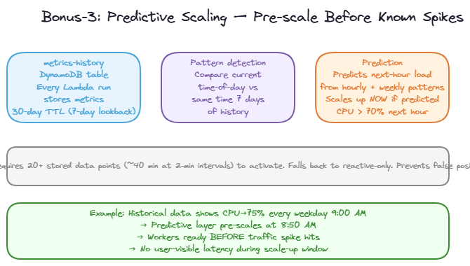
`predictive_scaling.py` stores every metric reading in `node-fleet-prod-metrics-history` DynamoDB table (30-day TTL, 7-day lookback). Detects hourly and weekly patterns. When predicted next-hour CPU >70%, scales up immediately — workers ready before demand hits. Requires 20+ stored data points (~40 min at 2-min intervals) to activate; falls back to reactive until then.

---

### BONUS-4 — Custom App Metrics
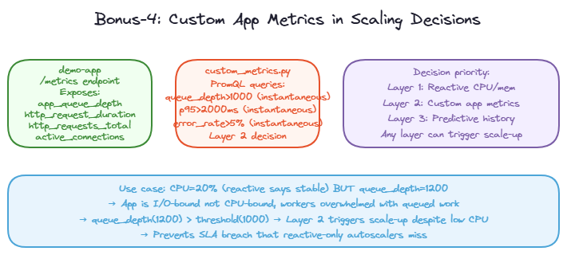
`custom_metrics.py` queries demo-app `/metrics` endpoint for queue depth, latency p95, and error rate via PromQL. Thresholds: queue >1000, p95 >2000ms, error rate >5% (all instantaneous — no window). Feeds into Layer 2 of the decision engine. Use case: CPU=20% (reactive says stable) but queue=1200 → Layer 2 triggers scale-up despite low CPU, preventing I/O-bound SLA breach.

---

### BONUS-5 — GitOps with FluxCD
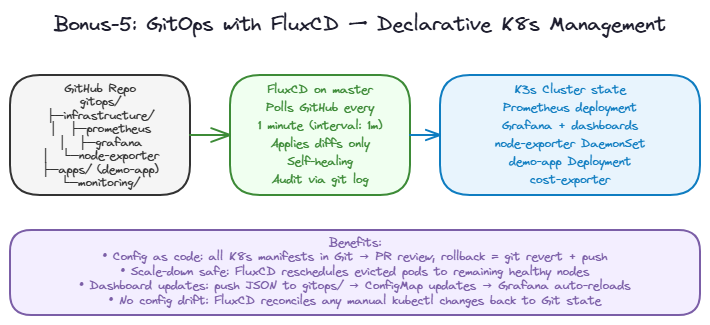
FluxCD installed on master node. `GitRepository` source polls GitHub every 1 min (`interval: 1m`). Any push to `gitops/` auto-applies K8s manifests within 1 minute. Manages Prometheus, Grafana, node-exporter, kube-state-metrics, demo-app deployments. Scale-down drains pods gracefully — FluxCD reconciles remaining pods to healthy nodes automatically.

---

### BONUS-6 — Slack Notifications
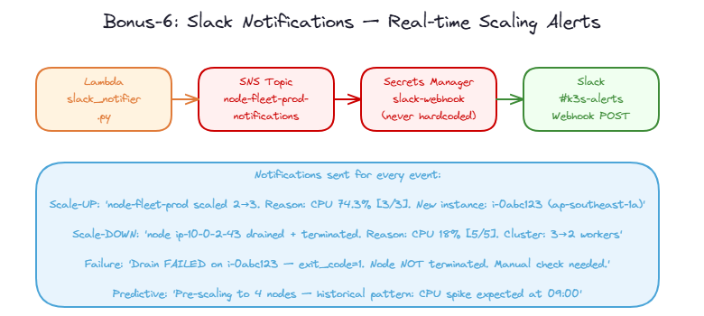
`slack_notifier.py` publishes to SNS topic → Lambda subscription → Slack webhook (stored in Secrets Manager `node-fleet/slack-webhook`). Notifications sent for: scale-up (before/after node count, reason, instance IDs), scale-down (node drained, reason), Lambda errors, drain failures, lock contention warnings. Non-blocking — failure to notify never kills the autoscaler.

---

## Full Requirements Coverage

See [`REQUIREMENTS_COVERAGE.md`](REQUIREMENTS_COVERAGE.md) for detailed implementation verification of every FR, NFR, and Bonus requirement cross-checked against source code.
