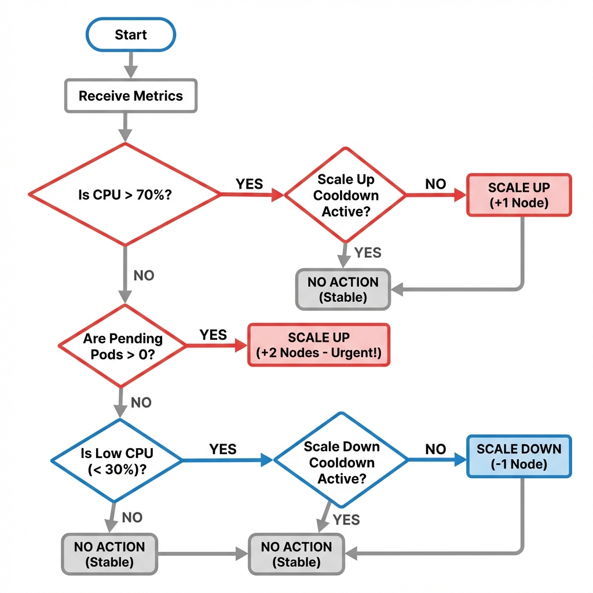

# node-fleet Scaling Algorithm

> **Critical: Node Count Semantics**
>
> - **Master Node**: Fixed, never scales (1 master always running)
> - **Worker Nodes**: Scalable pool managed by autoscaler (min 2, max 10)
> - **Total Cluster**: 1 master + 2-10 workers = **3-11 nodes total**
> - **All "current_nodes", "min_nodes", "max_nodes" in this algorithm refer to WORKER nodes ONLY**
> - **Initial State**: Pulumi launches 1 master + 2 workers in different AZs (3 nodes total)

## Table of Contents

1. [Algorithm Overview](#algorithm-overview)
2. [Decision Logic Flowchart](#decision-logic-flowchart)
3. [Metric Collection](#metric-collection)
4. [Scale-Up Logic](#scale-up-logic)
5. [Scale-Down Logic](#scale-down-logic)
6. [Safety Mechanisms](#safety-mechanisms)
7. [Pseudocode Implementation](#pseudocode-implementation)

---

## Algorithm Overview

The node-fleet autoscaler uses a **hybrid three-layer decision engine** that evaluates cluster health every 2 minutes using reactive metrics, predictive analysis, and custom application metrics.

### Core Principles

1. **Hybrid Intelligence**: Reactive + Predictive + Custom metrics for comprehensive scaling decisions
2. **Sustained Load Detection**: 2-reading window prevents false positives from transient spikes
3. **Safety First**: Multiple safeguards prevent service disruptions
4. **Cost-Aware**: Automated cost optimization with weekly recommendations
5. **Predictable**: Deterministic logic with clear thresholds and proactive pre-scaling

### Decision Layers

**Layer 1: Reactive Scaling** (Traditional)

- Monitors CPU, memory, pending pods every 2 minutes
- **Sustained threshold checking**: Requires 2 consecutive readings above threshold (prevents oscillation)
- Cooldown periods prevent scaling thrash

**Layer 2: Predictive Scaling** (Advanced)

- Analyzes 7-day historical CPU patterns
- Hour-of-day trend detection
- Proactive scale-up 10 minutes before predicted spikes (at minute 50 of each hour)

**Layer 3: Custom Application Metrics** (Production-Grade)

- Application queue depth monitoring (in-app task queues)
- API latency tracking (p95, p99)
- Request rate thresholds
- Business-specific triggers

### Key Parameters

| Parameter                   | Value      | Rationale                               |
| --------------------------- | ---------- | --------------------------------------- |
| **Evaluation Interval**     | 2 minutes  | Balance responsiveness vs cost          |
| **Sustained Load Window**   | 2 readings | Prevents false positives (4-min window) |
| **Min Nodes**               | 2          | High availability requirement           |
| **Max Nodes**               | 10         | AWS quota + cost limit                  |
| **CPU Threshold (Up)**      | 70%        | Leave 30% headroom for spikes           |
| **CPU Threshold (Down)**    | 30%        | Prevent oscillation                     |
| **Memory Threshold (Up)**   | 75%        | Critical for OOM prevention             |
| **Memory Threshold (Down)** | 50%        | Conservative, gradual scale-down        |
| **Scale-Up Cooldown**       | 5 minutes  | Allow new nodes to stabilize            |
| **Scale-Down Cooldown**     | 10 minutes | Longer to prevent thrashing             |
| **Scale-Up Increment**      | 1-2 nodes  | Based on urgency (pending pods)         |
| **Scale-Down Increment**    | 1 node     | Gradual, safe removal                   |

---

## Decision Logic Flowchart



---

## Metric Collection

### Prometheus Queries

**1. CPU Utilization (Cluster Average)**

```promql
avg(rate(node_cpu_seconds_total{mode!="idle"}[5m])) * 100
```

- **Returns**: Percentage (0-100)
- **Logic**: Average CPU across all nodes, 5-minute rate
- **Threshold**: >70% triggers scale-up

**2. Memory Utilization (Cluster Average)**

```promql
(1 - avg(node_memory_MemAvailable_bytes / node_memory_MemTotal_bytes)) * 100
```

- **Returns**: Percentage (0-100)
- **Logic**: (1 - Available/Total) across all nodes
- **Threshold**: >75% triggers scale-up

**3. Pending Pods**

```promql
sum(kube_pod_status_phase{phase="Pending"})
```

- **Returns**: Integer count
- **Logic**: Total pods in Pending state (unschedulable)
- **Threshold**: >0 triggers scale-up (urgent)

**4. Current Node Count**

```promql
count(kube_node_info{node=~".*worker.*"})
```

- **Returns**: Integer count
- **Logic**: Count of worker nodes (excludes master)
- **Used For**: Decision calculation, min/max enforcement

### Error Handling

```python
def collect_metrics():
    try:
        response = requests.get(
            f"{PROMETHEUS_URL}/api/v1/query",
            params={"query": promql_query},
            timeout=10
        )
        response.raise_for_status()
        data = response.json()
        return float(data['data']['result'][0]['value'][1])
    except (RequestException, KeyError, IndexError, ValueError) as e:
        logger.error(f"Prometheus query failed: {e}")
        # Fallback to cached metrics from DynamoDB
        return get_cached_metric_from_dynamodb()
```

---

## Scale-Up Logic

**CloudWatch Alarm Configuration**:


### Sustained Threshold Detection

**Problem**: Transient CPU spikes (30s-1min) can cause unnecessary scaling. A single reading above threshold is not sufficient.

**Solution**: Require **2 consecutive readings** above threshold (4-minute sustained load).

```python
def _is_sustained_above(self, metric_name, threshold, current_value):
    """
    Check if metric has been above threshold for 2+ consecutive readings

    Returns: (is_sustained, duration_minutes)
    """
    if current_value <= threshold:
        return False, 0

    # Check metrics history from DynamoDB
    history = self.state_manager.get_metrics_history(self.cluster_id)

    if not history or len(history) < 1:
        # First reading above threshold, store and wait
        return False, 0

    # Check previous reading (2 minutes ago)
    prev_value = history[-1].get(metric_name, 0)

    if prev_value > threshold:
        # Both current and previous readings above threshold
        # Sustained load detected (4-minute window)
        return True, 4

    return False, 0
```

### Trigger Conditions (OR Logic with Sustained Checks)

**Condition 1: Sustained High CPU**

```python
if cpu_utilization > 70:
    is_sustained, duration = _is_sustained_above('cpu_percent', 70, cpu_utilization)
    if is_sustained:
        return ScaleDecision(
            action="scale_up",
            reason=f"CPU {cpu_utilization:.1f}% exceeded 70% for {duration} minutes (sustained)"
        )
    else:
        # Transient spike, store metric and wait for next reading
        state_manager.store_metrics_history(cluster_id, cpu_utilization, memory_utilization)
        return ScaleDecision(action="none", reason="CPU spike detected, waiting for sustained load")
```

**Condition 2: Pending Pods (Immediate - No Sustained Check)**

```python
if pending_pods > 0:
    # Urgent: workloads cannot be scheduled, bypass sustained check
    nodes_to_add = 2 if pending_pods > 5 else 1
    return ScaleDecision(
        action="scale_up",
        nodes=nodes_to_add,
        reason=f"{pending_pods} pods pending (immediate scale, no sustained check)"
    )
```

**Condition 3: Sustained High Memory**

```python
if memory_utilization > 75:
    is_sustained, duration = _is_sustained_above('memory_percent', 75, memory_utilization)
    if is_sustained:
        return ScaleDecision(
            action="scale_up",
            reason=f"Memory {memory_utilization:.1f}% exceeded 75% for {duration} minutes (sustained)"
        )
    else:
        return ScaleDecision(action="none", reason="Memory spike detected, waiting for sustained load")
```

**Condition 4: Custom Application Metrics**

```python
if custom_metrics_enabled:
    scale_needed, reasons = custom_metrics.evaluate({
        'queue_depth': 100,
        'api_latency_p95': 500,  # ms
        'request_rate': 1000      # req/s
    })

    if scale_needed:
        return ScaleDecision(
            action="scale_up",
            reason=f"Custom metrics: {', '.join(reasons)}"
        )
```

**Condition 5: Predictive Scaling (Proactive)**

```python
# Only runs at minute 50+ of each hour
current_minute = datetime.utcnow().minute
if current_minute >= 50:
    should_scale, predicted_cpu = predictive_scaling.should_proactive_scale_up(
        cluster_id, cpu_utilization
    )

    if should_scale:
        return ScaleDecision(
            action="scale_up",
            nodes=1,
            reason=f"Predictive: Next hour CPU predicted at {predicted_cpu:.1f}% (proactive scale)"
        )
```

### Node Count Calculation

```python
def calculate_scale_up_nodes(current_nodes, max_nodes, pending_pods):
    # Urgent case: pending pods exist
    if pending_pods > 5:
        nodes_to_add = 2
    elif pending_pods > 0:
        nodes_to_add = 1
    else:
        # Normal case: high CPU/memory
        nodes_to_add = 1

    # Ensure we don't exceed max_nodes
    target_nodes = min(current_nodes + nodes_to_add, max_nodes)
    actual_nodes_to_add = target_nodes - current_nodes

    return actual_nodes_to_add
```

### Multi-AZ Distribution

```python
def select_subnets_for_scale_up(nodes_to_add, current_distribution):
    """
    Maintain balanced distribution across AZs.

    current_distribution = {
        'ap-southeast-1a': 3,
        'ap-southeast-1b': 2
    }
    nodes_to_add = 2

    Returns: ['subnet-1b', 'subnet-1a'] (balance first)
    """
    subnets = []
    az_counts = current_distribution.copy()

    for _ in range(nodes_to_add):
        # Pick AZ with fewest nodes
        min_az = min(az_counts, key=az_counts.get)
        subnets.append(SUBNET_MAP[min_az])
        az_counts[min_az] += 1

    return subnets
```

### Spot vs On-Demand Selection

```python
def determine_instance_market_options(spot_percentage=70):
    """
    70% Spot, 30% On-Demand distribution.
    """
    if random.randint(1, 100) <= spot_percentage:
        return {
            'MarketType': 'spot',
            'SpotOptions': {
                'MaxPrice': '0.02',  # USD per hour (t3.small on-demand price)
                'SpotInstanceType': 'one-time',
                'InstanceInterruptionBehavior': 'terminate'
            }
        }
    else:
        return None  # On-Demand
```

---

## Scale-Down Logic

**CloudWatch Alarm Configuration**:


### Trigger Conditions (AND Logic - ALL Must Be True)

```python
def should_scale_down(cpu, memory, pending_pods, current_nodes, min_nodes):
    conditions = [
        cpu < 30,                    # Low CPU
        memory < 50,                 # Low memory
        pending_pods == 0,           # No pending workloads
        current_nodes > min_nodes    # Above minimum
    ]

    if all(conditions):
        return True, f"CPU {cpu:.1f}% < 30%, Memory {memory:.1f}% < 50%, no pending pods"
    return False, None
```

### Node Selection Strategy

```python
def select_node_to_remove(nodes, current_distribution):
    """
    Priority order:
    1. Highest CPU idle
    2. Fewest pods running
    3. Maintain AZ balance (remove from AZ with most nodes)
    4. Not running critical system pods (kube-system)
    """

    # Get node metrics
    node_metrics = []
    for node in nodes:
        pods_count = get_pod_count_on_node(node)
        cpu_idle = get_node_cpu_idle(node)
        az = get_node_az(node)
        has_critical_pods = has_system_pods(node, namespace='kube-system')

        node_metrics.append({
            'name': node,
            'pods': pods_count,
            'cpu_idle': cpu_idle,
            'az': az,
            'critical': has_critical_pods
        })

    # Filter out critical nodes
    candidates = [n for n in node_metrics if not n['critical']]

    # Sort by: AZ count (desc), CPU idle (desc), pods (asc)
    az_counts = current_distribution
    candidates.sort(key=lambda n: (
        -az_counts[n['az']],  # Remove from AZ with most nodes
        -n['cpu_idle'],       # Prefer highest idle CPU
        n['pods']             # Prefer fewest pods
    ))

    return candidates[0]['name']
```

### Graceful Drain Process

```python
def drain_node(node_name, timeout=300):
    """
    Safely migrate pods to other nodes before termination.
    """
    cmd = [
        'kubectl', 'drain', node_name,
        '--ignore-daemonsets',        # Keep DaemonSets (node-exporter, fluentd)
        '--delete-emptydir-data',     # Allow emptyDir volume deletion
        '--force',                    # Force delete standalone pods
        f'--timeout={timeout}s',      # Max wait time
        '--skip-wait-for-delete-timeout=10'  # Don't wait forever for deletion
    ]

    try:
        result = subprocess.run(cmd, capture_output=True, text=True, timeout=timeout+10)
        if result.returncode != 0:
            logger.error(f"Drain failed: {result.stderr}")
            return False, result.stderr

        logger.info(f"Node {node_name} drained successfully")
        return True, None

    except subprocess.TimeoutExpired:
        logger.error(f"Drain timeout after {timeout} seconds")
        return False, "Timeout"
```

### PodDisruptionBudget Compliance

```python
def check_pdb_compliance(node_name):
    """
    Ensure draining won't violate PodDisruptionBudgets.
    """
    cmd = ['kubectl', 'get', 'pdb', '--all-namespaces', '-o', 'json']
    result = subprocess.run(cmd, capture_output=True, text=True)
    pdbs = json.loads(result.stdout)

    for pdb in pdbs['items']:
        min_available = pdb['spec'].get('minAvailable', 0)
        current_healthy = pdb['status'].get('currentHealthy', 0)

        # Check if draining this node would violate PDB
        pods_on_node = get_pods_on_node(node_name, pdb['metadata']['namespace'])
        pods_matching_pdb = [p for p in pods_on_node if matches_pdb_selector(p, pdb)]

        if current_healthy - len(pods_matching_pdb) < min_available:
            logger.warning(f"Drain would violate PDB {pdb['metadata']['name']}")
            return False

    return True
```

---

## Safety Mechanisms

### 1. Minimum Node Count Enforcement (HIGHEST PRIORITY)

```python
# This check runs BEFORE any other logic
if current_nodes < min_nodes:
    nodes_needed = min_nodes - current_nodes
    return {
        "action": "scale_up",
        "nodes": nodes_needed,
        "reason": f"Enforcing minimum node count ({min_nodes})",
        "bypass_cooldown": True  # Critical safety, ignore cooldown
    }
```

**Behavior**:

- If worker count drops below 2 (e.g., Spot interruptions), autoscaler immediately launches replacements
- Bypasses cooldown periods
- Highest priority in decision tree

### 2. Maximum Node Count Cap

```python
if current_nodes >= max_nodes:
    logger.warning(f"At maximum capacity ({max_nodes} nodes), cannot scale up")
    send_slack_alert("⚠️ At Max Capacity", f"Cluster at {max_nodes} nodes, consider increasing limit")
    return {"action": "no_action", "reason": "At maximum capacity"}
```

### 3. Distributed Lock (Race Condition Prevention)

```python
def acquire_lock(cluster_id, timeout=300):
    try:
        dynamodb.update_item(
            TableName='node-fleet-dev-state',
            Key={'cluster_id': cluster_id},
            UpdateExpression='SET scaling_in_progress = :true, lock_acquired_at = :now',
            ConditionExpression='attribute_not_exists(scaling_in_progress) OR scaling_in_progress = :false',
            ExpressionAttributeValues={':true': True, ':false': False, ':now': datetime.utcnow().isoformat()}
        )
        return True
    except ClientError as e:
        if e.response['Error']['Code'] == 'ConditionalCheckFailedException':
            # Lock already held, check if expired
            state = get_state(cluster_id)
            lock_age = (datetime.utcnow() - parse_iso(state['lock_acquired_at'])).seconds
            if lock_age > timeout:
                release_lock(cluster_id, force=True)
                return acquire_lock(cluster_id, timeout)
            logger.info("Scaling already in progress, skipping")
            return False
```

### 4. Cooldown Period Enforcement

```python
def check_cooldown(last_scale_time, last_action, scale_up_cooldown=300, scale_down_cooldown=600):
    if not last_scale_time:
        return True, None  # No previous scaling event

    time_since_last_scale = (datetime.utcnow() - parse_iso(last_scale_time)).seconds

    if last_action == "scale_up":
        if time_since_last_scale < scale_up_cooldown:
            remaining = scale_up_cooldown - time_since_last_scale
            return False, f"Scale-up cooldown: {remaining}s remaining"

    elif last_action == "scale_down":
        if time_since_last_scale < scale_down_cooldown:
            remaining = scale_down_cooldown - time_since_last_scale
            return False, f"Scale-down cooldown: {remaining}s remaining"

    return True, None
```

### 5. Node Join Timeout

```python
def wait_for_node_ready(instance_id, timeout=300):
    """
    Poll node status until Ready or timeout.
    """
    start_time = time.time()

    while time.time() - start_time < timeout:
        cmd = ['kubectl', 'get', 'node', '-l', f'instance-id={instance_id}', '-o', 'json']
        result = subprocess.run(cmd, capture_output=True, text=True)

        try:
            node_data = json.loads(result.stdout)
            if node_data['items']:
                node = node_data['items'][0]
                conditions = node['status']['conditions']
                ready_condition = next((c for c in conditions if c['type'] == 'Ready'), None)

                if ready_condition and ready_condition['status'] == 'True':
                    logger.info(f"Node {instance_id} is Ready")
                    return True
        except (json.JSONDecodeError, KeyError, StopIteration):
            pass

        time.sleep(10)  # Poll every 10 seconds

    logger.error(f"Node {instance_id} did not become Ready within {timeout}s")
    return False
```

---

## Pseudocode Implementation

### Main Autoscaler Function

```python
def lambda_handler(event, context):
    """
    Main autoscaler entry point.
    Triggered by EventBridge every 2 minutes.
    """

    # Step 1: Collect Metrics
    metrics = collect_metrics_from_prometheus()
    cpu = metrics['cpu_utilization']
    memory = metrics['memory_utilization']
    pending_pods = metrics['pending_pods']
    current_nodes = metrics['current_node_count']

    # Step 2: Retrieve State
    state = get_state_from_dynamodb(CLUSTER_ID)
    last_scale_time = state['last_scale_time']
    last_scale_action = state['last_scale_action']

    # Step 3: Acquire Lock (exit if held by another invocation)
    if not acquire_lock(CLUSTER_ID):
        logger.info("Another scaling operation in progress, exiting")
        return {"statusCode": 200, "body": "Lock held"}

    try:
        # Step 4: Check Cooldown
        can_scale, cooldown_reason = check_cooldown(last_scale_time, last_scale_action)
        if not can_scale:
            logger.info(cooldown_reason)
            return {"statusCode": 200, "body": cooldown_reason}

        # Step 5: Make Scaling Decision
        decision = make_scaling_decision(
            cpu=cpu,
            memory=memory,
            pending_pods=pending_pods,
            current_nodes=current_nodes,
            min_nodes=MIN_NODES,
            max_nodes=MAX_NODES
        )

        # Step 6: Execute Decision
        if decision['action'] == 'scale_up':
            nodes_added = scale_up(decision['nodes'], current_nodes)
            update_state(
                current_node_count=current_nodes + nodes_added,
                last_scale_action='scale_up',
                last_scale_time=datetime.utcnow().isoformat()
            )
            send_slack_notification(f"🟢 Scale-up: +{nodes_added} nodes, {decision['reason']}")

        elif decision['action'] == 'scale_down':
            node_removed = scale_down(decision['node_name'])
            update_state(
                current_node_count=current_nodes - 1,
                last_scale_action='scale_down',
                last_scale_time=datetime.utcnow().isoformat()
            )
            send_slack_notification(f"🔵 Scale-down: -1 node, {decision['reason']}")

        else:
            logger.info(f"No scaling needed: {decision['reason']}")

        # Step 7: Publish Metrics
        publish_cloudwatch_metrics(cpu, memory, pending_pods, current_nodes)

    finally:
        # Step 8: Always Release Lock
        release_lock(CLUSTER_ID)

    return {"statusCode": 200, "body": "Success"}


def make_scaling_decision(cpu, memory, pending_pods, current_nodes, min_nodes, max_nodes):
    """
    Core decision engine implementing flowchart logic.
    """

    # STEP 0: Enforce Minimum (HIGHEST PRIORITY)
    if current_nodes < min_nodes:
        nodes_needed = min_nodes - current_nodes
        return {
            "action": "scale_up",
            "nodes": nodes_needed,
            "reason": f"Enforcing minimum node count ({min_nodes})"
        }

    # STEP 1: Check Scale-UP Triggers (OR logic)
    if cpu > 70:
        nodes_to_add = calculate_scale_up_nodes(current_nodes, max_nodes, pending_pods)
        return {
            "action": "scale_up",
            "nodes": nodes_to_add,
            "reason": f"CPU {cpu:.1f}% > 70%"
        }

    if pending_pods > 0:
        nodes_to_add = 2 if pending_pods > 5 else 1
        nodes_to_add = min(nodes_to_add, max_nodes - current_nodes)
        return {
            "action": "scale_up",
            "nodes": nodes_to_add,
            "reason": f"{pending_pods} pending pods, cannot schedule"
        }

    if memory > 75:
        nodes_to_add = calculate_scale_up_nodes(current_nodes, max_nodes, 0)
        return {
            "action": "scale_up",
            "nodes": nodes_to_add,
            "reason": f"Memory {memory:.1f}% > 75%"
        }

    # STEP 2: Check Scale-DOWN Triggers (AND logic)
    if cpu < 30 and memory < 50 and pending_pods == 0 and current_nodes > min_nodes:
        node_to_remove = select_node_to_remove()
        return {
            "action": "scale_down",
            "node_name": node_to_remove,
            "reason": f"Low utilization: CPU {cpu:.1f}%, Memory {memory:.1f}%"
        }

    # STEP 3: No Action
    return {
        "action": "no_action",
        "reason": f"Metrics within thresholds (CPU {cpu:.1f}%, Mem {memory:.1f}%)"
    }


def scale_up(nodes_to_add, current_nodes):
    """
    Launch new EC2 instances and wait for K3s join.
    """
    subnets = select_subnets_for_scale_up(nodes_to_add)
    instance_ids = []

    for subnet in subnets:
        market_options = determine_instance_market_options(spot_percentage=70)

        response = ec2.run_instances(
            LaunchTemplate={'LaunchTemplateId': LAUNCH_TEMPLATE_ID},
            MinCount=1,
            MaxCount=1,
            SubnetId=subnet,
            InstanceMarketOptions=market_options,
            TagSpecifications=[{
                'ResourceType': 'instance',
                'Tags': [
                    {'Key': 'Project', 'Value': 'node-fleet'},
                    {'Key': 'Role', 'Value': 'k3s-worker'},
                    {'Key': 'ManagedBy', 'Value': 'autoscaler'}
                ]
            }]
        )

        instance_id = response['Instances'][0]['InstanceId']
        instance_ids.append(instance_id)
        logger.info(f"Launched instance {instance_id} in subnet {subnet}")

    # Wait for nodes to join K3s cluster
    for instance_id in instance_ids:
        if not wait_for_node_ready(instance_id, timeout=300):
            logger.error(f"Node {instance_id} failed to join cluster")
            # Tag as failed, but don't terminate (manual investigation)
            ec2.create_tags(Resources=[instance_id], Tags=[{'Key': 'Status', 'Value': 'join-failed'}])

    return len(instance_ids)


def scale_down(node_name):
    """
    Drain node and terminate EC2 instance.
    """
    # Check PDB compliance
    if not check_pdb_compliance(node_name):
        logger.warning(f"Cannot drain {node_name}: PDB violation")
        return None

    # Drain node
    success, error = drain_node(node_name, timeout=300)
    if not success:
        logger.error(f"Drain failed: {error}")
        send_slack_alert("⚠️ Scale-down Failed", f"Could not drain {node_name}: {error}")
        return None

    # Get instance ID from node
    instance_id = get_instance_id_from_node(node_name)

    # Terminate EC2 instance
    ec2.terminate_instances(InstanceIds=[instance_id])
    logger.info(f"Terminated instance {instance_id}")

    return node_name
```

---

## Example Scenarios

### Scenario 1: Flash Sale Traffic Spike

**Timeline**:

| Time  | CPU | Pending Pods | Action            | Reason                   |
| ----- | --- | ------------ | ----------------- | ------------------------ |
| 20:00 | 35% | 0            | No action         | Within limits            |
| 20:02 | 65% | 0            | No action         | Below 70% threshold      |
| 20:04 | 82% | 3            | **Scale up +2**   | CPU > 70% + pending pods |
| 20:06 | 85% | 8            | Cooldown          | Last scale 2 min ago     |
| 20:08 | 78% | 2            | Cooldown          | Last scale 4 min ago     |
| 20:10 | 68% | 0            | No action         | New nodes handling load  |
| 20:30 | 40% | 0            | No action         | Not below 30% yet        |
| 20:40 | 28% | 0            | **Scale down -1** | Low CPU, 10+ min stable  |

**Result**: Handled spike with +2 nodes in 4 minutes, scaled down after 40 minutes of low utilization.

### Scenario 2: Spot Instance Interruption

**Timeline**:

| Time  | Event                             | Current Nodes                  | Action                       |
| ----- | --------------------------------- | ------------------------------ | ---------------------------- |
| 10:00 | Normal operation                  | 4 (3 Spot + 1 On-Demand)       | -                            |
| 10:02 | Spot interruption warning (2 min) | 4 → 3 (draining)               | EventBridge triggers handler |
| 10:04 | Next autoscaler cycle             | 3 < MIN_NODES (4 in this case) | **Scale up +1 On-Demand**    |
| 10:07 | New On-Demand node Ready          | 4                              | Restored to minimum          |

**Result**: Self-healed within 5 minutes of Spot interruption.

---

_For deployment instructions, see [DEPLOYMENT_GUIDE.md](DEPLOYMENT_GUIDE.md)._
