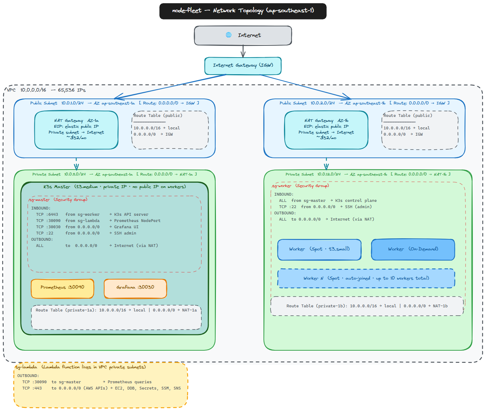

# node-fleet — Security Checklist

> **Status**: ✅ All critical controls implemented

---

## Pre-Deployment Checklist

Before deploying to production, verify each item:

### IAM & Access Control

- [x] Lambda execution role uses least-privilege (no `*` actions or resources)
- [x] Lambda EC2 permissions scoped to `tag:Project=node-fleet` (can't terminate random instances)
- [x] Lambda DynamoDB permissions scoped to table ARN (not `*`)
- [x] Lambda Secrets Manager permissions scoped to `node-fleet/*` paths only
- [x] Worker IAM role has only: ECR pull, Secrets Manager read (k3s-token only), CloudWatch write, SSM
- [x] Master IAM role has only: Secrets Manager read (own secrets), EC2 describe
- [x] No wildcard `*` on Action or Resource in production policies
- [x] No inline policies with admin access
- [x] MFA enabled on AWS console accounts

### Secrets Management

- [x] K3s join token stored in Secrets Manager (`node-fleet/k3s-token`)
- [x] Prometheus credentials stored in Secrets Manager (`node-fleet/prometheus-auth`)
- [x] Slack webhook stored in Secrets Manager (`node-fleet/slack-webhook`)
- [x] No secrets in environment variables (visible in Lambda console)
- [x] No secrets in Lambda source code or Git history
- [x] No secrets in EC2 userdata scripts (token fetched at runtime from Secrets Manager)
- [x] No hardcoded IPs, passwords, or tokens in any Python/TypeScript files

### Network Security



- [x] Workers in private subnets (no public IPs)
- [x] Prometheus accessible only from Lambda SG (not open to internet)
- [x] K3s API (:6443) accessible only from worker SG
- [x] NAT Gateways for worker outbound (not direct internet routes)
- [x] Lambda placed in VPC private subnets

### Encryption

- [x] All EBS volumes encrypted at rest (AWS KMS, aws/ebs key)
- [x] DynamoDB server-side encryption enabled
- [x] Secrets Manager uses AES-256 encryption
- [x] K3s control plane traffic over TLS 1.3
- [x] S3 Lambda artifacts bucket has SSE-S3 encryption
- [x] ECR image scanning on push enabled

### Monitoring & Audit

- [x] CloudWatch log group with 30-day retention for Lambda
- [x] CloudWatch alarms for scaling failures, Lambda errors, Lambda timeouts
- [x] DynamoDB Streams enabled for audit trail of state changes
- [x] SNS topic subscribed for critical alerts (email + Slack)
- [x] All resources tagged with `Project: node-fleet` for audit trail

---

## IAM Policies (Exact)

### Lambda Execution Role Policy

```json
{
  "Version": "2012-10-17",
  "Statement": [
    {
      "Sid": "EC2NodeManagement",
      "Effect": "Allow",
      "Action": [
        "ec2:RunInstances",
        "ec2:TerminateInstances",
        "ec2:DescribeInstances",
        "ec2:DescribeInstanceStatus",
        "ec2:CreateTags"
      ],
      "Resource": "*",
      "Condition": {
        "StringEquals": {
          "ec2:ResourceTag/Project": "node-fleet"
        }
      }
    },
    {
      "Sid": "EC2NetworkInterface",
      "Effect": "Allow",
      "Action": [
        "ec2:CreateNetworkInterface",
        "ec2:DeleteNetworkInterface",
        "ec2:DescribeNetworkInterfaces"
      ],
      "Resource": "*"
    },
    {
      "Sid": "EC2DescribeForTagLookup",
      "Effect": "Allow",
      "Action": [
        "ec2:DescribeSubnets",
        "ec2:DescribeLaunchTemplates"
      ],
      "Resource": "*"
    },
    {
      "Sid": "DynamoDBStateLock",
      "Effect": "Allow",
      "Action": [
        "dynamodb:PutItem",
        "dynamodb:GetItem",
        "dynamodb:UpdateItem",
        "dynamodb:DeleteItem",
        "dynamodb:Query"
      ],
      "Resource": "arn:aws:dynamodb:ap-southeast-1:*:table/node-fleet-prod-state"
    },
    {
      "Sid": "DynamoDBMetricsHistory",
      "Effect": "Allow",
      "Action": [
        "dynamodb:PutItem",
        "dynamodb:GetItem",
        "dynamodb:Query"
      ],
      "Resource": "arn:aws:dynamodb:ap-southeast-1:*:table/k3s-metrics-history"
    },
    {
      "Sid": "SecretsManagerNodeFleet",
      "Effect": "Allow",
      "Action": ["secretsmanager:GetSecretValue"],
      "Resource": [
        "arn:aws:secretsmanager:ap-southeast-1:*:secret:node-fleet/k3s-token*",
        "arn:aws:secretsmanager:ap-southeast-1:*:secret:node-fleet/prometheus-auth*",
        "arn:aws:secretsmanager:ap-southeast-1:*:secret:node-fleet/slack-webhook*"
      ]
    },
    {
      "Sid": "SSMDrainCommands",
      "Effect": "Allow",
      "Action": [
        "ssm:SendCommand",
        "ssm:GetCommandInvocation",
        "ssm:DescribeInstanceInformation"
      ],
      "Resource": "*",
      "Condition": {
        "StringEquals": {
          "ssm:resourceTag/Project": "node-fleet"
        }
      }
    },
    {
      "Sid": "SNSAlerts",
      "Effect": "Allow",
      "Action": ["sns:Publish"],
      "Resource": "arn:aws:sns:ap-southeast-1:*:node-fleet-autoscaler-alerts"
    },
    {
      "Sid": "CloudWatchMetrics",
      "Effect": "Allow",
      "Action": ["cloudwatch:PutMetricData"],
      "Resource": "*",
      "Condition": {
        "StringEquals": {
          "cloudwatch:namespace": "NodeFleet/Autoscaler"
        }
      }
    },
    {
      "Sid": "CloudWatchLogs",
      "Effect": "Allow",
      "Action": [
        "logs:CreateLogGroup",
        "logs:CreateLogStream",
        "logs:PutLogEvents"
      ],
      "Resource": "arn:aws:logs:ap-southeast-1:*:log-group:/aws/lambda/node-fleet-prod-autoscaler:*"
    },
    {
      "Sid": "SQSDeadLetterQueue",
      "Effect": "Allow",
      "Action": ["sqs:SendMessage"],
      "Resource": "arn:aws:sqs:ap-southeast-1:*:node-fleet-autoscaler-dlq"
    }
  ]
}
```

### Worker Instance Role Policy

```json
{
  "Statement": [
    {
      "Sid": "ECRPull",
      "Effect": "Allow",
      "Action": [
        "ecr:GetAuthorizationToken",
        "ecr:BatchCheckLayerAvailability",
        "ecr:GetDownloadUrlForLayer",
        "ecr:BatchGetImage"
      ],
      "Resource": "*"
    },
    {
      "Sid": "K3sTokenFetch",
      "Effect": "Allow",
      "Action": ["secretsmanager:GetSecretValue"],
      "Resource": "arn:aws:secretsmanager:ap-southeast-1:*:secret:node-fleet/k3s-token*"
    },
    {
      "Sid": "CloudWatchLogs",
      "Effect": "Allow",
      "Action": [
        "logs:CreateLogStream",
        "logs:PutLogEvents",
        "logs:CreateLogGroup"
      ],
      "Resource": "arn:aws:logs:ap-southeast-1:*:*"
    },
    {
      "Sid": "SSMCoreForDrain",
      "Effect": "Allow",
      "Action": [
        "ssm:UpdateInstanceInformation",
        "ssmmessages:CreateControlChannel",
        "ssmmessages:CreateDataChannel",
        "ssmmessages:OpenControlChannel",
        "ssmmessages:OpenDataChannel"
      ],
      "Resource": "*"
    }
  ]
}
```

---

## Security Controls in Code

### No Hardcoded Credentials

Every credential follows this pattern: Secrets Manager first → env var fallback → fail fast. No silent fallback to hardcoded values.

```python
def get_prometheus_credentials():
    try:
        secret = boto3.client('secretsmanager').get_secret_value(
            SecretId='node-fleet/prometheus-auth'
        )
        data = json.loads(secret['SecretString'])
        return data['username'], data['password']
    except Exception:
        u = os.environ.get('PROMETHEUS_USERNAME')
        p = os.environ.get('PROMETHEUS_PASSWORD')
        if not u or not p:
            raise ValueError("Prometheus credentials not available")
        return u, p
```

### No Hardcoded Master IP

Master IP resolved via EC2 API at runtime using the `Role=k3s-master` tag. If the master is replaced, Lambda automatically discovers the new IP.

```python
def get_master_instance_id():
    resp = ec2.describe_instances(Filters=[
        {'Name': 'tag:Role', 'Values': ['k3s-master']},
        {'Name': 'instance-state-name', 'Values': ['running']}
    ])
    instances = [i for r in resp['Reservations'] for i in r['Instances']]
    if not instances:
        raise ValueError("No running k3s-master instance found")
    return instances[0]['InstanceId']
```

### Drain Validation (Safety Critical)

Lambda will NOT terminate an instance unless drain is fully validated:

```python
def validate_drain_complete(exit_status, output):
    """
    Both conditions required — exit 0 alone is not enough.
    kubectl drain can exit 0 while pods are still running (race condition).
    """
    if exit_status != 0:
        return False, f"exit_status={exit_status}"
    if "drained" not in output.lower():
        return False, "'drained' keyword not found in output"
    return True, "OK"
```

---

## Incident Response

### Runaway Scaling (Lambda Scaling Too Aggressively)

```bash
# 1. IMMEDIATELY disable EventBridge
aws events disable-rule --name node-fleet-prod-autoscaler-schedule --region ap-southeast-1

# 2. Check what launched
aws ec2 describe-instances \
  --filters "Name=tag:Project,Values=node-fleet" \
  "Name=instance-state-name,Values=running" \
  --query 'Reservations[*].Instances[*].[InstanceId,LaunchTime,InstanceType]' \
  --output table

# 3. Terminate excess instances (manually, safely)
# kubectl cordon + drain first, then terminate

# 4. Release DynamoDB lock
aws dynamodb update-item \
  --table-name node-fleet-prod-state \
  --key '{"cluster_id":{"S":"node-fleet-prod"}}' \
  --update-expression 'REMOVE scaling_in_progress, lock_acquired_at, lock_expiry' \
  --region ap-southeast-1

# 5. Fix Lambda logic
# 6. Test manually
aws lambda invoke --function-name node-fleet-prod-autoscaler /tmp/test.json

# 7. Re-enable only after fix verified
aws events enable-rule --name node-fleet-prod-autoscaler-schedule --region ap-southeast-1
```

### Credentials Leaked (Secret Exposed)

```bash
# 1. Immediately rotate the compromised secret
aws secretsmanager rotate-secret --secret-id node-fleet/k3s-token

# 2. Revoke old token on K3s master
ssh -i node-fleet-key.pem ubuntu@$MASTER_IP
sudo cat /var/lib/rancher/k3s/server/node-token  # generate new token
# Restart k3s-server to invalidate old token
sudo systemctl restart k3s

# 3. Store new token
TOKEN=$(sudo cat /var/lib/rancher/k3s/server/node-token)
aws secretsmanager put-secret-value \
  --secret-id node-fleet/k3s-token --secret-string "$TOKEN"

# 4. Workers will need to re-join — rolling restart
kubectl get nodes -o name | xargs -I{} kubectl drain {} --ignore-daemonsets

# 5. Review CloudTrail for unauthorized use
aws cloudtrail lookup-events \
  --lookup-attributes AttributeKey=ResourceName,AttributeValue=node-fleet/k3s-token \
  --start-time $(date -d '24 hours ago' -u +%Y-%m-%dT%H:%M:%SZ)
```

---

## Runtime Security Verification

```bash
# Verify Lambda IAM has correct permissions (no over-privilege)
aws iam simulate-principal-policy \
  --policy-source-arn $(aws lambda get-function-configuration \
    --function-name node-fleet-prod-autoscaler \
    --query 'Role' --output text) \
  --action-names ec2:TerminateInstances \
  --resource-arns "arn:aws:ec2:ap-southeast-1:*:instance/*"

# Verify EBS encryption
aws ec2 describe-volumes \
  --filters "Name=tag:Project,Values=node-fleet" \
  --query 'Volumes[*].[VolumeId,Encrypted,KmsKeyId]' --output table

# Verify DynamoDB SSE
aws dynamodb describe-table \
  --table-name node-fleet-prod-state \
  --query 'Table.SSEDescription' --output json

# Check for any publicly exposed resources
aws ec2 describe-instances \
  --filters "Name=tag:Project,Values=node-fleet" \
  --query 'Reservations[*].Instances[*].[InstanceId,PublicIpAddress]' \
  --output table
# Workers should show "None" for PublicIpAddress
```
