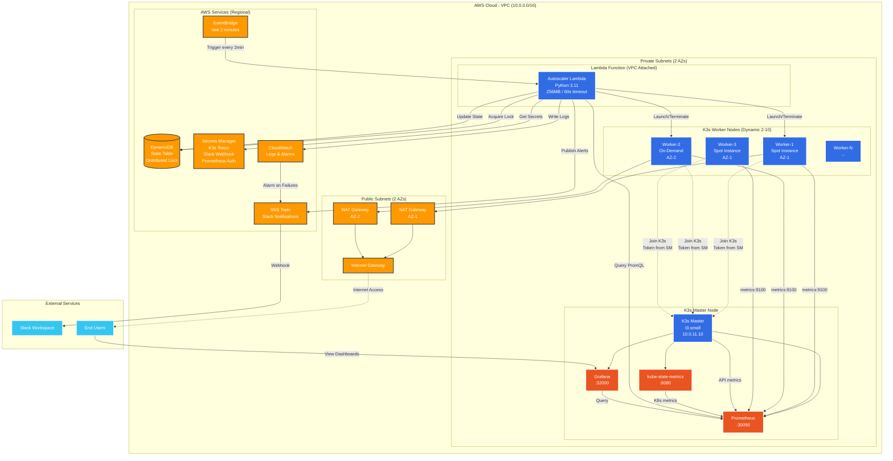

# SmartScale K3s Autoscaler - Architecture Overview Diagram



## Component Descriptions

### AWS Infrastructure Layer

#### VPC & Networking

- **VPC CIDR**: 10.0.0.0/16
- **Public Subnets**: 10.0.1.0/24 (AZ-1), 10.0.2.0/24 (AZ-2)
- **Private Subnets**: 10.0.11.0/24 (AZ-1), 10.0.12.0/24 (AZ-2)
- **NAT Gateways**: 2 (one per AZ for high availability)
- **Internet Gateway**: Shared across AZs

#### K3s Master Node

- **Instance Type**: t3.small (2 vCPU, 2GB RAM)
- **Role**: Kubernetes control plane + monitoring stack
- **Components**:
  - K3s server (API server, scheduler, controller manager)
  - Prometheus (metrics storage, 7-day retention)
  - Grafana (visualization dashboards)
  - kube-state-metrics (Kubernetes object metrics)

#### K3s Worker Nodes (Dynamic)

- **Instance Types**: t3.small (can be diversified: t3.small, t3a.small)
- **Count Range**: 2 minimum, 10 maximum
- **Distribution**: Balanced across 2 AZs
- **Mix**: 70% Spot instances, 30% On-Demand
- **Auto-scaling**: Managed by Lambda based on metrics

#### Lambda Autoscaler

- **Runtime**: Python 3.11
- **Memory**: 256 MB
- **Timeout**: 60 seconds
- **Trigger**: EventBridge (every 2 minutes)
- **VPC**: Attached to private subnets for Prometheus access
- **Execution Flow**:
  1. Query Prometheus for metrics
  2. Acquire DynamoDB lock
  3. Evaluate scaling decision
  4. Launch/terminate EC2 instances
  5. Update state and send notifications

### AWS Managed Services

#### DynamoDB State Table

- **Purpose**: Cluster state management and distributed locking
- **Billing**: On-demand (pay per request)
- **Schema**:
  - `cluster_id` (Primary Key)
  - `node_count`, `last_scale_time`
  - `scaling_in_progress`, `lock_expiry`
  - `metrics_history` (last 10 readings)

#### Secrets Manager

- **K3s Token**: Node join authentication
- **Prometheus Credentials**: Basic auth for API access
- **Slack Webhook**: Notification endpoint
- **Encryption**: AES-256 at rest

#### SNS Topic

- **Purpose**: Alert distribution
- **Subscriptions**:
  - Slack webhook (via Lambda forwarder)
  - Email (for critical alerts)
  - SMS (optional, for emergencies)

#### CloudWatch

- **Logs**: Lambda execution logs (30-day retention)
- **Metrics**: Custom autoscaler metrics (invocations, scaling events, node count)
- **Alarms**: 8 alarms (4 critical, 4 warning)

#### EventBridge

- **Schedule**: `rate(2 minutes)` cron expression
- **Target**: Lambda autoscaler function
- **Permissions**: Invoke Lambda via IAM role

### Monitoring Stack

#### Prometheus

- **Port**: 30090 (NodePort)
- **Scrape Interval**: 15 seconds
- **Retention**: 7 days
- **Storage**: 20GB persistent volume
- **Scraped Targets**:
  - Node exporters (:9100) - System metrics
  - kube-state-metrics (:8080) - K8s object metrics
  - Demo app pods (:3000/metrics) - Application metrics

#### Grafana

- **Port**: 32000 (NodePort)
- **Dashboards**: 3 pre-configured
  1. Cluster Overview (CPU, memory, nodes, pods)
  2. Autoscaler Performance (scaling events, Lambda metrics)
  3. Cost Tracking (hourly cost, monthly projection, savings)
- **Data Source**: Prometheus

#### kube-state-metrics

- **Purpose**: Expose Kubernetes API object metrics
- **Metrics**: Pod status, deployments, nodes, persistent volumes
- **Required For**: Pending pod count, node readiness

### External Integrations

#### Slack

- **Notification Format**: Structured blocks with emojis
- **Event Types**:
  - 🟢 Scale-up initiated
  - 🔵 Scale-down completed
  - 🔴 Scaling failure
  - ⚠️ Warnings (high memory, max capacity)

#### End Users

- **Access Points**:
  - Demo app via NodePort (http://master-ip:30080)
  - Grafana dashboards (http://master-ip:32000)
  - SSH to master for kubectl access

## Data Flow Sequences

### 1. Scale-Up Flow

```
EventBridge (2min trigger)
  → Lambda invoked
  → Query Prometheus: CPU=78%, Pending=5
  → DynamoDB: Acquire lock
  → Decision: Scale up by 2 nodes
  → EC2: RunInstances (1 Spot, 1 On-Demand)
  → Poll instance status (every 10s, max 5min)
  → Verify nodes join K3s cluster (Ready=True)
  → DynamoDB: Update node_count=7, release lock
  → SNS: Publish scale-up notification
  → Slack: "🟢 Added 2 nodes, total 7"
  → CloudWatch: Log success
```

### 2. Scale-Down Flow

```
EventBridge (2min trigger)
  → Lambda invoked
  → Query Prometheus: CPU=25%, Pending=0
  → Check cooldown (10min elapsed since last scale-down)
  → DynamoDB: Acquire lock
  → Decision: Scale down by 1 node
  → Select node: Fewest pods, longest idle
  → kubectl cordon <node>
  → kubectl drain <node> --timeout=5m
  → EC2: TerminateInstances
  → kubectl delete node <node>
  → DynamoDB: Update node_count=4, release lock
  → SNS: Publish scale-down notification
  → Slack: "🔵 Removed 1 node, total 4"
  → CloudWatch: Log success
```

### 3. Worker Join Flow

```
Lambda: EC2 RunInstances
  → Instance boots with User Data script
  → User Data: Retrieve K3s token from Secrets Manager
  → User Data: Query EC2 tags to find master IP
  → User Data: curl -sfL https://get.k3s.io | K3S_URL=... sh -
  → K3s agent starts, connects to master:6443
  → Master validates token, adds node to cluster
  → Node status: Ready=True
  → Lambda polls: kubectl get node <name> -o json
  → Lambda confirms join success
```

### 4. Metric Collection Flow

```
Prometheus (every 15s)
  → Scrape node-exporters on workers:9100
  → Scrape kube-state-metrics:8080
  → Scrape demo app pods:3000/metrics
  → Store in TSDB (local 20GB volume)
  → Expose metrics via API:30090
  → Lambda queries: /api/v1/query?query=...
  → Grafana queries: /api/v1/query_range?query=...
```

## Security Zones

### Public Zone (Internet-Facing)

- Internet Gateway
- NAT Gateways (static public IPs)

### Private Zone (No Direct Internet)

- K3s Master (private IP only)
- K3s Workers (private IPs only)
- Lambda function (VPC-attached)

### Managed Services Zone (AWS Internal)

- DynamoDB (accessed via VPC endpoint)
- Secrets Manager (accessed via VPC endpoint)
- CloudWatch (AWS internal network)

### Access Control

- **SSH**: Only to master node via public IP (ephemeral bastion)
- **Kubectl**: Via master node SSH tunnel
- **Grafana**: Port-forward or NodePort (master public IP)
- **Prometheus**: Lambda access only (private, no external exposure)

## Disaster Recovery

### Failure Scenarios

1. **Lambda Timeout**: Next invocation detects expired lock, retries
2. **Master Node Failure**: Manual recovery (restore from snapshot)
3. **Worker Node Failure**: Auto-replaced by autoscaler
4. **DynamoDB Unavailability**: Lambda retries, uses cached state
5. **Prometheus Down**: Lambda uses cached metrics, triggers alarm

### HA Considerations

- **Multi-AZ Workers**: At least 1 node per AZ
- **NAT Gateway Redundancy**: 2 NAT Gateways (one per AZ)
- **Spot Instance Fallback**: Auto-switch to On-Demand if Spot unavailable
- **Lock Expiry**: 5-minute TTL prevents stuck operations

---

_Diagram generated using Mermaid - can be rendered in GitHub, VS Code, or online viewers_
