# Network Topology Diagram

```mermaid
graph TB
    subgraph Internet
        Users[End Users<br/>Browsers/API Clients]
        DevOps[DevOps Team<br/>SSH Access]
    end

    subgraph "AWS Region: ap-southeast-1"
        subgraph "VPC: 10.0.0.0/16"
            IGW[Internet Gateway]

            subgraph "Availability Zone A (ap-southeast-1a)"
                subgraph "Public Subnet A: 10.0.1.0/24"
                    NAT1[NAT Gateway A<br/>Elastic IP: 52.xxx.xxx.1]
                end

                subgraph "Private Subnet A: 10.0.11.0/24"
                    Master[K3s Master<br/>10.0.11.10<br/>Public IP: 54.xxx.xxx.100]
                    W1[Worker-1<br/>10.0.11.20<br/>Spot Instance]
                    W3[Worker-3<br/>10.0.11.21<br/>Spot Instance]
                    Lambda1[Lambda ENI<br/>10.0.11.50]
                end
            end

            subgraph "Availability Zone B (ap-southeast-1b)"
                subgraph "Public Subnet B: 10.0.2.0/24"
                    NAT2[NAT Gateway B<br/>Elastic IP: 52.xxx.xxx.2]
                end

                subgraph "Private Subnet B: 10.0.12.0/24"
                    W2[Worker-2<br/>10.0.12.20<br/>On-Demand]
                    W4[Worker-N<br/>10.0.12.21<br/>...]
                    Lambda2[Lambda ENI<br/>10.0.12.50]
                end
            end

            subgraph "Route Tables"
                RTPublic[Public Route Table<br/>0.0.0.0/0 → IGW]
                RTPrivateA[Private Route Table A<br/>0.0.0.0/0 → NAT-A]
                RTPrivateB[Private Route Table B<br/>0.0.0.0/0 → NAT-B]
            end

            subgraph "Security Groups"
                SG_Master[Master SG<br/>sg-master-xxx]
                SG_Worker[Worker SG<br/>sg-worker-xxx]
                SG_Lambda[Lambda SG<br/>sg-lambda-xxx]
            end
        end

        subgraph "AWS Services (VPC Endpoints)"
            DDB_EP[DynamoDB<br/>Endpoint]
            SM_EP[Secrets Manager<br/>Endpoint]
            CW_EP[CloudWatch<br/>Endpoint]
        end
    end

    %% Internet Connections
    Users -->|HTTP/HTTPS| IGW
    DevOps -->|SSH:22| IGW

    %% IGW to Public Subnets
    IGW -.->|Inbound| Master
    IGW <-->|Bidirectional| NAT1
    IGW <-->|Bidirectional| NAT2

    %% NAT Gateway Connections
    Master -->|Outbound Internet| NAT1
    W1 -->|Outbound Internet| NAT1
    W3 -->|Outbound Internet| NAT1
    W2 -->|Outbound Internet| NAT2
    W4 -->|Outbound Internet| NAT2
    Lambda1 -->|Outbound| NAT1
    Lambda2 -->|Outbound| NAT2

    %% K3s Cluster Communication
    W1 <-->|K3s API<br/>6443/tcp| Master
    W2 <-->|K3s API<br/>6443/tcp| Master
    W3 <-->|K3s API<br/>6443/tcp| Master
    W4 <-->|K3s API<br/>6443/tcp| Master

    %% Lambda to Prometheus
    Lambda1 -.->|Prometheus API<br/>30090/tcp| Master
    Lambda2 -.->|Prometheus API<br/>30090/tcp| Master

    %% Lambda to AWS Services
    Lambda1 -->|HTTPS| DDB_EP
    Lambda1 -->|HTTPS| SM_EP
    Lambda1 -->|HTTPS| CW_EP
    Lambda2 -->|HTTPS| DDB_EP
    Lambda2 -->|HTTPS| SM_EP
    Lambda2 -->|HTTPS| CW_EP

    %% Worker to Master Metrics
    W1 -.->|node-exporter<br/>9100/tcp| Master
    W2 -.->|node-exporter<br/>9100/tcp| Master
    W3 -.->|node-exporter<br/>9100/tcp| Master

    %% Route Table Associations
    RTPublic -.->|Associated| NAT1
    RTPublic -.->|Associated| NAT2
    RTPrivateA -.->|Associated| Master
    RTPrivateA -.->|Associated| W1
    RTPrivateA -.->|Associated| W3
    RTPrivateB -.->|Associated| W2
    RTPrivateB -.->|Associated| W4

    %% Security Group Associations
    SG_Master -.->|Attached| Master
    SG_Worker -.->|Attached| W1
    SG_Worker -.->|Attached| W2
    SG_Worker -.->|Attached| W3
    SG_Worker -.->|Attached| W4
    SG_Lambda -.->|Attached| Lambda1
    SG_Lambda -.->|Attached| Lambda2

    %% Styling
    classDef internet fill:#E1F5FE,stroke:#01579B,stroke-width:2px
    classDef public fill:#FFF9C4,stroke:#F57F17,stroke-width:2px
    classDef private fill:#F3E5F5,stroke:#4A148C,stroke-width:2px
    classDef aws fill:#FF9800,stroke:#E65100,stroke-width:2px
    classDef sg fill:#FFCCBC,stroke:#BF360C,stroke-width:2px
    classDef rt fill:#C8E6C9,stroke:#1B5E20,stroke-width:2px

    class Users,DevOps internet
    class NAT1,NAT2 public
    class Master,W1,W2,W3,W4,Lambda1,Lambda2 private
    class DDB_EP,SM_EP,CW_EP aws
    class SG_Master,SG_Worker,SG_Lambda sg
    class RTPublic,RTPrivateA,RTPrivateB rt
```



## Network Configuration Details

### VPC Configuration

```hcl
VPC CIDR: 10.0.0.0/16
DNS Resolution: Enabled
DNS Hostnames: Enabled
Tenancy: Default
```

### Subnet Breakdown

| Subnet    | CIDR         | AZ              | Type    | Resources               | Route Table |
| --------- | ------------ | --------------- | ------- | ----------------------- | ----------- |
| Public-A  | 10.0.1.0/24  | ap-southeast-1a | Public  | NAT Gateway A           | RTPublic    |
| Public-B  | 10.0.2.0/24  | ap-southeast-1b | Public  | NAT Gateway B           | RTPublic    |
| Private-A | 10.0.11.0/24 | ap-southeast-1a | Private | Master, Workers, Lambda | RTPrivateA  |
| Private-B | 10.0.12.0/24 | ap-southeast-1b | Private | Workers, Lambda         | RTPrivateB  |

**Total IPs per subnet**: 251 usable (256 - 5 AWS reserved)

### Route Tables

#### Public Route Table (RTPublic)

```
Destination       Target
10.0.0.0/16      local
0.0.0.0/0        igw-xxxxx (Internet Gateway)
```

#### Private Route Table A (RTPrivateA)

```
Destination       Target
10.0.0.0/16      local
0.0.0.0/0        nat-xxxxx (NAT Gateway A)
```

#### Private Route Table B (RTPrivateB)

```
Destination       Target
10.0.0.0/16      local
0.0.0.0/0        nat-yyyyy (NAT Gateway B)
```

### Security Groups

#### Master Security Group (sg-master-xxx)

**Inbound Rules**:

```
Port    Protocol  Source              Description
22      TCP       0.0.0.0/0           SSH from anywhere (restrict in prod)
6443    TCP       sg-worker-xxx       K3s API from workers
30090   TCP       sg-lambda-xxx       Prometheus from Lambda
32000   TCP       0.0.0.0/0           Grafana UI (restrict in prod)
30080   TCP       0.0.0.0/0           Demo app NodePort
9100    TCP       sg-worker-xxx       Node exporter metrics
```

**Outbound Rules**:

```
All traffic allowed to 0.0.0.0/0
```

#### Worker Security Group (sg-worker-xxx)

**Inbound Rules**:

```
Port    Protocol  Source              Description
22      TCP       sg-master-xxx       SSH from master (troubleshooting)
All     All       sg-master-xxx       K3s cluster communication
All     All       sg-worker-xxx       Pod-to-pod communication
9100    TCP       sg-master-xxx       Node exporter for Prometheus
```

**Outbound Rules**:

```
All traffic allowed to 0.0.0.0/0
```

#### Lambda Security Group (sg-lambda-xxx)

**Inbound Rules**:

```
None (Lambda doesn't accept inbound)
```

**Outbound Rules**:

```
Port    Protocol  Destination         Description
30090   TCP       sg-master-xxx       Prometheus queries
443     TCP       0.0.0.0/0           AWS APIs (DynamoDB, Secrets, EC2)
```

### VPC Endpoints

To reduce NAT Gateway costs and improve security:

#### DynamoDB Endpoint (Gateway Type)

```
Service: com.amazonaws.ap-southeast-1.dynamodb
Type: Gateway
Route Tables: RTPrivateA, RTPrivateB
Cost: Free
```

#### Secrets Manager Endpoint (Interface Type)

```
Service: com.amazonaws.ap-southeast-1.secretsmanager
Type: Interface
Subnets: Private-A, Private-B
Security Group: sg-endpoints (allow 443 from sg-lambda, sg-master, sg-worker)
Cost: $0.01/hour/endpoint ($7.20/month)
```

#### EC2 Endpoint (Interface Type)

```
Service: com.amazonaws.ap-southeast-1.ec2
Type: Interface
Purpose: Lambda RunInstances/TerminateInstances calls
Cost: $7.20/month (optional - can use NAT instead)
```

### IP Address Allocation

#### Master Node

- **Private IP**: 10.0.11.10 (static)
- **Public IP**: 54.xxx.xxx.100 (Elastic IP - $3.60/month)
- **Purpose**: SSH access, Grafana UI, Demo app access

#### Worker Nodes

- **Private IPs**: DHCP-assigned from subnet pool
- **Public IPs**: None (use NAT for outbound)
- **Ephemeral**: Created/destroyed dynamically

#### Lambda ENIs

- **Private IPs**: Auto-assigned by AWS in each AZ
- **Count**: 1-2 ENIs (scales with concurrency)
- **Purpose**: VPC connectivity for Prometheus access

### Network ACLs (NACLs)

**Default NACL** (applied to all subnets):

```
Inbound:
100    All Traffic    0.0.0.0/0    ALLOW
*      All Traffic    0.0.0.0/0    DENY

Outbound:
100    All Traffic    0.0.0.0/0    ALLOW
*      All Traffic    0.0.0.0/0    DENY
```

_Security groups provide sufficient protection; NACLs left at default_

### DNS Configuration

#### Private DNS (Route53 Private Hosted Zone)

```
Zone: node-fleet.internal
Records:
  master.node-fleet.internal    → 10.0.11.10
  prometheus.node-fleet.internal → 10.0.11.10:30090
  grafana.node-fleet.internal    → 10.0.11.10:32000
```

**Benefits**:

- Lambda uses `prometheus.node-fleet.internal` instead of hardcoded IP
- Master IP change doesn't require Lambda env var update

### Traffic Flow Examples

#### 1. End User → Demo App

```
User Browser
  → Internet Gateway (54.xxx.xxx.100:30080)
  → Master Node (10.0.11.10:30080)
  → K3s Service (demo-app)
  → Pod on Worker-1 (10.244.x.x:5000)
```

#### 2. Lambda → Prometheus Query

```
Lambda Function (triggered by EventBridge)
  → Lambda ENI (10.0.11.50)
  → Security Group sg-lambda allows 30090 → sg-master
  → Master Node (10.0.11.10:30090)
  → Prometheus API
  → Response with metrics
```

#### 3. Worker → Internet (Package Download)

```
Worker-1 (10.0.11.20)
  → Route Table Private-A (0.0.0.0/0 → NAT-A)
  → NAT Gateway A (10.0.1.x)
  → Internet Gateway
  → Internet (e.g., get.k3s.io)
```

#### 4. Lambda → DynamoDB (State Update)

```
Lambda Function
  → Lambda ENI
  → VPC Endpoint for DynamoDB (no NAT traversal)
  → DynamoDB Service (AWS internal network)
  → State table updated
```

### High Availability Design

#### Multi-AZ Strategy

- **NAT Gateways**: 2 (one per AZ) - if AZ-A fails, workers in AZ-B continue
- **Workers**: Distributed across both AZs (at least 1 per AZ)
- **Lambda**: AWS automatically creates ENIs in multiple AZs

#### Failure Scenarios

**Scenario 1: NAT Gateway A Fails**

```
Workers in Private-A lose internet
  → Cannot pull container images
  → Existing pods continue running
  → New pods scheduled to workers in Private-B
  → Alert triggered: NAT Gateway unavailable
```

**Scenario 2: Entire AZ-A Fails**

```
Master node down (single point of failure)
  → Manual failover required
  → Restore master from snapshot in AZ-B
  → Update DNS to new master IP
  → Workers rejoin cluster

Workers in AZ-A down
  → K3s marks nodes NotReady
  → Pods rescheduled to workers in AZ-B
  → Autoscaler launches new workers in AZ-B
```

### Cost Optimization

#### NAT Gateway Cost

```
Data Processed: ~100 GB/month
NAT Gateway Hourly: $0.045/hour/gateway
Data Transfer: $0.045/GB

Monthly Cost (2 NAT Gateways):
  Hourly: 2 × $0.045 × 730 hours = $65.70
  Data: 100 GB × $0.045 = $4.50
  Total: ~$70/month
```

**Optimization**: Use VPC Endpoints for AWS services to reduce NAT traffic

#### VPC Endpoint Cost vs Savings

```
DynamoDB Endpoint (Gateway): Free
Secrets Manager Endpoint: $7.20/month
EC2 Endpoint: $7.20/month

NAT Savings (if 50% traffic is AWS APIs):
  50 GB × $0.045 = $2.25/month

Decision: Keep DynamoDB endpoint (free), skip EC2 endpoint (cost > savings)
```

### Network Performance

#### Baseline Performance

- **Instance Network**: t3.small = Up to 5 Gbps
- **NAT Gateway**: Up to 45 Gbps (auto-scales)
- **VPC Peering**: N/A (not used)
- **Internet Gateway**: Unlimited bandwidth

#### Latency Measurements

```
Master ↔ Worker (same AZ): <1ms
Master ↔ Worker (cross AZ): ~2ms
Lambda → Prometheus: ~5-10ms
Lambda → DynamoDB (VPC Endpoint): ~10ms
Lambda → DynamoDB (via NAT): ~20ms
```

---

_Network topology designed for high availability, security, and cost efficiency_
