# Scaling Decision Logic Flowchart

```mermaid
flowchart TD
    Start([EventBridge Trigger<br/>Every 2 Minutes]) --> CheckLock{DynamoDB<br/>Lock Available?}

    CheckLock -->|No, Lock Held| LogSkip[Log: Scaling in Progress]
    LogSkip --> End1([Exit Gracefully])

    CheckLock -->|Yes, Acquire Lock| GetMetrics[Query Prometheus<br/>CPU, Memory, Pending Pods]

    GetMetrics --> CheckPrometheus{Prometheus<br/>Available?}
    CheckPrometheus -->|No| UseCached{Cached Metrics<br/>Available?}
    UseCached -->|No| ReleaseLock1[Release Lock]
    ReleaseLock1 --> Alert1[Send Alert:<br/>Prometheus Down]
    Alert1 --> End2([Exit with Error])

    UseCached -->|Yes| ProceedCached[Use Cached Metrics]
    CheckPrometheus -->|Yes| ProceedFresh[Use Fresh Metrics]

    ProceedCached --> GetState
    ProceedFresh --> GetState[Get Current State<br/>from DynamoDB]

    GetState --> CheckCooldown{Cooldown<br/>Period Active?}

    CheckCooldown -->|Scale-Up Cooldown<br/>< 5 min| LogCooldown1[Log: In Cooldown Period]
    LogCooldown1 --> ReleaseLock2[Release Lock]
    ReleaseLock2 --> End3([Exit - No Action])

    CheckCooldown -->|Scale-Down Cooldown<br/>< 10 min| LogCooldown2[Log: In Cooldown Period]
    LogCooldown2 --> ReleaseLock2

    CheckCooldown -->|Cooldown Expired| EvaluateMetrics{Evaluate<br/>Scaling Triggers}

    %% Scale-Up Decision Tree
    EvaluateMetrics -->|CPU > 70%<br/>for 3+ min| ScaleUpNeeded
    EvaluateMetrics -->|Pending Pods<br/>> 0 for 3+ min| ScaleUpNeeded
    EvaluateMetrics -->|Memory > 75%| ScaleUpNeeded
    EvaluateMetrics -->|Custom Metrics<br/>Threshold| ScaleUpNeeded

    %% Scale-Down Decision Tree
    EvaluateMetrics -->|CPU < 30% AND<br/>Memory < 50% AND<br/>No Pending Pods<br/>for 10+ min| ScaleDownNeeded

    %% No Action
    EvaluateMetrics -->|Metrics in<br/>Normal Range| NoAction[Log: No Scaling Needed]
    NoAction --> ReleaseLock3[Release Lock]
    ReleaseLock3 --> End4([Exit - Stable])

    %% Scale-Up Path
    ScaleUpNeeded{Scale-Up Decision} --> CheckMaxNodes{Current Nodes<br/>< Max 10?}

    CheckMaxNodes -->|No, At Max| AlertMaxCapacity[Alert: At Max Capacity<br/>Cannot Scale Further]
    AlertMaxCapacity --> ReleaseLock4[Release Lock]
    ReleaseLock4 --> End5([Exit - At Limit])

    CheckMaxNodes -->|Yes| CalcScaleUp[Calculate Nodes to Add<br/>Urgency-Based: 1-2 nodes]

    CalcScaleUp --> CalcSpotMix[Calculate Spot/On-Demand Mix<br/>Target: 70% Spot, 30% On-Demand]

    CalcSpotMix --> SelectAZ[Select Target AZ<br/>Choose AZ with Fewer Nodes]

    SelectAZ --> LaunchSpot{Launch Spot<br/>Instances}

    LaunchSpot -->|Success| LaunchOnDemand{Launch On-Demand<br/>Instances}
    LaunchSpot -->|Spot Unavailable| LaunchFallback[Launch On-Demand Fallback]

    LaunchFallback --> LaunchOnDemand
    LaunchOnDemand -->|Success| PollStatus[Poll Instance Status<br/>Every 10s, Max 5min]
    LaunchOnDemand -->|EC2 Quota Exceeded| AlertQuota[Alert: EC2 Quota Exceeded]
    AlertQuota --> ReleaseLock5[Release Lock]
    ReleaseLock5 --> End6([Exit - Quota Error])

    PollStatus --> CheckJoin{All Nodes<br/>Ready=True?}

    CheckJoin -->|No, Timeout 5min| AlertJoinFail[Alert: Node Join Failed]
    AlertJoinFail --> TerminateFailed[Terminate Failed Instances]
    TerminateFailed --> ReleaseLock6[Release Lock]
    ReleaseLock6 --> End7([Exit - Join Failed])

    CheckJoin -->|Yes, All Ready| UpdateStateUp[Update DynamoDB:<br/>Increment node_count<br/>Set last_scale_time<br/>Record scale_action=up]

    UpdateStateUp --> PublishMetricsUp[Publish CloudWatch Metrics:<br/>ScaleUpEvents +1<br/>CurrentNodeCount]

    PublishMetricsUp --> NotifySlackUp[Send Slack Notification:<br/>🟢 Scale-Up Success]

    NotifySlackUp --> ReleaseLock7[Release Lock]
    ReleaseLock7 --> End8([Exit - Scale-Up Complete])

    %% Scale-Down Path
    ScaleDownNeeded{Scale-Down Decision} --> CheckMinNodes{Current Nodes<br/>> Min 2?}

    CheckMinNodes -->|No, At Min| LogMin[Log: At Minimum Nodes]
    LogMin --> ReleaseLock8[Release Lock]
    ReleaseLock8 --> End9([Exit - At Min])

    CheckMinNodes -->|Yes| SelectNode[Select Node for Removal<br/>Criteria:<br/>1. Fewest pods<br/>2. No StatefulSets<br/>3. Longest idle<br/>4. AZ with most nodes]

    SelectNode --> CordonNode[kubectl cordon node]

    CordonNode --> DrainNode[kubectl drain node<br/>--timeout=5m<br/>--ignore-daemonsets<br/>--delete-emptydir-data]

    DrainNode --> CheckDrain{Drain<br/>Successful?}

    CheckDrain -->|No, Timeout| AlertDrainFail[Alert: Drain Failed]
    AlertDrainFail --> UncordonNode[kubectl uncordon node]
    UncordonNode --> ReleaseLock9[Release Lock]
    ReleaseLock9 --> End10([Exit - Drain Failed])

    CheckDrain -->|Yes| TerminateInstance[EC2 TerminateInstances]

    TerminateInstance --> DeleteNode[kubectl delete node]

    DeleteNode --> UpdateStateDown[Update DynamoDB:<br/>Decrement node_count<br/>Set last_scale_time<br/>Record scale_action=down]

    UpdateStateDown --> PublishMetricsDown[Publish CloudWatch Metrics:<br/>ScaleDownEvents +1<br/>CurrentNodeCount]

    PublishMetricsDown --> NotifySlackDown[Send Slack Notification:<br/>🔵 Scale-Down Success]

    NotifySlackDown --> ReleaseLock10[Release Lock]
    ReleaseLock10 --> End11([Exit - Scale-Down Complete])

    %% Styling
    classDef startEnd fill:#4CAF50,stroke:#2E7D32,stroke-width:3px,color:#fff
    classDef decision fill:#FF9800,stroke:#E65100,stroke-width:2px,color:#fff
    classDef process fill:#2196F3,stroke:#1565C0,stroke-width:2px,color:#fff
    classDef error fill:#F44336,stroke:#C62828,stroke-width:2px,color:#fff
    classDef success fill:#4CAF50,stroke:#2E7D32,stroke-width:2px,color:#fff

    class Start,End1,End2,End3,End4,End5,End6,End7,End8,End9,End10,End11 startEnd
    class CheckLock,CheckPrometheus,UseCached,CheckCooldown,EvaluateMetrics,ScaleUpNeeded,CheckMaxNodes,LaunchSpot,LaunchOnDemand,CheckJoin,ScaleDownNeeded,CheckMinNodes,CheckDrain decision
    class GetMetrics,GetState,CalcScaleUp,CalcSpotMix,SelectAZ,PollStatus,UpdateStateUp,UpdateStateDown,CordonNode,DrainNode,TerminateInstance,DeleteNode process
    class Alert1,AlertMaxCapacity,AlertQuota,AlertJoinFail,AlertDrainFail error
    class NotifySlackUp,NotifySlackDown,PublishMetricsUp,PublishMetricsDown success
```



## Decision Criteria Details

### Scale-UP Triggers (OR Logic - ANY condition met)

```
IF (average_cpu > 70% for 3 consecutive minutes) OR
   (pending_pods > 0 for 3 consecutive minutes) OR
   (cluster_memory > 75%) OR
   (api_latency_p95 > 2 seconds) OR  // BONUS
   (queue_depth > 1000 messages) OR  // BONUS
   (error_rate > 5% for 2 minutes)   // BONUS
THEN
   scale_up_needed = True
```

**Urgency Calculation**:

```python
if cpu > 85% or pending_pods > 10:
    nodes_to_add = 2  # Urgent
elif cpu > 70% or pending_pods > 0:
    nodes_to_add = 1  # Normal
```

### Scale-DOWN Triggers (AND Logic - ALL conditions met)

```
IF (average_cpu < 30% for 10 consecutive minutes) AND
   (pending_pods == 0) AND
   (cluster_memory < 50%) AND
   (queue_depth < 100 for 10 minutes) AND  // BONUS
   (cooldown_elapsed >= 10 minutes)
THEN
   scale_down_needed = True
```

**Safety Checks Before Scale-Down**:

```python
# Never scale down if:
if current_nodes <= MIN_NODES:  # Below minimum
    return False
if has_statefulset_pods(node):  # StatefulSet on node
    return False
if violates_pdb(node):  # PodDisruptionBudget violation
    return False
if critical_pods_count(node) > 0:  # kube-system pods
    return False
```

## Spot/On-Demand Mix Algorithm

```python
def calculate_spot_ondemand_mix(current_nodes, desired_nodes,
                                 existing_spot, existing_ondemand,
                                 target_spot_percentage=70):
    """
    Maintain 70% Spot, 30% On-Demand ratio
    """
    total_desired = desired_nodes
    target_spot = int(total_desired * target_spot_percentage / 100)
    target_ondemand = total_desired - target_spot

    nodes_to_add = desired_nodes - current_nodes

    # Calculate what to launch
    spot_deficit = target_spot - existing_spot
    ondemand_deficit = target_ondemand - existing_ondemand

    spot_to_launch = min(spot_deficit, nodes_to_add)
    ondemand_to_launch = nodes_to_add - spot_to_launch

    # Handle negative (over-provisioned Spot)
    if spot_to_launch < 0:
        ondemand_to_launch = nodes_to_add
        spot_to_launch = 0

    return {
        'spot': max(0, spot_to_launch),
        'ondemand': max(0, ondemand_to_launch)
    }
```

## Multi-AZ Node Selection

```python
def select_subnet_for_new_instance(cluster_id):
    """
    Choose AZ with fewer worker nodes for balanced distribution
    """
    nodes_by_az = get_node_distribution_by_az(cluster_id)

    # {'ap-southeast-1a': 3, 'ap-southeast-1b': 2}
    az_with_fewest_nodes = min(nodes_by_az, key=nodes_by_az.get)

    return subnet_mapping[az_with_fewest_nodes]
```

## Predictive Scaling Integration (BONUS)

```python
def should_pre_scale(current_time, historical_data):
    """
    Check if predictive scaling recommends pre-emptive action
    """
    # Analyze last 7 days, same hour
    same_hour_data = filter_by_hour(historical_data, current_time.hour)
    avg_cpu_next_hour = calculate_average(same_hour_data, 'cpu', offset=+1)

    # If historically CPU spikes in next hour, pre-scale now
    if avg_cpu_next_hour > 70:
        logger.info(f"Predictive: CPU expected to reach {avg_cpu_next_hour}% in next hour")
        return 'scale_up', 1

    return 'no_action', 0
```

## Error Handling Flow

### Lambda Timeout (60s limit)

```
Lambda starts execution
  → 50s elapsed, not finished
  → Lambda times out
  → Lock remains in DynamoDB (expires in 5min)

Next Lambda invocation (2min later):
  → Checks lock age
  → If lock > 5min old: Force release
  → Check for incomplete operations:
      - EC2 instances in 'pending' state?
      - Nodes stuck in 'NotReady' status?
  → Clean up or complete operation
  → Resume normal operation
```

### Prometheus Unavailable

```
Lambda queries Prometheus
  → Connection timeout (10s)
  → Retry 1: Failed
  → Retry 2: Failed
  → Check cache (_metrics_cache):
      - If cache age < 5min: Use cached
      - If cache age > 5min: Abort
  → Send CloudWatch alarm
  → Release lock
  → Exit gracefully
```

### EC2 Quota Exceeded

```
Lambda: RunInstances
  → AWS returns: LimitExceededException
  → Catch exception
  → Send Slack alert:
      "🔴 Cannot scale: EC2 quota reached (10 instances)"
  → Send CloudWatch metric: ScalingFailures +1
  → Create CloudWatch alarm
  → Release lock
  → Exit (will retry in 2min)
```

## Metrics History Tracking

Every Lambda invocation stores metrics for trend analysis:

```python
# Current reading
metrics = {
    'cpu_usage': 72.5,
    'memory_usage': 65.0,
    'pending_pods': 3,
    'timestamp': 1704067200
}

# Append to DynamoDB state
state['metrics_history'].append(metrics)

# Keep only last 10 readings (20 minutes of history)
state['metrics_history'] = state['metrics_history'][-10:]

# Check for sustained threshold breaches
sustained_high_cpu = all(m['cpu_usage'] > 70
                         for m in state['metrics_history'][-3:])
```

## Lock Expiry & Recovery

```python
def acquire_lock_with_expiry():
    """
    DynamoDB conditional write with 5-minute expiry
    """
    current_time = int(time.time())
    lock_expiry = current_time + 300  # 5 minutes

    try:
        table.update_item(
            Key={'cluster_id': CLUSTER_ID},
            UpdateExpression='SET scaling_in_progress = :true, lock_acquired_at = :now, lock_expiry = :expiry',
            ConditionExpression='attribute_not_exists(scaling_in_progress) OR lock_acquired_at < :expired',
            ExpressionAttributeValues={
                ':true': True,
                ':now': current_time,
                ':expiry': lock_expiry,
                ':expired': current_time - 300  # Locks older than 5min auto-release
            }
        )
        return True  # Lock acquired
    except ConditionalCheckFailedException:
        return False  # Lock held by another invocation
```

---

_Flowchart generated using Mermaid - supports conditional logic, loops, and error handling paths_
